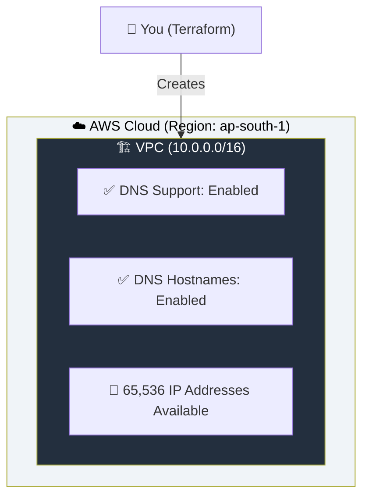
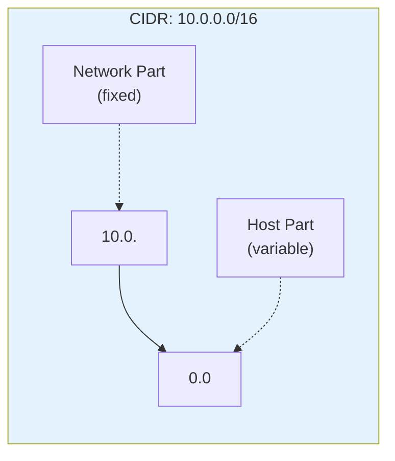
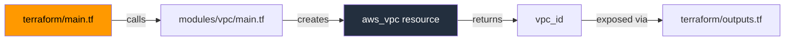

# 01 - VPC Basics

## What is a VPC?

A **Virtual Private Cloud (VPC)** is your own isolated virtual network within AWS. Think of it as your private data center in the cloud — you control the IP ranges, subnets, route tables, and gateways.

Every AWS resource (EC2, RDS, Lambda, etc.) runs **inside** a VPC.

---

## Architecture



---

## Key Concepts

### CIDR Block Notation

CIDR (Classless Inter-Domain Routing) defines the IP address range for your VPC.



| CIDR | IP Range | Total IPs | Usable IPs | Common Use |
|------|----------|-----------|------------|------------|
| `10.0.0.0/16` | 10.0.0.0 – 10.0.255.255 | 65,536 | 65,531 | Large VPC |
| `10.0.0.0/24` | 10.0.0.0 – 10.0.0.255 | 256 | 251 | Single Subnet |
| `10.0.0.0/28` | 10.0.0.0 – 10.0.0.15 | 16 | 11 | Small Subnet |
| `10.0.0.0/20` | 10.0.0.0 – 10.0.15.255 | 4,096 | 4,091 | Medium Subnet |

> **Why 5 less?** AWS reserves 5 IPs in every subnet:
> - `.0` — Network address
> - `.1` — VPC router
> - `.2` — DNS server
> - `.3` — Reserved for future
> - `.255` — Broadcast (not supported but reserved)

### DNS Settings

| Setting | What It Does | Default |
|---------|-------------|---------|
| `enable_dns_support` | Enables DNS resolution within the VPC | `true` |
| `enable_dns_hostnames` | Assigns DNS hostnames to EC2 instances | `false` |

> **Best Practice:** Always enable both. Required for services like RDS, EFS, and VPC endpoints.

---

## File Structure

```
01-vpc-basics/
├── README.md                    ← You are here
├── modules/
│   └── vpc/
│       ├── main.tf              ← VPC resource definition
│       ├── variables.tf         ← Input: vpc_cidr
│       └── outputs.tf           ← Output: vpc_id
└── terraform/
    ├── main.tf                  ← Calls the VPC module
    ├── variables.tf             ← Declares variables with defaults
    ├── outputs.tf               ← Exposes VPC ID
    ├── providers.tf             ← AWS provider configuration
    └── terraform.tfvars.example ← Example variable values
```

---

## How It Works



---

## Usage

```bash
cd terraform/
cp terraform.tfvars.example terraform.tfvars
# Edit terraform.tfvars with your values
terraform init
terraform plan
terraform apply
```

---

## What's Next?

➡️ [02-subnets](../02-subnets/) — Divide your VPC into smaller networks using subnets.
