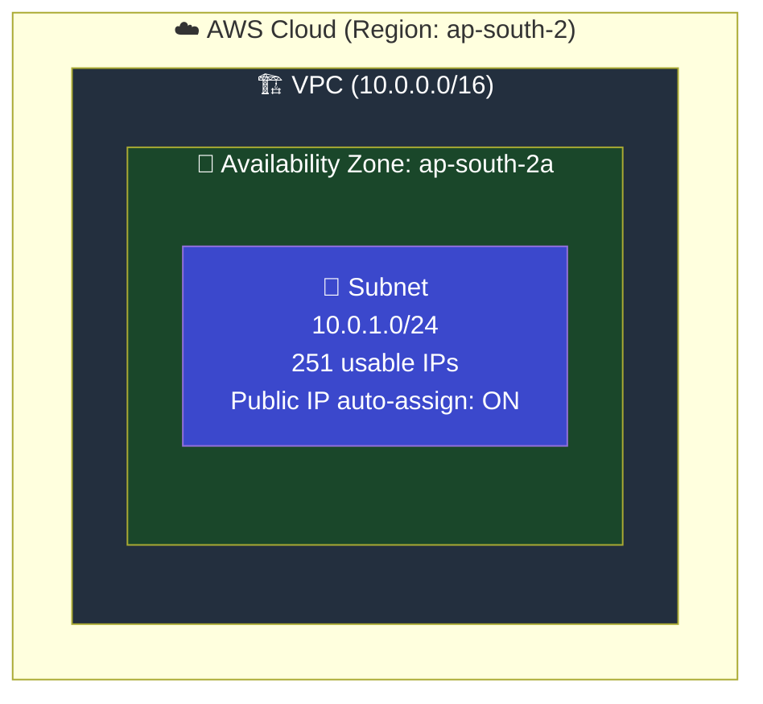
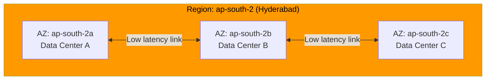
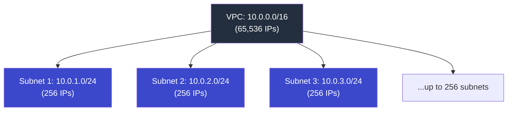
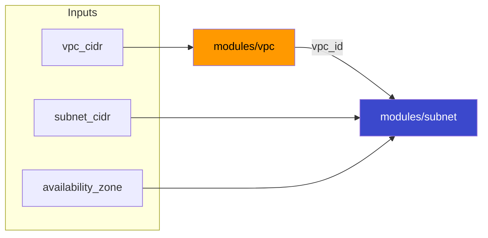

# 02 - Subnets

## What is a Subnet?

A **Subnet** (sub-network) is a range of IP addresses within your VPC. Subnets let you divide your VPC into smaller, isolated sections — each placed in a specific **Availability Zone (AZ)**.

> Think of VPC as a building, and subnets as rooms inside that building. Each room is in a specific floor (AZ).

---

## Architecture



---

## Key Concepts

### What is an Availability Zone (AZ)?

Each AWS Region has multiple isolated data centers called Availability Zones.



| Term | What It Is | Example |
|------|-----------|---------|
| **Region** | Geographic area with multiple data centers | `ap-south-2` (Hyderabad) |
| **AZ** | Isolated data center within a region | `ap-south-2a` |
| **Subnet** | IP range placed in ONE specific AZ | `10.0.1.0/24` in `ap-south-2a` |

### Subnet CIDR Planning

When you have a VPC with `10.0.0.0/16`, you can split it into subnets:



### `map_public_ip_on_launch`

| Value | Effect |
|-------|--------|
| `true` | Every EC2 launched in this subnet gets a public IP automatically |
| `false` | EC2 instances only get private IPs (need Elastic IP for public access) |

> **Note:** This alone doesn't give internet access. You also need an Internet Gateway + Route Table (covered in [04-internet-gateway](../04-internet-gateway/)).

---

## Module Dependencies



---

## File Structure

```
02-subnets/
├── README.md                    ← You are here
├── modules/
│   ├── vpc/
│   │   ├── main.tf
│   │   ├── variables.tf
│   │   └── outputs.tf
│   └── subnet/
│       ├── main.tf              ← Subnet resource
│       ├── variables.tf         ← Inputs: vpc_id, cidr, AZ
│       └── outputs.tf           ← Output: subnet_id, name
└── terraform/
    ├── main.tf
    ├── variables.tf
    ├── outputs.tf
    ├── providers.tf
    └── terraform.tfvars.example
```

---

## Usage

```bash
cd terraform/
cp terraform.tfvars.example terraform.tfvars
terraform init
terraform plan
terraform apply
```

---

## What's Next?

➡️ [03-public-private-subnets](../03-public-private-subnets/) — Create separate public and private subnets for network isolation.
