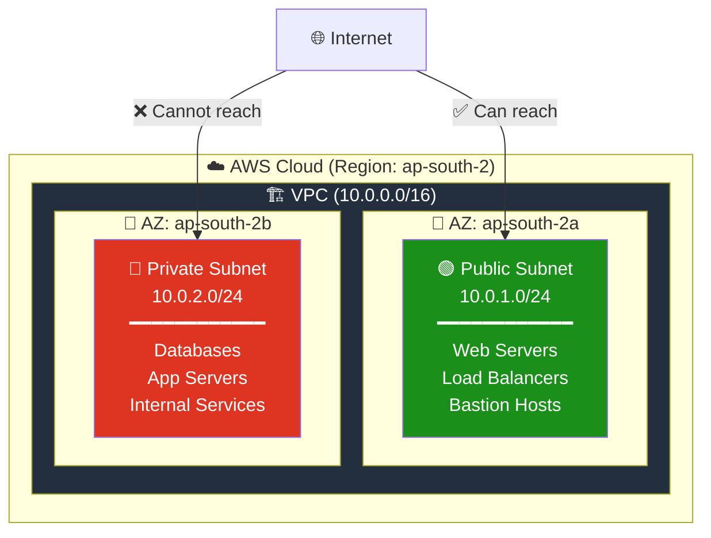
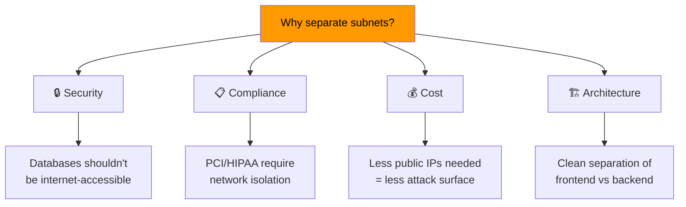
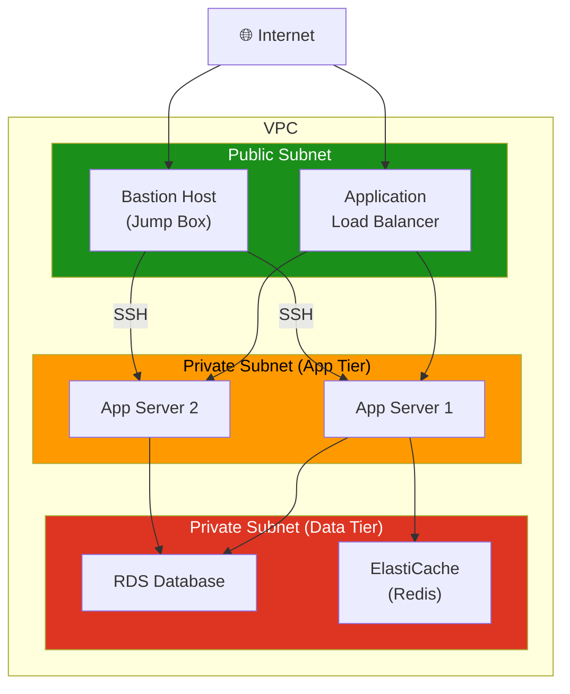
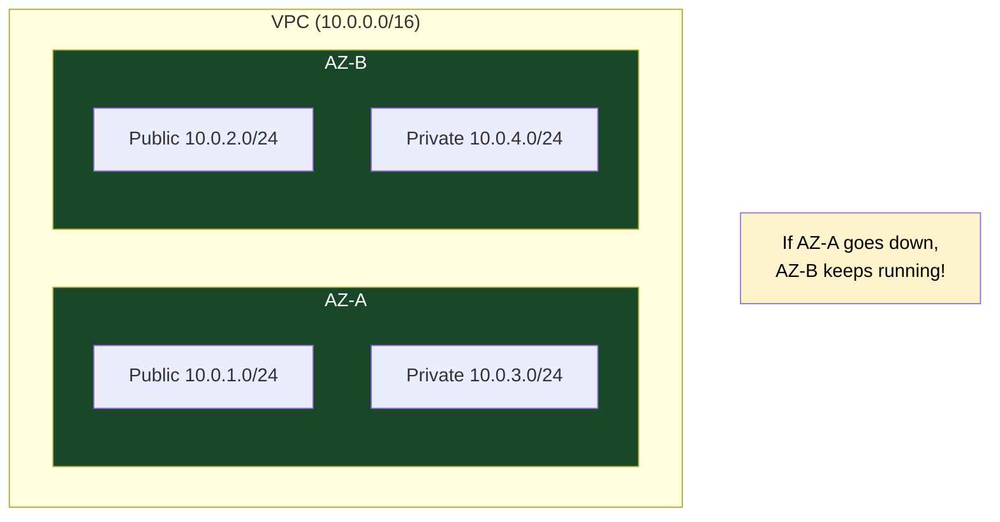
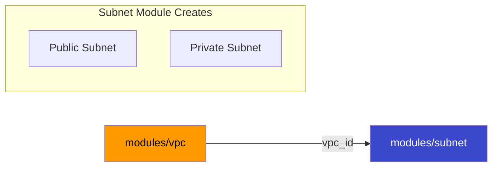

# 03 - Public & Private Subnets

## What's the Difference?

In AWS, subnets are not inherently "public" or "private" — it depends on their **routing configuration**. But architecturally, we design them differently:

| Feature | Public Subnet | Private Subnet |
|---------|--------------|----------------|
| **Purpose** | Host internet-facing resources | Host internal/backend resources |
| **Internet access** | Bidirectional (via IGW) | Outbound only (via NAT) or none |
| **Public IP** | Auto-assigned or Elastic IP | Not assigned |
| **Examples** | Web servers, bastion hosts, ALBs | Databases, app servers, caches |
| **Security** | Exposed (protected by SG/NACL) | Hidden from internet |

---

## Architecture



---

## Why Separate Public and Private?



### Common Architecture Pattern (3-Tier)



---

## Multi-AZ Design for High Availability



> **Best Practice:** Always deploy across at least 2 AZs for fault tolerance.

---

## Module Dependencies



---

## File Structure

```
03-public-private-subnets/
├── README.md                    ← You are here
├── modules/
│   ├── vpc/
│   │   ├── main.tf
│   │   ├── variables.tf
│   │   └── outputs.tf
│   └── subnet/
│       ├── main.tf              ← Creates BOTH public & private subnets
│       ├── variables.tf
│       └── outputs.tf
└── terraform/
    ├── main.tf
    ├── variables.tf
    ├── outputs.tf
    ├── providers.tf
    └── terraform.tfvars.example
```

---

## Usage

```bash
cd terraform/
cp terraform.tfvars.example terraform.tfvars
terraform init
terraform plan
terraform apply
```

---

## What's Next?

➡️ [04-internet-gateway](../04-internet-gateway/) — Connect your public subnet to the internet with an Internet Gateway.
