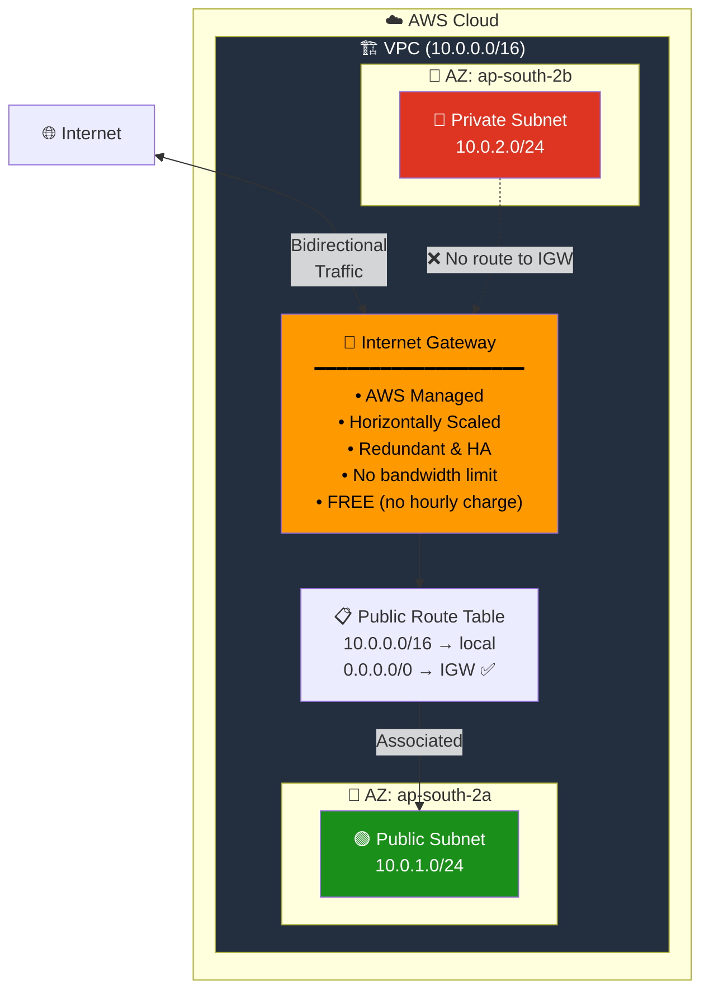
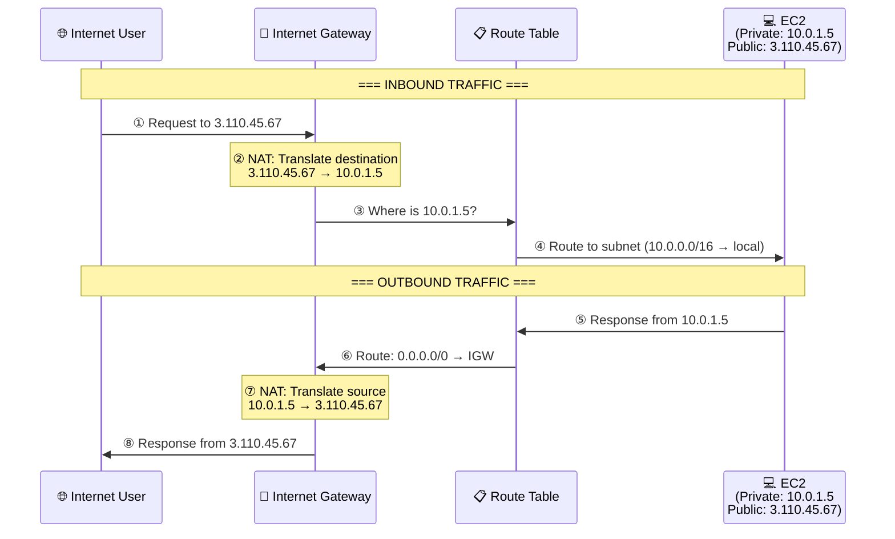
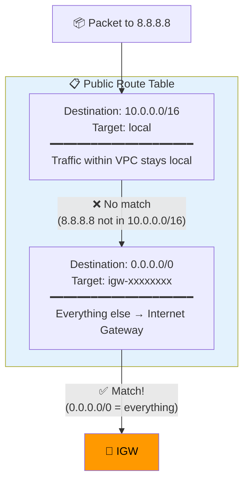
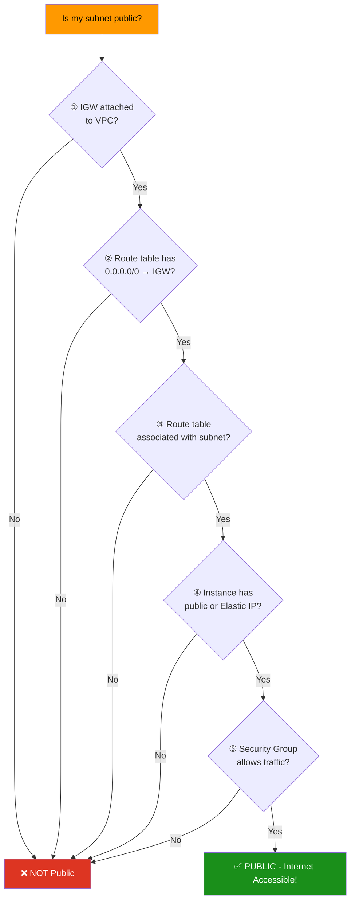
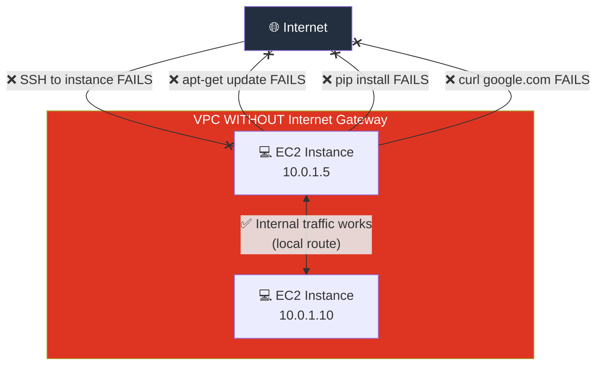
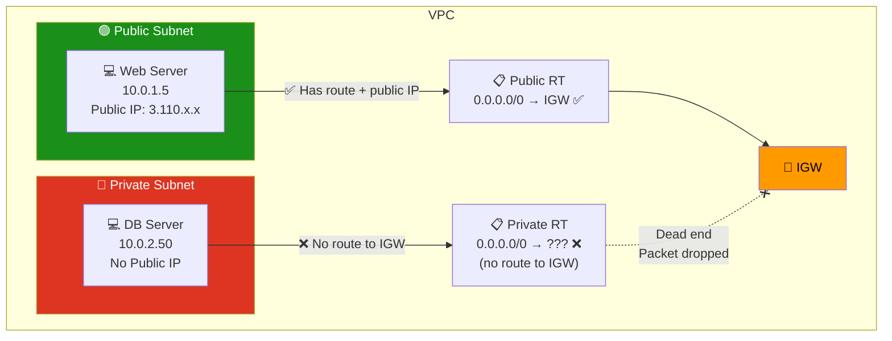
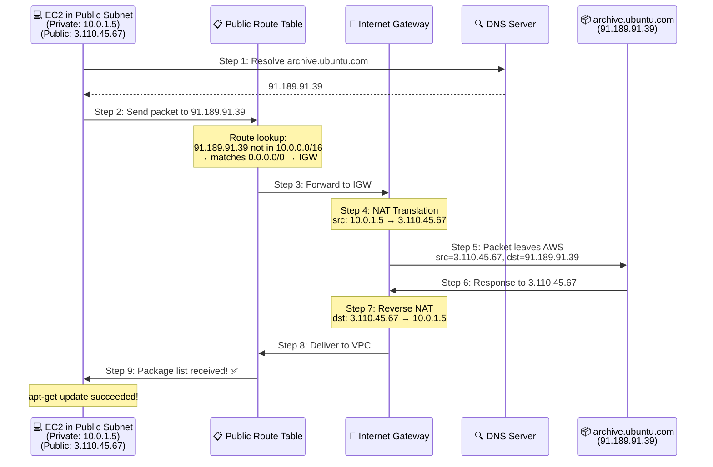
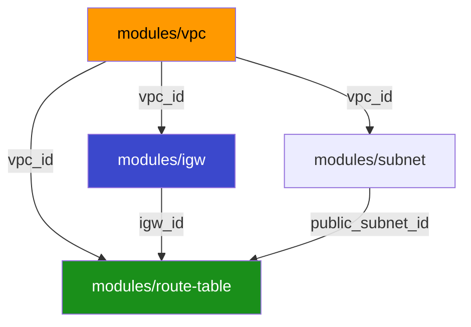
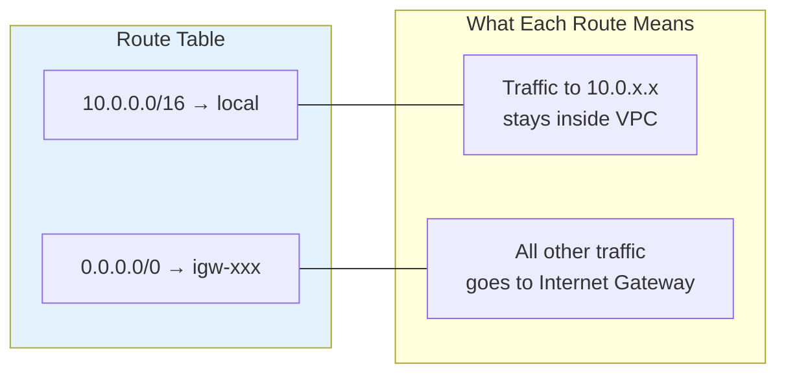

# 04 - Internet Gateway (IGW)

## What is an Internet Gateway?

An **Internet Gateway (IGW)** is an AWS-managed, horizontally scaled, redundant component that allows **bidirectional** communication between your VPC and the internet.

> **Simple analogy:** The IGW is the front door of your VPC. Without it, nothing inside the VPC can talk to the internet, and nobody from the internet can reach resources inside.

---

## Architecture



---

## How Does IGW Work? (Step by Step)

### The NAT Translation Process

The IGW performs **1:1 Network Address Translation (NAT)** — it translates between public IPs and private IPs.



### What Happens Inside the Route Table

Every VPC has a **main route table** with a default local route. You add an IGW route for internet access:



---

## What Makes a Subnet "Public"?

A subnet is public **only when ALL 5 conditions are met**:



> **Common mistake:** Setting `map_public_ip_on_launch = true` on a subnet does NOT make it public. Without the IGW route, the public IP is useless.

---

## IGW Properties

| Property | Detail |
|----------|--------|
| **Cost** | **FREE** — no hourly or data transfer charges |
| **Availability** | Highly available, redundant, AWS managed |
| **Bandwidth** | No bandwidth constraints |
| **Limit** | **1 IGW per VPC** (hard limit) |
| **Direction** | Bidirectional (inbound + outbound) |
| **NAT** | 1:1 NAT for instances with public IPv4 |
| **IPv6** | Supports IPv6 natively (no NAT needed) |
| **Scaling** | Horizontally auto-scales, no management needed |

---

## Why Do We Need an Internet Gateway?

Without an IGW, your VPC is a **completely isolated network**. Think of it like building a house with no doors — you have rooms (subnets) and hallways (route tables), but nothing connects to the outside world.

### What Happens Without an IGW?



**Without IGW, you CANNOT:**
- SSH into any instance (even with a public IP)
- Run `apt-get update`, `yum install`, or `pip install` on any instance
- Access any external API, download any file, or reach any website
- Pull Docker images from Docker Hub or ECR public

**Without IGW, you CAN still:**
- Communicate between instances inside the same VPC (local route always works)
- Access AWS services via VPC Endpoints (private links, no internet needed)
- Connect to on-premises networks via VPN or Direct Connect

---

## Can a Private Subnet Instance Use the IGW Directly?

**NO.** This is a critical concept. Even though the IGW is attached to the VPC, a private subnet instance **cannot** use it because:



### Two reasons private instances can't use IGW:

| # | Reason | Explanation |
|---|--------|-------------|
| 1 | **No route** | The private subnet's route table has no `0.0.0.0/0 → igw` entry. Outbound packets have nowhere to go. |
| 2 | **No public IP** | Even if you added an IGW route, the IGW performs 1:1 NAT. It needs a public IP mapped to the private IP. Private instances typically have no public IP. |

> **So how does a private instance reach the internet?** That's exactly what a **NAT Gateway** solves — see [05-nat-gateway](../05-nat-gateway/).

---

## Real-World Traffic Example: Public Instance Downloading Software

When an EC2 instance in a **public subnet** runs `sudo apt-get update`, here's the full journey:



---

## Module Dependencies



---

## File Structure

```
04-internet-gateway/
├── README.md                    ← You are here
├── modules/
│   ├── vpc/
│   │   ├── main.tf
│   │   ├── variables.tf
│   │   └── outputs.tf
│   ├── subnet/
│   │   ├── main.tf
│   │   ├── variables.tf
│   │   └── outputs.tf
│   ├── igw/
│   │   ├── main.tf              ← Internet Gateway resource
│   │   ├── variables.tf
│   │   └── outputs.tf
│   └── route-table/
│       ├── main.tf              ← Route table + association
│       ├── variables.tf
│       └── outputs.tf
└── terraform/
    ├── main.tf
    ├── variables.tf
    ├── outputs.tf
    ├── providers.tf
    └── terraform.tfvars.example
```

---

## Route Table Deep Dive

### What is a Route Table?

A route table contains **rules (routes)** that determine where network traffic is directed.



### Route Priority (Most Specific Wins)

```
Route Table:
  10.0.0.0/16  → local
  10.0.1.0/24  → nat-gateway-xxx
  0.0.0.0/0    → igw-xxx

Packet destination: 10.0.1.50
  ✅ Matches 10.0.1.0/24 (most specific = /24)
  ✅ Matches 10.0.0.0/16
  ✅ Matches 0.0.0.0/0
  ➡️ Winner: 10.0.1.0/24 → nat-gateway-xxx
```

---

## Usage

```bash
cd terraform/
cp terraform.tfvars.example terraform.tfvars
terraform init
terraform plan
terraform apply
```

After apply, your public subnet will have internet access through the IGW.

---

## What's Next?

➡️ [05-nat-gateway](../05-nat-gateway/) — Enable internet access for private subnets using a NAT Gateway.
