# 04 - Internet Gateway (IGW)

## What is an Internet Gateway?

An **Internet Gateway (IGW)** is an AWS-managed, horizontally scaled, redundant component that allows **bidirectional** communication between your VPC and the internet.

> **Simple analogy:** The IGW is the front door of your VPC. Without it, nothing inside the VPC can talk to the internet, and nobody from the internet can reach resources inside.

---

## Architecture

```mermaid
graph TB
    Internet["🌐 Internet"]

    subgraph AWS["☁️ AWS Cloud"]
        subgraph VPC["🏗️ VPC (10.0.0.0/16)"]
            IGW["🚪 Internet Gateway<br/>━━━━━━━━━━━━━━━━━━━<br/>• AWS Managed<br/>• Horizontally Scaled<br/>• Redundant & HA<br/>• No bandwidth limit<br/>• FREE (no hourly charge)"]

            subgraph AZ_A["📍 AZ: ap-south-2a"]
                PubSub["🟢 Public Subnet<br/>10.0.1.0/24"]
            end

            subgraph AZ_B["📍 AZ: ap-south-2b"]
                PrivSub["🔴 Private Subnet<br/>10.0.2.0/24"]
            end

            PubRT["📋 Public Route Table<br/>10.0.0.0/16 → local<br/>0.0.0.0/0 → IGW ✅"]
        end
    end

    Internet <-->|"Bidirectional<br/>Traffic"| IGW
    IGW --> PubRT
    PubRT -->|"Associated"| PubSub
    PrivSub -.->|"❌ No route to IGW"| IGW

    style IGW fill:#ff9900,color:#000
    style VPC fill:#232f3e,color:#fff
    style PubSub fill:#1a8f1a,color:#fff
    style PrivSub fill:#dd3522,color:#fff
```



---

## How Does IGW Work? (Step by Step)

### The NAT Translation Process

The IGW performs **1:1 Network Address Translation (NAT)** — it translates between public IPs and private IPs.

```mermaid
sequenceDiagram
    participant User as 🌐 Internet User
    participant IGW as 🚪 Internet Gateway
    participant RT as 📋 Route Table
    participant EC2 as 💻 EC2<br/>(Private: 10.0.1.5<br/>Public: 3.110.45.67)

    Note over User,EC2: === INBOUND TRAFFIC ===

    User->>IGW: ① Request to 3.110.45.67
    Note over IGW: ② NAT: Translate destination<br/>3.110.45.67 → 10.0.1.5
    IGW->>RT: ③ Where is 10.0.1.5?
    RT->>EC2: ④ Route to subnet (10.0.0.0/16 → local)

    Note over User,EC2: === OUTBOUND TRAFFIC ===

    EC2->>RT: ⑤ Response from 10.0.1.5
    RT->>IGW: ⑥ Route: 0.0.0.0/0 → IGW
    Note over IGW: ⑦ NAT: Translate source<br/>10.0.1.5 → 3.110.45.67
    IGW->>User: ⑧ Response from 3.110.45.67
```



### What Happens Inside the Route Table

Every VPC has a **main route table** with a default local route. You add an IGW route for internet access:

```mermaid
graph TD
    subgraph RT["📋 Public Route Table"]
        R1["Destination: 10.0.0.0/16<br/>Target: local<br/>━━━━━━━━━━━━━━━━━━━━━<br/>Traffic within VPC stays local"]
        R2["Destination: 0.0.0.0/0<br/>Target: igw-xxxxxxxx<br/>━━━━━━━━━━━━━━━━━━━━━<br/>Everything else → Internet Gateway"]
    end

    Packet["📦 Packet to 8.8.8.8"] --> R1
    R1 -->|"❌ No match<br/>(8.8.8.8 not in 10.0.0.0/16)"| R2
    R2 -->|"✅ Match!<br/>(0.0.0.0/0 = everything)"| IGW2["🚪 IGW"]

    style RT fill:#e3f2fd
    style IGW2 fill:#ff9900,color:#000
```



---

## What Makes a Subnet "Public"?

A subnet is public **only when ALL 5 conditions are met**:

```mermaid
graph TD
    Q["Is my subnet public?"]
    Q --> C1{"① IGW attached<br/>to VPC?"}
    C1 -->|No| FAIL["❌ NOT Public"]
    C1 -->|Yes| C2{"② Route table has<br/>0.0.0.0/0 → IGW?"}
    C2 -->|No| FAIL
    C2 -->|Yes| C3{"③ Route table<br/>associated with subnet?"}
    C3 -->|No| FAIL
    C3 -->|Yes| C4{"④ Instance has<br/>public or Elastic IP?"}
    C4 -->|No| FAIL
    C4 -->|Yes| C5{"⑤ Security Group<br/>allows traffic?"}
    C5 -->|No| FAIL
    C5 -->|Yes| SUCCESS["✅ PUBLIC - Internet Accessible!"]

    style Q fill:#ff9900,color:#000
    style SUCCESS fill:#1a8f1a,color:#fff
    style FAIL fill:#dd3522,color:#fff
```



> **Common mistake:** Setting `map_public_ip_on_launch = true` on a subnet does NOT make it public. Without the IGW route, the public IP is useless.

---

## IGW Properties

| Property | Detail |
|----------|--------|
| **Cost** | **FREE** — no hourly or data transfer charges |
| **Availability** | Highly available, redundant, AWS managed |
| **Bandwidth** | No bandwidth constraints |
| **Limit** | **1 IGW per VPC** (hard limit) |
| **Direction** | Bidirectional (inbound + outbound) |
| **NAT** | 1:1 NAT for instances with public IPv4 |
| **IPv6** | Supports IPv6 natively (no NAT needed) |
| **Scaling** | Horizontally auto-scales, no management needed |

---

## Module Dependencies


---

## File Structure

```
04-internet-gateway/
├── README.md                    ← You are here
├── modules/
│   ├── vpc/
│   │   ├── main.tf
│   │   ├── variables.tf
│   │   └── outputs.tf
│   ├── subnet/
│   │   ├── main.tf
│   │   ├── variables.tf
│   │   └── outputs.tf
│   ├── igw/
│   │   ├── main.tf              ← Internet Gateway resource
│   │   ├── variables.tf
│   │   └── outputs.tf
│   └── route-table/
│       ├── main.tf              ← Route table + association
│       ├── variables.tf
│       └── outputs.tf
└── terraform/
    ├── main.tf
    ├── variables.tf
    ├── outputs.tf
    ├── providers.tf
    └── terraform.tfvars.example
```

---

## Route Table Deep Dive

### What is a Route Table?

A route table contains **rules (routes)** that determine where network traffic is directed.

```mermaid
graph LR
    subgraph RT["Route Table"]
        direction TB
        R1["10.0.0.0/16 → local"]
        R2["0.0.0.0/0 → igw-xxx"]
    end

    subgraph Meaning["What Each Route Means"]
        M1["Traffic to 10.0.x.x<br/>stays inside VPC"]
        M2["All other traffic<br/>goes to Internet Gateway"]
    end

    R1 --- M1
    R2 --- M2

    style RT fill:#e3f2fd
```



### Route Priority (Most Specific Wins)

```
Route Table:
  10.0.0.0/16  → local
  10.0.1.0/24  → nat-gateway-xxx
  0.0.0.0/0    → igw-xxx

Packet destination: 10.0.1.50
  ✅ Matches 10.0.1.0/24 (most specific = /24)
  ✅ Matches 10.0.0.0/16
  ✅ Matches 0.0.0.0/0
  ➡️ Winner: 10.0.1.0/24 → nat-gateway-xxx
```

---

## Usage

```bash
cd terraform/
cp terraform.tfvars.example terraform.tfvars
terraform init
terraform plan
terraform apply
```

After apply, your public subnet will have internet access through the IGW.

---

## What's Next?

➡️ [05-nat-gateway](../05-nat-gateway/) — Enable internet access for private subnets using a NAT Gateway.
