# 05 - NAT Gateway

## What is a NAT Gateway?

A **NAT (Network Address Translation) Gateway** enables instances in a **private subnet** to initiate **outbound** connections to the internet (e.g., software updates, API calls) while **blocking all inbound** connections from the internet.

> **Simple analogy:** NAT Gateway is like a proxy. Private instances send requests through it. The internet sees the NAT Gateway's IP, never the private instance's IP. Replies come back through the NAT, but nobody can initiate a connection TO the private instance.

---

## Architecture

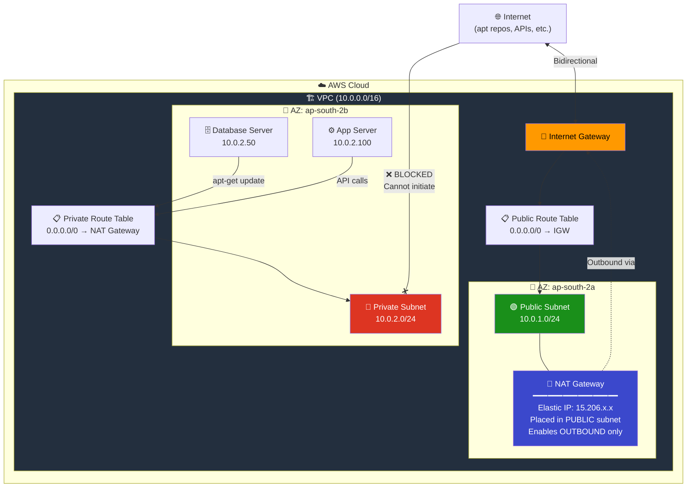

---

## How NAT Gateway Works (Step by Step)

### Complete Traffic Flow

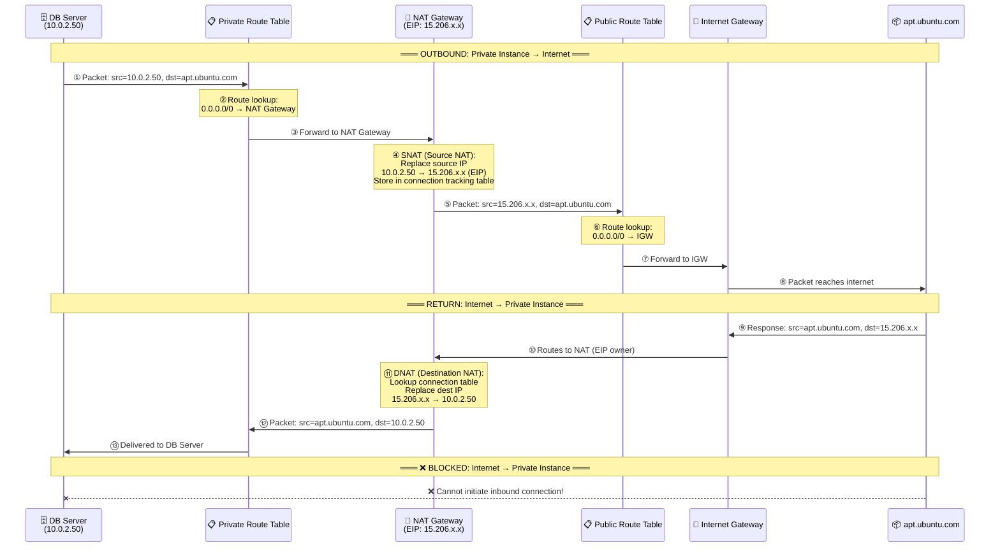

### SNAT vs DNAT Explained

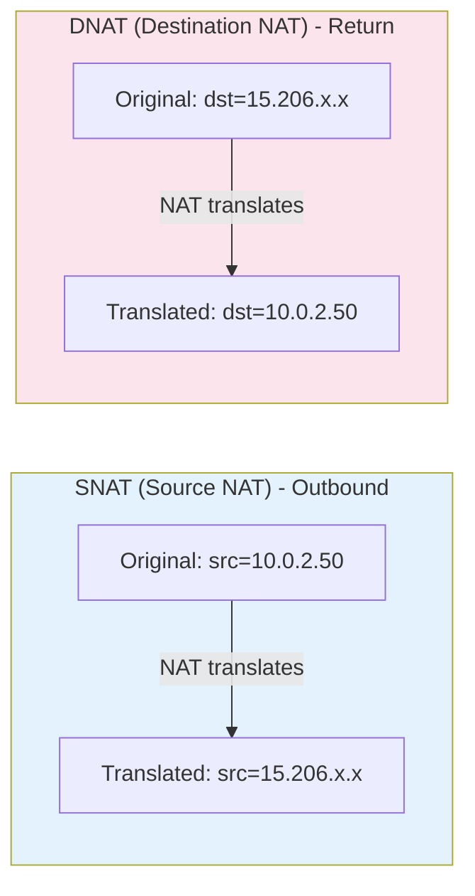

---

## Real-World Example: How a Private Server Downloads Software

This is the most common question: **"If my server is in a private subnet with no public IP, how can it run `apt-get update` or `pip install`?"**

The answer: **Through the NAT Gateway.** Let's trace the full journey.

### Scenario: Database Server Needs Security Patches

Your database server (`10.0.2.50`) is in a private subnet. It needs to run `sudo apt-get update && sudo apt-get upgrade` to install critical security patches.

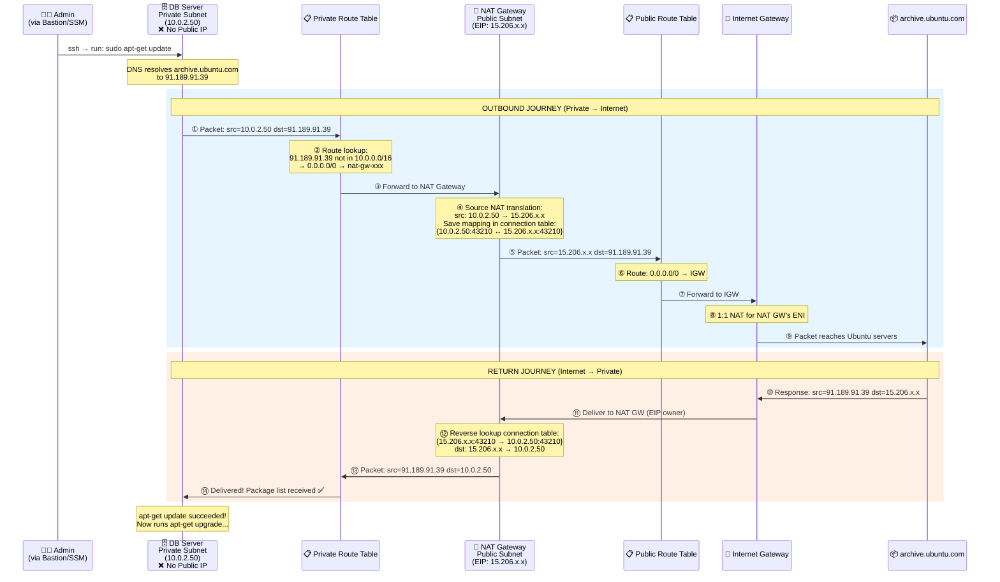

### The Key Insight: 4 IP Translations in One Request

A single `apt-get update` packet goes through **4 address translations**:

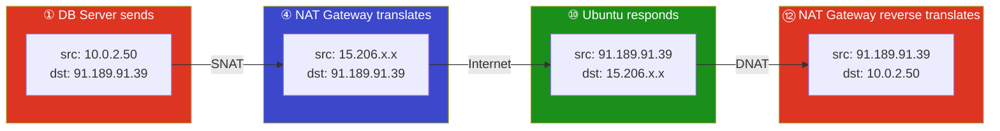

> **The internet (Ubuntu servers) never sees `10.0.2.50`.** It only communicates with `15.206.x.x` (the NAT Gateway's Elastic IP). This is why private instances are protected — they are invisible to the internet.

### What Commands Work Through NAT Gateway?

| Command | What It Does | Works via NAT? |
|---------|-------------|----------------|
| `apt-get update` | Downloads package lists from Ubuntu repos | ✅ Yes |
| `apt-get install nginx` | Downloads & installs nginx package | ✅ Yes |
| `yum update` | Updates packages on Amazon Linux/CentOS | ✅ Yes |
| `pip install boto3` | Installs Python packages from PyPI | ✅ Yes |
| `npm install express` | Installs Node.js packages from npm | ✅ Yes |
| `curl https://api.example.com` | Makes HTTP request to external API | ✅ Yes |
| `docker pull nginx` | Pulls container image from Docker Hub | ✅ Yes |
| `git clone https://...` | Clones a repository from GitHub/GitLab | ✅ Yes |
| `wget https://...` | Downloads files from the internet | ✅ Yes |
| Someone SSH into DB | Inbound connection from internet | ❌ **BLOCKED** |
| Port scan from internet | Scanning private instance ports | ❌ **BLOCKED** |

### What If There Is No NAT Gateway?

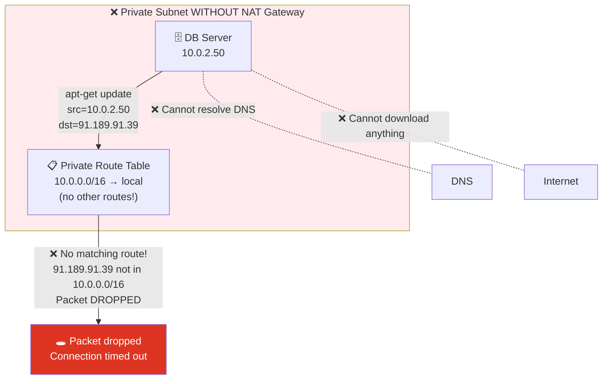

Without a NAT Gateway (and no other internet path):
- `apt-get update` → **hangs, then timeout** (no route for the packet)
- `pip install` → **fails** with connection error
- `curl` → **fails** with "Could not resolve host" or connection timeout
- The instance is **completely isolated** from the internet
- It can still talk to other instances in the VPC via the `local` route

---

## The Complete Network Path — Everything Connected

Here's how IGW and NAT Gateway work **together** to serve both public and private subnets:

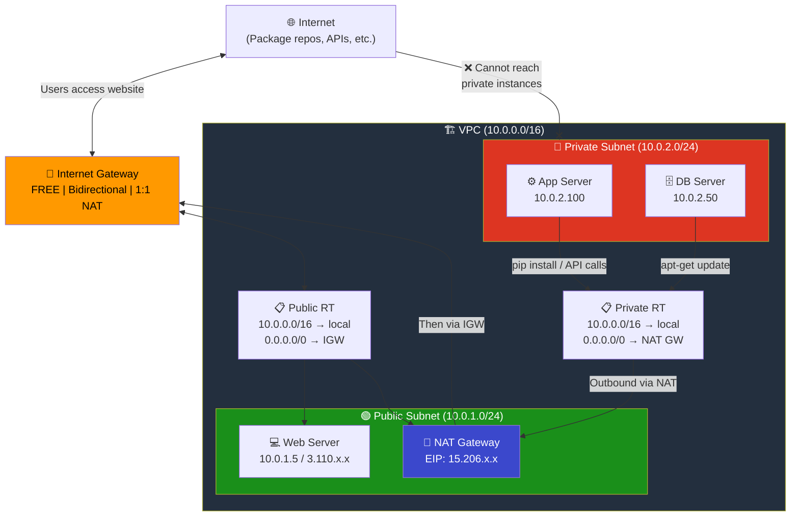

**Summary of the path for a private instance to download software:**

```
Private Instance → Private Route Table → NAT Gateway → Public Route Table → IGW → Internet
     (10.0.2.50)    (0.0.0.0/0→NAT)     (SNAT to EIP)   (0.0.0.0/0→IGW)   (to world)
```

---

## NAT Gateway vs NAT Instance

| Feature | NAT Gateway | NAT Instance |
|---------|------------|--------------|
| **Managed by** | AWS (fully managed) | You (self-managed EC2) |
| **Availability** | HA within an AZ | Single instance (SPOF) |
| **Bandwidth** | 5-100 Gbps (auto-scales) | Depends on instance type |
| **Cost** | ~$0.045/hr + $0.045/GB | Instance cost only |
| **Maintenance** | None | Patching, monitoring, etc. |
| **Security Group** | Cannot associate | Can associate |
| **Use as bastion** | No | Yes |
| **Recommendation** | ✅ **Use this** | Legacy (avoid) |

---

## Elastic IP (EIP) — Why NAT Needs It

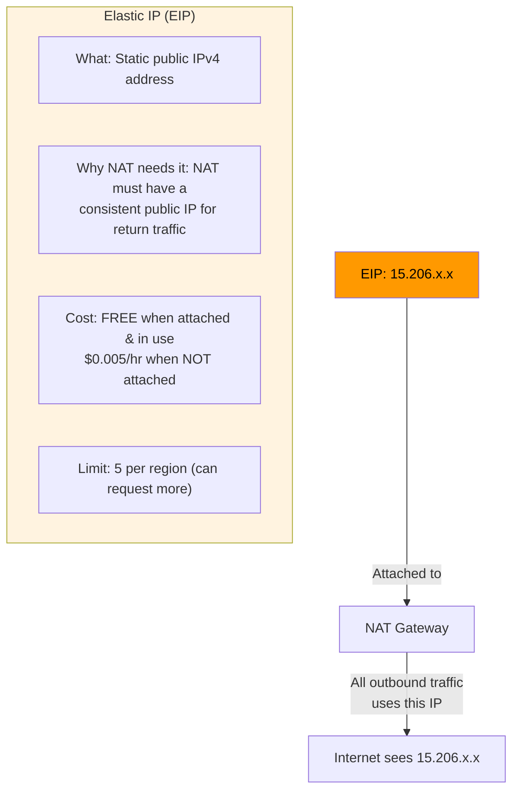

---

## Key Rule: NAT Gateway Goes in PUBLIC Subnet

This is the most common mistake. The NAT Gateway MUST be in a **public subnet** because:

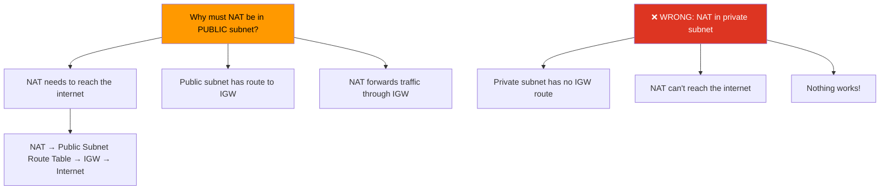

---

## NAT Gateway Properties

| Property | Detail |
|----------|--------|
| **Cost** | **~$0.045/hr** (~$33/month) + **$0.045/GB** data processed |
| **Requires** | Elastic IP + placement in a **public** subnet |
| **Direction** | **Outbound only** (no inbound initiation) |
| **Bandwidth** | 5 Gbps, auto-scales to 100 Gbps |
| **Connections** | 55,000 simultaneous per destination |
| **Protocols** | TCP, UDP, ICMP |
| **Availability** | AZ-scoped — deploy one per AZ for HA |
| **IPv6** | Not needed (use Egress-Only IGW instead) |

### Cost Example

```
Monthly cost (NAT Gateway):
━━━━━━━━━━━━━━━━━━━━━━━━━━━━━━━━━━
Hourly:     $0.045 × 730 hrs = $32.85
Data (50GB): $0.045 × 50 GB  = $2.25
EIP:         FREE (attached)
━━━━━━━━━━━━━━━━━━━━━━━━━━━━━━━━━━
Total:                        ≈ $35.10/month
```

---

## High Availability Setup

If an AZ goes down, its NAT Gateway goes down too. Deploy one per AZ:

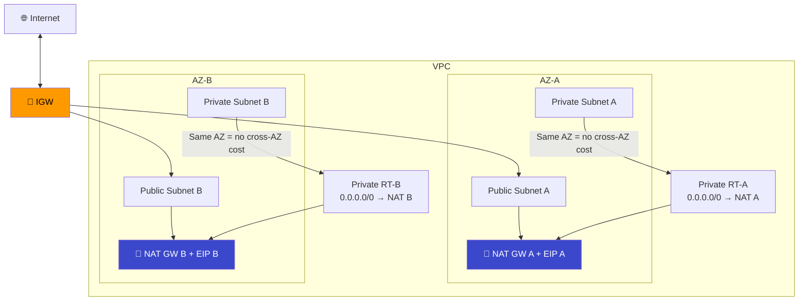

> **Cost tip:** Cross-AZ data transfer costs $0.01/GB. Keeping NAT in the same AZ as private subnets avoids this.

---

## IGW vs NAT Gateway Comparison

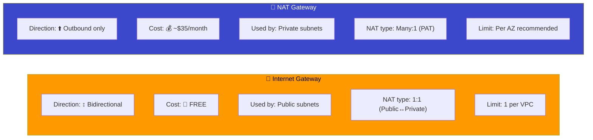

### When to Use What?

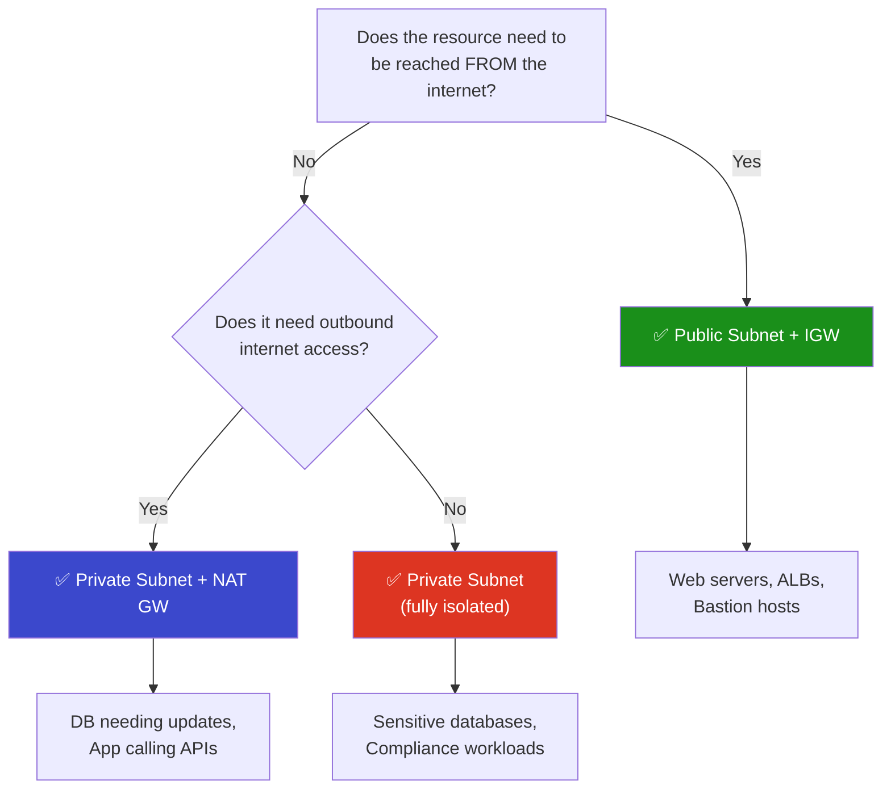

---

## Module Dependencies

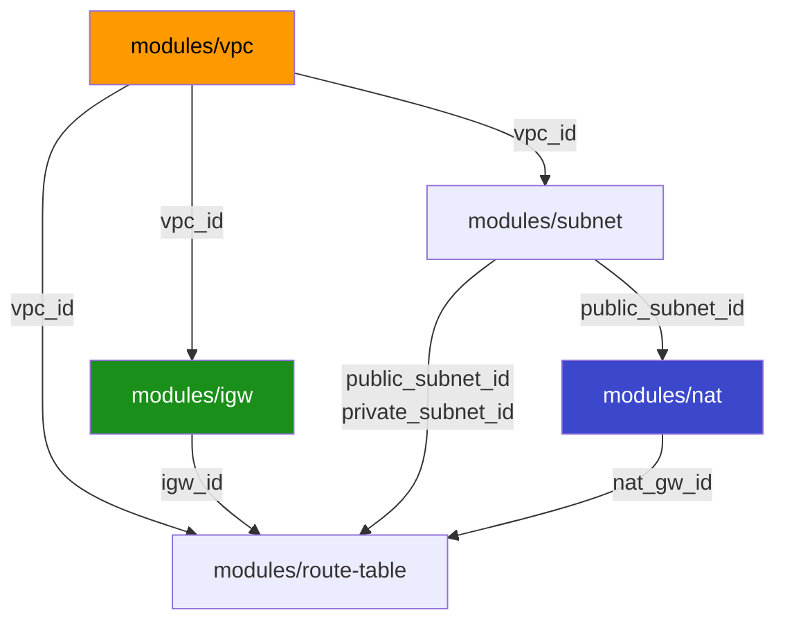

---

## File Structure

```
05-nat-gateway/
├── README.md                    ← You are here
├── modules/
│   ├── vpc/
│   │   ├── main.tf
│   │   ├── variables.tf
│   │   └── outputs.tf
│   ├── subnet/
│   │   ├── main.tf
│   │   ├── variables.tf
│   │   └── outputs.tf
│   ├── igw/
│   │   ├── main.tf
│   │   ├── variables.tf
│   │   └── outputs.tf
│   ├── nat/
│   │   ├── main.tf              ← EIP + NAT Gateway
│   │   ├── variables.tf
│   │   └── outputs.tf
│   └── route-table/
│       ├── main.tf              ← Public RT + Private RT + Associations
│       ├── variables.tf
│       └── outputs.tf
└── terraform/
    ├── main.tf
    ├── variables.tf
    ├── outputs.tf
    ├── providers.tf
    └── terraform.tfvars.example
```

---

## Usage

```bash
cd terraform/
cp terraform.tfvars.example terraform.tfvars
terraform init
terraform plan
terraform apply
```

> **Warning:** NAT Gateway costs ~$0.045/hr. Remember to `terraform destroy` when done testing!

---

## What's Next?

➡️ [06-security-groups](../06-security-groups/) — Control inbound and outbound traffic to your resources with Security Groups.
