# 05 - NAT Gateway

## What is a NAT Gateway?

A **NAT (Network Address Translation) Gateway** enables instances in a **private subnet** to initiate **outbound** connections to the internet (e.g., software updates, API calls) while **blocking all inbound** connections from the internet.

---

## The Problem: Why Can't Private Instances Reach the Internet Directly?

To understand NAT, you first need to understand **why a private instance can't just talk to the internet on its own**.

### Private IPs Are Not Routable on the Internet

The internet only understands **public IP addresses**. Private IPs like `10.x.x.x`, `172.16.x.x`, `192.168.x.x` are reserved for internal use — **no router on the internet will forward packets with these source addresses.**

```mermaid
graph LR
    subgraph Your_VPC["Your VPC"]
        DB["🗄️ DB Server\n10.0.2.50\n(Private IP only)"]
    end

    subgraph Internet_Routers["🌐 Internet Routers"]
        R1["Router 1"]
        R2["Router 2"]
        R3["Router 3"]
    end

    Ubuntu["📦 Ubuntu Servers\n91.189.91.39"]

    DB -->|"Packet: src=10.0.2.50\ndst=91.189.91.39"| R1
    R1 -->|"❌ DROP!\nsrc 10.0.2.50 is private\nI don't know how to\nroute reply back"| R2
    R2 -.-x R3
    R3 -.-x Ubuntu

    style DB fill:#dd3522,color:#fff
    style R1 fill:#ff9900,color:#000
```

**Even if the packet somehow reached Ubuntu's servers, the reply would go to `10.0.2.50` — but the internet has no idea where `10.0.2.50` is!** Millions of private networks use `10.0.2.50` internally. The internet can't route to it.

### The Solution: Someone with a Public IP Must Speak on Behalf of the Private Instance

That "someone" is the **NAT Gateway**. It has a **public IP (Elastic IP)** that the internet CAN route to.

---

## The NAT Gateway Analogy: The Post Office Box

Imagine you live in a gated community (private subnet) with no street address visible from outside. You want to order something online, but the delivery truck can't find your house.

```mermaid
graph TB
    subgraph Gated_Community["🏘️ Gated Community (Private Subnet)\nNo street address visible from outside"]
        You["🏠 You (DB Server)\nInternal address: House #50\n(10.0.2.50)"]
    end

    subgraph Post_Office["📮 Post Office Box (NAT Gateway)\nLocated OUTSIDE the gate\nPublic address: PO Box 206\n(EIP: 15.206.x.x)"]
        PO["📬 PO Box 206"]
    end

    subgraph Outside["🌐 Online Store (Internet)"]
        Store["📦 Amazon / Ubuntu Repos"]
    end

    You -->|"① You drop your letter at the PO Box\n(packet goes to NAT)"| PO
    PO -->|"② PO Box sends with return address: PO Box 206\n(NAT replaces your IP with EIP)"| Store
    Store -->|"③ Store ships to PO Box 206\n(reply goes to NAT's EIP)"| PO
    PO -->|"④ Post office delivers to House #50\n(NAT puts your IP back)"| You

    Store --x|"❌ Store doesn't know House #50 exists\nCan't deliver directly"| You

    style Gated_Community fill:#dd3522,color:#fff
    style Post_Office fill:#3b48cc,color:#fff
    style Outside fill:#1a8f1a,color:#fff
```

| Analogy | AWS Equivalent |
|---------|----------------|
| Gated community | Private subnet |
| Your house (House #50) | EC2 instance (10.0.2.50) |
| PO Box outside the gate | NAT Gateway in public subnet |
| PO Box address (PO Box 206) | Elastic IP (15.206.x.x) |
| Delivery truck | Internet traffic |
| Gate security | Route table + Security Group |
| You can send mail OUT | ✅ Outbound internet works |
| Nobody can visit your house | ❌ Inbound from internet blocked |

---

## How a Private Machine Reaches the Internet (The Full Picture)

Here's the **complete path** when a database server in a private subnet runs `sudo apt-get update`:

```mermaid
graph TB
    subgraph VPC["🏗️ VPC (10.0.0.0/16)"]
        subgraph Private["🔴 Private Subnet (10.0.2.0/24)"]
            DB["🗄️ DB Server\nIP: 10.0.2.50\n❌ No public IP\n❌ No direct internet"]
        end

        PrivRT["📋 Private Route Table\n━━━━━━━━━━━━━━━━━━━━━━━━\n10.0.0.0/16 → local\n0.0.0.0/0 → nat-gw-xxx ← this is the key!"]

        subgraph Public["🟢 Public Subnet (10.0.1.0/24)"]
            NAT["🔄 NAT Gateway\nPrivate IP: 10.0.1.100\nElastic IP: 15.206.x.x\n━━━━━━━━━━━━━━━━━━━━━━━━\n① Receives packet from DB\n② Replaces src IP with EIP\n③ Remembers the mapping\n④ Forwards to internet"]
        end

        PubRT["📋 Public Route Table\n━━━━━━━━━━━━━━━━━━━━━━━━\n10.0.0.0/16 → local\n0.0.0.0/0 → igw-xxx"]

        IGW["🚪 Internet Gateway\n━━━━━━━━━━━━━━━━━━━━━━━━\nBridge between VPC and Internet\nFREE | AWS Managed"]
    end

    Internet["🌐 Internet\n(apt repos, PyPI, npm, Docker Hub, GitHub...)"]

    DB -->|"Step 1️⃣\napt-get update\nsrc=10.0.2.50"| PrivRT
    PrivRT -->|"Step 2️⃣\n0.0.0.0/0 → NAT GW"| NAT
    NAT -->|"Step 3️⃣\nsrc changed to 15.206.x.x"| PubRT
    PubRT -->|"Step 4️⃣\n0.0.0.0/0 → IGW"| IGW
    IGW -->|"Step 5️⃣\nPacket exits AWS"| Internet

    Internet -->|"Step 6️⃣\nReply to 15.206.x.x"| IGW
    IGW -->|"Step 7️⃣\nDeliver to NAT (EIP owner)"| NAT
    NAT -->|"Step 8️⃣\ndst changed back to 10.0.2.50"| PrivRT
    PrivRT -->|"Step 9️⃣\nDeliver to DB server"| DB

    style DB fill:#dd3522,color:#fff
    style Private fill:#ffcdd2
    style NAT fill:#3b48cc,color:#fff
    style Public fill:#c8e6c9
    style IGW fill:#ff9900,color:#000
    style Internet fill:#232f3e,color:#fff
    style PrivRT fill:#e3f2fd
    style PubRT fill:#e3f2fd
```

### Breaking Down Each Step

| Step | Where | What Happens | Packet Source → Dest |
|------|-------|-------------|---------------------|
| 1️⃣ | DB Server | App runs `apt-get update`, OS creates packet | `10.0.2.50 → 91.189.91.39` |
| 2️⃣ | Private Route Table | Looks up route: `91.189.91.39` matches `0.0.0.0/0 → NAT GW` | `10.0.2.50 → 91.189.91.39` |
| 3️⃣ | NAT Gateway | **SNAT**: replaces source with Elastic IP, saves mapping | `15.206.x.x → 91.189.91.39` |
| 4️⃣ | Public Route Table | Looks up route: `91.189.91.39` matches `0.0.0.0/0 → IGW` | `15.206.x.x → 91.189.91.39` |
| 5️⃣ | Internet Gateway | Sends packet to the internet | `15.206.x.x → 91.189.91.39` |
| 6️⃣ | Ubuntu Server | Sends response back to the EIP | `91.189.91.39 → 15.206.x.x` |
| 7️⃣ | Internet Gateway | Routes to NAT GW (it owns the EIP) | `91.189.91.39 → 15.206.x.x` |
| 8️⃣ | NAT Gateway | **DNAT**: looks up mapping, restores original dest IP | `91.189.91.39 → 10.0.2.50` |
| 9️⃣ | Private Route Table | `10.0.2.50` matches `10.0.0.0/16 → local`, delivers | `91.189.91.39 → 10.0.2.50` |

> **Key takeaway:** The DB server's private IP (`10.0.2.50`) **never leaves the VPC**. The internet only ever sees the NAT Gateway's Elastic IP (`15.206.x.x`).

---

## NAT Connection Tracking Table (How NAT Remembers)

The NAT Gateway maintains an internal **connection tracking table** — this is how it knows which return packets belong to which private instance.

```mermaid
graph TD
    subgraph NAT_Table["🔄 NAT Gateway — Connection Tracking Table"]
        direction TB
        Header["Internal IP:Port ↔ External IP:Port | Destination | Status"]
        Row1["10.0.2.50:43210 ↔ 15.206.x.x:43210 | apt.ubuntu.com:443 | ACTIVE"]
        Row2["10.0.2.100:51234 ↔ 15.206.x.x:51234 | api.github.com:443 | ACTIVE"]
        Row3["10.0.2.100:49876 ↔ 15.206.x.x:49876 | pypi.org:443 | ACTIVE"]
        Row4["10.0.2.75:60001 ↔ 15.206.x.x:60001 | registry.npmjs.org:443 | IDLE"]
    end

    DB2["🗄️ DB Server\n10.0.2.50"] -->|"Creates Row 1"| NAT_Table
    App2["⚙️ App Server\n10.0.2.100"] -->|"Creates Rows 2 & 3"| NAT_Table
    Worker["🔧 Worker\n10.0.2.75"] -->|"Creates Row 4"| NAT_Table

    NAT_Table -->|"All outbound traffic\nappears as 15.206.x.x"| Internet3["🌐 Internet"]
    Internet3 -->|"Return traffic to\n15.206.x.x:43210"| NAT_Table
    NAT_Table -->|"Lookup: 43210 → 10.0.2.50\nDeliver to DB Server"| DB2

    style NAT_Table fill:#e8eaf6
    style DB2 fill:#dd3522,color:#fff
    style App2 fill:#ff9900,color:#000
    style Worker fill:#1a8f1a,color:#fff
```

**How multiple private instances share ONE public IP:**

1. **DB Server** (`10.0.2.50`) sends a packet using source port `43210`
2. **App Server** (`10.0.2.100`) sends a packet using source port `51234`
3. Both packets leave the NAT Gateway as `15.206.x.x` but with **different ports**
4. When replies come back, NAT checks the **port number** to figure out which internal server to deliver to
5. This is called **PAT (Port Address Translation)** — many private IPs share one public IP using different ports

> **Capacity:** A single NAT Gateway supports up to **55,000 simultaneous connections** to each unique destination. If you need more, use multiple NAT Gateways.

---

## Two Route Tables: The Core of Public vs Private

The **entire difference** between a public and private subnet comes down to **one line in the route table**:

```mermaid
graph TB
    subgraph VPC_RT["VPC (10.0.0.0/16)"]
        subgraph PubRT2["📋 PUBLIC Subnet Route Table"]
            PR1["10.0.0.0/16 → local (same in both)"]
            PR2["0.0.0.0/0 → igw-xxx\n━━━━━━━━━━━━━━━━━━━━━━━━\n↑ THIS makes it PUBLIC\nTraffic goes directly to Internet Gateway\n= Bidirectional internet access"]
        end

        subgraph PrivRT2["📋 PRIVATE Subnet Route Table"]
            PP1["10.0.0.0/16 → local (same in both)"]
            PP2["0.0.0.0/0 → nat-gw-xxx\n━━━━━━━━━━━━━━━━━━━━━━━━\n↑ THIS makes it PRIVATE\nTraffic goes through NAT Gateway first\n= Outbound only internet access"]
        end
    end

    PubRT2 -->|"Associated with"| PubSub2["🟢 Public Subnet\nInstances CAN be reached from internet"]
    PrivRT2 -->|"Associated with"| PrivSub2["🔴 Private Subnet\nInstances CANNOT be reached from internet"]

    style PubRT2 fill:#c8e6c9
    style PrivRT2 fill:#ffcdd2
    style PubSub2 fill:#1a8f1a,color:#fff
    style PrivSub2 fill:#dd3522,color:#fff
```

| | Public Subnet RT | Private Subnet RT |
|--|-------------------|--------------------|
| **Default route** | `0.0.0.0/0 → IGW` | `0.0.0.0/0 → NAT GW` |
| **Outbound internet** | ✅ Direct via IGW | ✅ Via NAT → IGW |
| **Inbound from internet** | ✅ Allowed (if SG permits) | ❌ Blocked (NAT drops it) |
| **Instance needs public IP?** | ✅ Yes (for IGW's 1:1 NAT) | ❌ No (NAT provides one) |
| **Use case** | Web servers, load balancers | Databases, app backends |

---

## Architecture

```mermaid
graph TB
    Internet["🌐 Internet<br/>(apt repos, APIs, etc.)"]

    subgraph AWS["☁️ AWS Cloud"]
        subgraph VPC["🏗️ VPC (10.0.0.0/16)"]
            IGW["🚪 Internet Gateway"]

            subgraph AZ_A["📍 AZ: ap-south-2a"]
                PubSub["🟢 Public Subnet<br/>10.0.1.0/24"]
                NAT["🔄 NAT Gateway<br/>━━━━━━━━━━━━━━━━━<br/>Elastic IP: 15.206.x.x<br/>Placed in PUBLIC subnet<br/>Enables OUTBOUND only"]
            end

            subgraph AZ_B["📍 AZ: ap-south-2b"]
                PrivSub["🔴 Private Subnet<br/>10.0.2.0/24"]
                DB["🗄️ Database Server<br/>10.0.2.50"]
                App["⚙️ App Server<br/>10.0.2.100"]
            end

            PubRT["📋 Public Route Table<br/>0.0.0.0/0 → IGW"]
            PrivRT["📋 Private Route Table<br/>0.0.0.0/0 → NAT Gateway"]
        end
    end

    Internet <-->|"Bidirectional"| IGW
    IGW --> PubRT --> PubSub
    PubSub --- NAT
    NAT -.->|"Outbound via"| IGW
    PrivRT --> PrivSub
    DB -->|"apt-get update"| PrivRT
    App -->|"API calls"| PrivRT

    Internet --x|"❌ BLOCKED<br/>Cannot initiate"| PrivSub

    style IGW fill:#ff9900,color:#000
    style NAT fill:#3b48cc,color:#fff
    style PubSub fill:#1a8f1a,color:#fff
    style PrivSub fill:#dd3522,color:#fff
    style VPC fill:#232f3e,color:#fff
```

---

## How NAT Gateway Works (Step by Step)

### Complete Traffic Flow

```mermaid
sequenceDiagram
    participant DB as 🗄️ DB Server<br/>(10.0.2.50)
    participant PrivRT as 📋 Private Route Table
    participant NAT as 🔄 NAT Gateway<br/>(EIP: 15.206.x.x)
    participant PubRT as 📋 Public Route Table
    participant IGW as 🚪 Internet Gateway
    participant Apt as 📦 apt.ubuntu.com

    Note over DB,Apt: ═══ OUTBOUND: Private Instance → Internet ═══

    DB->>PrivRT: ① Packet: src=10.0.2.50, dst=apt.ubuntu.com
    Note over PrivRT: ② Route lookup:<br/>0.0.0.0/0 → NAT Gateway
    PrivRT->>NAT: ③ Forward to NAT Gateway

    Note over NAT: ④ SNAT (Source NAT):<br/>Replace source IP<br/>10.0.2.50 → 15.206.x.x (EIP)<br/>Store in connection tracking table

    NAT->>PubRT: ⑤ Packet: src=15.206.x.x, dst=apt.ubuntu.com
    Note over PubRT: ⑥ Route lookup:<br/>0.0.0.0/0 → IGW
    PubRT->>IGW: ⑦ Forward to IGW
    IGW->>Apt: ⑧ Packet reaches internet

    Note over DB,Apt: ═══ RETURN: Internet → Private Instance ═══

    Apt->>IGW: ⑨ Response: src=apt.ubuntu.com, dst=15.206.x.x
    IGW->>NAT: ⑩ Routes to NAT (EIP owner)

    Note over NAT: ⑪ DNAT (Destination NAT):<br/>Lookup connection table<br/>Replace dest IP<br/>15.206.x.x → 10.0.2.50

    NAT->>PrivRT: ⑫ Packet: src=apt.ubuntu.com, dst=10.0.2.50
    PrivRT->>DB: ⑬ Delivered to DB Server

    Note over DB,Apt: ═══ ❌ BLOCKED: Internet → Private Instance ═══
    Apt--xDB: ❌ Cannot initiate inbound connection!
```

### SNAT vs DNAT Explained


---

## Real-World Example: How a Private Server Downloads Software

This is the most common question: **"If my server is in a private subnet with no public IP, how can it run `apt-get update` or `pip install`?"**

The answer: **Through the NAT Gateway.** Let's trace the full journey.

### Scenario: Database Server Needs Security Patches

Your database server (`10.0.2.50`) is in a private subnet. It needs to run `sudo apt-get update && sudo apt-get upgrade` to install critical security patches.

```mermaid
sequenceDiagram
    participant Admin as 👨‍💻 Admin<br/>(via Bastion/SSM)
    participant DB as 🗄️ DB Server<br/>Private Subnet<br/>(10.0.2.50)<br/>❌ No Public IP
    participant PrivRT as 📋 Private Route Table
    participant NAT as 🔄 NAT Gateway<br/>Public Subnet<br/>(EIP: 15.206.x.x)
    participant PubRT as 📋 Public Route Table
    participant IGW as 🚪 Internet Gateway
    participant Apt as 📦 archive.ubuntu.com

    Admin->>DB: ssh → run: sudo apt-get update

    Note over DB: DNS resolves archive.ubuntu.com<br/>to 91.189.91.39

    rect rgb(230, 245, 255)
    Note over DB,Apt: OUTBOUND JOURNEY (Private → Internet)
    DB->>PrivRT: ① Packet: src=10.0.2.50 dst=91.189.91.39
    Note over PrivRT: ② Route lookup:<br/>91.189.91.39 not in 10.0.0.0/16<br/>→ 0.0.0.0/0 → nat-gw-xxx
    PrivRT->>NAT: ③ Forward to NAT Gateway
    Note over NAT: ④ Source NAT translation:<br/>src: 10.0.2.50 → 15.206.x.x<br/>Save mapping in connection table:<br/>{10.0.2.50:43210 ↔ 15.206.x.x:43210}
    NAT->>PubRT: ⑤ Packet: src=15.206.x.x dst=91.189.91.39
    Note over PubRT: ⑥ Route: 0.0.0.0/0 → IGW
    PubRT->>IGW: ⑦ Forward to IGW
    Note over IGW: ⑧ 1:1 NAT for NAT GW's ENI
    IGW->>Apt: ⑨ Packet reaches Ubuntu servers
    end

    rect rgb(255, 240, 230)
    Note over DB,Apt: RETURN JOURNEY (Internet → Private)
    Apt->>IGW: ⑩ Response: src=91.189.91.39 dst=15.206.x.x
    IGW->>NAT: ⑪ Deliver to NAT GW (EIP owner)
    Note over NAT: ⑫ Reverse lookup connection table:<br/>{15.206.x.x:43210 → 10.0.2.50:43210}<br/>dst: 15.206.x.x → 10.0.2.50
    NAT->>PrivRT: ⑬ Packet: src=91.189.91.39 dst=10.0.2.50
    PrivRT->>DB: ⑭ Delivered! Package list received ✅
    end

    Note over DB: apt-get update succeeded!<br/>Now runs apt-get upgrade...
```

### The Key Insight: 4 IP Translations in One Request

A single `apt-get update` packet goes through **4 address translations**:

```mermaid
graph LR
    subgraph Step1["① DB Server sends"]
        A1["src: 10.0.2.50\ndst: 91.189.91.39"]
    end
    subgraph Step2["④ NAT Gateway translates"]
        A2["src: 15.206.x.x\ndst: 91.189.91.39"]
    end
    subgraph Step3["⑩ Ubuntu responds"]
        A3["src: 91.189.91.39\ndst: 15.206.x.x"]
    end
    subgraph Step4["⑫ NAT Gateway reverse translates"]
        A4["src: 91.189.91.39\ndst: 10.0.2.50"]
    end

    A1 -->|"SNAT"| A2
    A2 -->|"Internet"| A3
    A3 -->|"DNAT"| A4

    style Step1 fill:#dd3522,color:#fff
    style Step2 fill:#3b48cc,color:#fff
    style Step3 fill:#1a8f1a,color:#fff
    style Step4 fill:#dd3522,color:#fff
```

> **The internet (Ubuntu servers) never sees `10.0.2.50`.** It only communicates with `15.206.x.x` (the NAT Gateway's Elastic IP). This is why private instances are protected — they are invisible to the internet.

### What Commands Work Through NAT Gateway?

| Command | What It Does | Works via NAT? |
|---------|-------------|----------------|
| `apt-get update` | Downloads package lists from Ubuntu repos | ✅ Yes |
| `apt-get install nginx` | Downloads & installs nginx package | ✅ Yes |
| `yum update` | Updates packages on Amazon Linux/CentOS | ✅ Yes |
| `pip install boto3` | Installs Python packages from PyPI | ✅ Yes |
| `npm install express` | Installs Node.js packages from npm | ✅ Yes |
| `curl https://api.example.com` | Makes HTTP request to external API | ✅ Yes |
| `docker pull nginx` | Pulls container image from Docker Hub | ✅ Yes |
| `git clone https://...` | Clones a repository from GitHub/GitLab | ✅ Yes |
| `wget https://...` | Downloads files from the internet | ✅ Yes |
| Someone SSH into DB | Inbound connection from internet | ❌ **BLOCKED** |
| Port scan from internet | Scanning private instance ports | ❌ **BLOCKED** |

### What If There Is No NAT Gateway?

```mermaid
graph TB
    subgraph Without_NAT["❌ Private Subnet WITHOUT NAT Gateway"]
        DB2["🗄️ DB Server\n10.0.2.50"]
        PrivRT2["📋 Private Route Table\n10.0.0.0/16 → local\n(no other routes!)"]
    end

    DB2 -->|"apt-get update\nsrc=10.0.2.50\ndst=91.189.91.39"| PrivRT2
    PrivRT2 -->|"❌ No matching route!\n91.189.91.39 not in 10.0.0.0/16\nPacket DROPPED"| Nowhere["🕳️ Packet dropped\nConnection timed out"]

    DB2 -.-|"❌ Cannot resolve DNS"| DNS2["DNS"]
    DB2 -.-|"❌ Cannot download anything"| Internet2["Internet"]

    style Without_NAT fill:#ffebee
    style Nowhere fill:#dd3522,color:#fff
```

Without a NAT Gateway (and no other internet path):
- `apt-get update` → **hangs, then timeout** (no route for the packet)
- `pip install` → **fails** with connection error
- `curl` → **fails** with "Could not resolve host" or connection timeout
- The instance is **completely isolated** from the internet
- It can still talk to other instances in the VPC via the `local` route

---

## The Complete Network Path — Everything Connected

Here's how IGW and NAT Gateway work **together** to serve both public and private subnets:

```mermaid
graph TB
    Internet["🌐 Internet\n(Package repos, APIs, etc.)"]
    IGW["🚪 Internet Gateway\nFREE | Bidirectional | 1:1 NAT"]

    subgraph VPC["🏗️ VPC (10.0.0.0/16)"]
        subgraph Public["🟢 Public Subnet (10.0.1.0/24)"]
            WebServer["💻 Web Server\n10.0.1.5 / 3.110.x.x"]
            NAT["🔄 NAT Gateway\nEIP: 15.206.x.x"]
        end

        subgraph Private["🔴 Private Subnet (10.0.2.0/24)"]
            AppServer["⚙️ App Server\n10.0.2.100"]
            DBServer["🗄️ DB Server\n10.0.2.50"]
        end

        PubRT["📋 Public RT\n10.0.0.0/16 → local\n0.0.0.0/0 → IGW"]
        PrivRT["📋 Private RT\n10.0.0.0/16 → local\n0.0.0.0/0 → NAT GW"]
    end

    Internet <-->|"Users access website"| IGW
    IGW <--> PubRT
    PubRT --> WebServer
    PubRT --> NAT

    AppServer -->|"pip install / API calls"| PrivRT
    DBServer -->|"apt-get update"| PrivRT
    PrivRT -->|"Outbound via NAT"| NAT
    NAT -->|"Then via IGW"| IGW

    Internet --x|"❌ Cannot reach\nprivate instances"| Private

    style IGW fill:#ff9900,color:#000
    style NAT fill:#3b48cc,color:#fff
    style Public fill:#1a8f1a,color:#fff
    style Private fill:#dd3522,color:#fff
    style VPC fill:#232f3e,color:#fff
```

**Summary of the path for a private instance to download software:**

```
Private Instance → Private Route Table → NAT Gateway → Public Route Table → IGW → Internet
     (10.0.2.50)    (0.0.0.0/0→NAT)     (SNAT to EIP)   (0.0.0.0/0→IGW)   (to world)
```

---

## NAT Gateway vs NAT Instance

| Feature | NAT Gateway | NAT Instance |
|---------|------------|--------------|
| **Managed by** | AWS (fully managed) | You (self-managed EC2) |
| **Availability** | HA within an AZ | Single instance (SPOF) |
| **Bandwidth** | 5-100 Gbps (auto-scales) | Depends on instance type |
| **Cost** | ~$0.045/hr + $0.045/GB | Instance cost only |
| **Maintenance** | None | Patching, monitoring, etc. |
| **Security Group** | Cannot associate | Can associate |
| **Use as bastion** | No | Yes |
| **Recommendation** | ✅ **Use this** | Legacy (avoid) |

---

## Elastic IP (EIP) — Why NAT Needs It


---

## Key Rule: NAT Gateway Goes in PUBLIC Subnet

This is the most common mistake. The NAT Gateway MUST be in a **public subnet** because:

```mermaid
graph TD
    Q["Why must NAT be in PUBLIC subnet?"]
    Q --> A["NAT needs to reach the internet"]
    Q --> B["Public subnet has route to IGW"]
    Q --> C["NAT forwards traffic through IGW"]

    A --> R["NAT → Public Subnet Route Table → IGW → Internet"]

    Wrong["❌ WRONG: NAT in private subnet"]
    Wrong --> W1["Private subnet has no IGW route"]
    Wrong --> W2["NAT can't reach the internet"]
    Wrong --> W3["Nothing works!"]

    style Q fill:#ff9900,color:#000
    style Wrong fill:#dd3522,color:#fff
```

---

## NAT Gateway Properties

| Property | Detail |
|----------|--------|
| **Cost** | **~$0.045/hr** (~$33/month) + **$0.045/GB** data processed |
| **Requires** | Elastic IP + placement in a **public** subnet |
| **Direction** | **Outbound only** (no inbound initiation) |
| **Bandwidth** | 5 Gbps, auto-scales to 100 Gbps |
| **Connections** | 55,000 simultaneous per destination |
| **Protocols** | TCP, UDP, ICMP |
| **Availability** | AZ-scoped — deploy one per AZ for HA |
| **IPv6** | Not needed (use Egress-Only IGW instead) |

### Cost Example

```
Monthly cost (NAT Gateway):
━━━━━━━━━━━━━━━━━━━━━━━━━━━━━━━━━━
Hourly:     $0.045 × 730 hrs = $32.85
Data (50GB): $0.045 × 50 GB  = $2.25
EIP:         FREE (attached)
━━━━━━━━━━━━━━━━━━━━━━━━━━━━━━━━━━
Total:                        ≈ $35.10/month
```

---

## High Availability Setup

If an AZ goes down, its NAT Gateway goes down too. Deploy one per AZ:

```mermaid
graph TB
    Internet["🌐 Internet"]
    IGW["🚪 IGW"]

    subgraph VPC["VPC"]
        subgraph AZ_A["AZ-A"]
            PubA["Public Subnet A"]
            NAT_A["🔄 NAT GW A + EIP A"]
            PrivA["Private Subnet A"]
        end

        subgraph AZ_B["AZ-B"]
            PubB["Public Subnet B"]
            NAT_B["🔄 NAT GW B + EIP B"]
            PrivB["Private Subnet B"]
        end

        PrivRTA["Private RT-A<br/>0.0.0.0/0 → NAT A"]
        PrivRTB["Private RT-B<br/>0.0.0.0/0 → NAT B"]
    end

    Internet <--> IGW
    IGW --> PubA & PubB
    PubA --> NAT_A
    PubB --> NAT_B
    PrivA -->|"Same AZ = no cross-AZ cost"| PrivRTA --> NAT_A
    PrivB -->|"Same AZ = no cross-AZ cost"| PrivRTB --> NAT_B

    style NAT_A fill:#3b48cc,color:#fff
    style NAT_B fill:#3b48cc,color:#fff
    style IGW fill:#ff9900,color:#000
```

> **Cost tip:** Cross-AZ data transfer costs $0.01/GB. Keeping NAT in the same AZ as private subnets avoids this.

---

## IGW vs NAT Gateway Comparison

```mermaid
graph LR
    subgraph IGW_Box["🚪 Internet Gateway"]
        I1["Direction: ↕️ Bidirectional"]
        I2["Cost: 💚 FREE"]
        I3["Used by: Public subnets"]
        I4["NAT type: 1:1 (Public↔Private)"]
        I5["Limit: 1 per VPC"]
    end

    subgraph NAT_Box["🔄 NAT Gateway"]
        N1["Direction: ⬆️ Outbound only"]
        N2["Cost: 💰 ~$35/month"]
        N3["Used by: Private subnets"]
        N4["NAT type: Many:1 (PAT)"]
        N5["Limit: Per AZ recommended"]
    end

    style IGW_Box fill:#ff9900,color:#000
    style NAT_Box fill:#3b48cc,color:#fff
```

### When to Use What?

```mermaid
flowchart TD
    A["Does the resource need to<br/>be reached FROM the internet?"]
    A -->|"Yes"| B["✅ Public Subnet + IGW"]
    A -->|"No"| C{"Does it need outbound<br/>internet access?"}
    C -->|"Yes"| D["✅ Private Subnet + NAT GW"]
    C -->|"No"| E["✅ Private Subnet<br/>(fully isolated)"]

    B --> F["Web servers, ALBs,<br/>Bastion hosts"]
    D --> G["DB needing updates,<br/>App calling APIs"]
    E --> H["Sensitive databases,<br/>Compliance workloads"]

    style B fill:#1a8f1a,color:#fff
    style D fill:#3b48cc,color:#fff
    style E fill:#dd3522,color:#fff
```

---

## Module Dependencies


---

## File Structure

```
05-nat-gateway/
├── README.md                    ← You are here
├── modules/
│   ├── vpc/
│   │   ├── main.tf
│   │   ├── variables.tf
│   │   └── outputs.tf
│   ├── subnet/
│   │   ├── main.tf
│   │   ├── variables.tf
│   │   └── outputs.tf
│   ├── igw/
│   │   ├── main.tf
│   │   ├── variables.tf
│   │   └── outputs.tf
│   ├── nat/
│   │   ├── main.tf              ← EIP + NAT Gateway
│   │   ├── variables.tf
│   │   └── outputs.tf
│   └── route-table/
│       ├── main.tf              ← Public RT + Private RT + Associations
│       ├── variables.tf
│       └── outputs.tf
└── terraform/
    ├── main.tf
    ├── variables.tf
    ├── outputs.tf
    ├── providers.tf
    └── terraform.tfvars.example
```

---

## Usage

```bash
cd terraform/
cp terraform.tfvars.example terraform.tfvars
terraform init
terraform plan
terraform apply
```

> **Warning:** NAT Gateway costs ~$0.045/hr. Remember to `terraform destroy` when done testing!

---

## What's Next?

➡️ [06-security-groups](../06-security-groups/) — Control inbound and outbound traffic to your resources with Security Groups.
