# 05 - NAT Gateway

## What is a NAT Gateway?

A **NAT (Network Address Translation) Gateway** enables instances in a **private subnet** to initiate **outbound** connections to the internet (e.g., software updates, API calls) while **blocking all inbound** connections from the internet.

> **Simple analogy:** NAT Gateway is like a proxy. Private instances send requests through it. The internet sees the NAT Gateway's IP, never the private instance's IP. Replies come back through the NAT, but nobody can initiate a connection TO the private instance.

---

## Architecture

```mermaid
graph TB
    Internet["🌐 Internet<br/>(apt repos, APIs, etc.)"]

    subgraph AWS["☁️ AWS Cloud"]
        subgraph VPC["🏗️ VPC (10.0.0.0/16)"]
            IGW["🚪 Internet Gateway"]

            subgraph AZ_A["📍 AZ: ap-south-2a"]
                PubSub["🟢 Public Subnet<br/>10.0.1.0/24"]
                NAT["🔄 NAT Gateway<br/>━━━━━━━━━━━━━━━━━<br/>Elastic IP: 15.206.x.x<br/>Placed in PUBLIC subnet<br/>Enables OUTBOUND only"]
            end

            subgraph AZ_B["📍 AZ: ap-south-2b"]
                PrivSub["🔴 Private Subnet<br/>10.0.2.0/24"]
                DB["🗄️ Database Server<br/>10.0.2.50"]
                App["⚙️ App Server<br/>10.0.2.100"]
            end

            PubRT["📋 Public Route Table<br/>0.0.0.0/0 → IGW"]
            PrivRT["📋 Private Route Table<br/>0.0.0.0/0 → NAT Gateway"]
        end
    end

    Internet <-->|"Bidirectional"| IGW
    IGW --> PubRT --> PubSub
    PubSub --- NAT
    NAT -.->|"Outbound via"| IGW
    PrivRT --> PrivSub
    DB -->|"apt-get update"| PrivRT
    App -->|"API calls"| PrivRT

    Internet --x|"❌ BLOCKED<br/>Cannot initiate"| PrivSub

    style IGW fill:#ff9900,color:#000
    style NAT fill:#3b48cc,color:#fff
    style PubSub fill:#1a8f1a,color:#fff
    style PrivSub fill:#dd3522,color:#fff
    style VPC fill:#232f3e,color:#fff
```



---

## How NAT Gateway Works (Step by Step)

### Complete Traffic Flow

```mermaid
sequenceDiagram
    participant DB as 🗄️ DB Server<br/>(10.0.2.50)
    participant PrivRT as 📋 Private Route Table
    participant NAT as 🔄 NAT Gateway<br/>(EIP: 15.206.x.x)
    participant PubRT as 📋 Public Route Table
    participant IGW as 🚪 Internet Gateway
    participant Apt as 📦 apt.ubuntu.com

    Note over DB,Apt: ═══ OUTBOUND: Private Instance → Internet ═══

    DB->>PrivRT: ① Packet: src=10.0.2.50, dst=apt.ubuntu.com
    Note over PrivRT: ② Route lookup:<br/>0.0.0.0/0 → NAT Gateway
    PrivRT->>NAT: ③ Forward to NAT Gateway

    Note over NAT: ④ SNAT (Source NAT):<br/>Replace source IP<br/>10.0.2.50 → 15.206.x.x (EIP)<br/>Store in connection tracking table

    NAT->>PubRT: ⑤ Packet: src=15.206.x.x, dst=apt.ubuntu.com
    Note over PubRT: ⑥ Route lookup:<br/>0.0.0.0/0 → IGW
    PubRT->>IGW: ⑦ Forward to IGW
    IGW->>Apt: ⑧ Packet reaches internet

    Note over DB,Apt: ═══ RETURN: Internet → Private Instance ═══

    Apt->>IGW: ⑨ Response: src=apt.ubuntu.com, dst=15.206.x.x
    IGW->>NAT: ⑩ Routes to NAT (EIP owner)

    Note over NAT: ⑪ DNAT (Destination NAT):<br/>Lookup connection table<br/>Replace dest IP<br/>15.206.x.x → 10.0.2.50

    NAT->>PrivRT: ⑫ Packet: src=apt.ubuntu.com, dst=10.0.2.50
    PrivRT->>DB: ⑬ Delivered to DB Server

    Note over DB,Apt: ═══ ❌ BLOCKED: Internet → Private Instance ═══
    Apt--xDB: ❌ Cannot initiate inbound connection!
```



### SNAT vs DNAT Explained


---

## NAT Gateway vs NAT Instance

| Feature | NAT Gateway | NAT Instance |
|---------|------------|--------------|
| **Managed by** | AWS (fully managed) | You (self-managed EC2) |
| **Availability** | HA within an AZ | Single instance (SPOF) |
| **Bandwidth** | 5-100 Gbps (auto-scales) | Depends on instance type |
| **Cost** | ~$0.045/hr + $0.045/GB | Instance cost only |
| **Maintenance** | None | Patching, monitoring, etc. |
| **Security Group** | Cannot associate | Can associate |
| **Use as bastion** | No | Yes |
| **Recommendation** | ✅ **Use this** | Legacy (avoid) |

---

## Elastic IP (EIP) — Why NAT Needs It


---

## Key Rule: NAT Gateway Goes in PUBLIC Subnet

This is the most common mistake. The NAT Gateway MUST be in a **public subnet** because:

```mermaid
graph TD
    Q["Why must NAT be in PUBLIC subnet?"]
    Q --> A["NAT needs to reach the internet"]
    Q --> B["Public subnet has route to IGW"]
    Q --> C["NAT forwards traffic through IGW"]

    A --> R["NAT → Public Subnet Route Table → IGW → Internet"]

    Wrong["❌ WRONG: NAT in private subnet"]
    Wrong --> W1["Private subnet has no IGW route"]
    Wrong --> W2["NAT can't reach the internet"]
    Wrong --> W3["Nothing works!"]

    style Q fill:#ff9900,color:#000
    style Wrong fill:#dd3522,color:#fff
```



---

## NAT Gateway Properties

| Property | Detail |
|----------|--------|
| **Cost** | **~$0.045/hr** (~$33/month) + **$0.045/GB** data processed |
| **Requires** | Elastic IP + placement in a **public** subnet |
| **Direction** | **Outbound only** (no inbound initiation) |
| **Bandwidth** | 5 Gbps, auto-scales to 100 Gbps |
| **Connections** | 55,000 simultaneous per destination |
| **Protocols** | TCP, UDP, ICMP |
| **Availability** | AZ-scoped — deploy one per AZ for HA |
| **IPv6** | Not needed (use Egress-Only IGW instead) |

### Cost Example

```
Monthly cost (NAT Gateway):
━━━━━━━━━━━━━━━━━━━━━━━━━━━━━━━━━━
Hourly:     $0.045 × 730 hrs = $32.85
Data (50GB): $0.045 × 50 GB  = $2.25
EIP:         FREE (attached)
━━━━━━━━━━━━━━━━━━━━━━━━━━━━━━━━━━
Total:                        ≈ $35.10/month
```

---

## High Availability Setup

If an AZ goes down, its NAT Gateway goes down too. Deploy one per AZ:

```mermaid
graph TB
    Internet["🌐 Internet"]
    IGW["🚪 IGW"]

    subgraph VPC["VPC"]
        subgraph AZ_A["AZ-A"]
            PubA["Public Subnet A"]
            NAT_A["🔄 NAT GW A + EIP A"]
            PrivA["Private Subnet A"]
        end

        subgraph AZ_B["AZ-B"]
            PubB["Public Subnet B"]
            NAT_B["🔄 NAT GW B + EIP B"]
            PrivB["Private Subnet B"]
        end

        PrivRTA["Private RT-A<br/>0.0.0.0/0 → NAT A"]
        PrivRTB["Private RT-B<br/>0.0.0.0/0 → NAT B"]
    end

    Internet <--> IGW
    IGW --> PubA & PubB
    PubA --> NAT_A
    PubB --> NAT_B
    PrivA -->|"Same AZ = no cross-AZ cost"| PrivRTA --> NAT_A
    PrivB -->|"Same AZ = no cross-AZ cost"| PrivRTB --> NAT_B

    style NAT_A fill:#3b48cc,color:#fff
    style NAT_B fill:#3b48cc,color:#fff
    style IGW fill:#ff9900,color:#000
```



> **Cost tip:** Cross-AZ data transfer costs $0.01/GB. Keeping NAT in the same AZ as private subnets avoids this.

---

## IGW vs NAT Gateway Comparison

```mermaid
graph LR
    subgraph IGW_Box["🚪 Internet Gateway"]
        I1["Direction: ↕️ Bidirectional"]
        I2["Cost: 💚 FREE"]
        I3["Used by: Public subnets"]
        I4["NAT type: 1:1 (Public↔Private)"]
        I5["Limit: 1 per VPC"]
    end

    subgraph NAT_Box["🔄 NAT Gateway"]
        N1["Direction: ⬆️ Outbound only"]
        N2["Cost: 💰 ~$35/month"]
        N3["Used by: Private subnets"]
        N4["NAT type: Many:1 (PAT)"]
        N5["Limit: Per AZ recommended"]
    end

    style IGW_Box fill:#ff9900,color:#000
    style NAT_Box fill:#3b48cc,color:#fff
```



### When to Use What?

```mermaid
flowchart TD
    A["Does the resource need to<br/>be reached FROM the internet?"]
    A -->|"Yes"| B["✅ Public Subnet + IGW"]
    A -->|"No"| C{"Does it need outbound<br/>internet access?"}
    C -->|"Yes"| D["✅ Private Subnet + NAT GW"]
    C -->|"No"| E["✅ Private Subnet<br/>(fully isolated)"]

    B --> F["Web servers, ALBs,<br/>Bastion hosts"]
    D --> G["DB needing updates,<br/>App calling APIs"]
    E --> H["Sensitive databases,<br/>Compliance workloads"]

    style B fill:#1a8f1a,color:#fff
    style D fill:#3b48cc,color:#fff
    style E fill:#dd3522,color:#fff
```



---

## Module Dependencies


---

## File Structure

```
05-nat-gateway/
├── README.md                    ← You are here
├── modules/
│   ├── vpc/
│   │   ├── main.tf
│   │   ├── variables.tf
│   │   └── outputs.tf
│   ├── subnet/
│   │   ├── main.tf
│   │   ├── variables.tf
│   │   └── outputs.tf
│   ├── igw/
│   │   ├── main.tf
│   │   ├── variables.tf
│   │   └── outputs.tf
│   ├── nat/
│   │   ├── main.tf              ← EIP + NAT Gateway
│   │   ├── variables.tf
│   │   └── outputs.tf
│   └── route-table/
│       ├── main.tf              ← Public RT + Private RT + Associations
│       ├── variables.tf
│       └── outputs.tf
└── terraform/
    ├── main.tf
    ├── variables.tf
    ├── outputs.tf
    ├── providers.tf
    └── terraform.tfvars.example
```

---

## Usage

```bash
cd terraform/
cp terraform.tfvars.example terraform.tfvars
terraform init
terraform plan
terraform apply
```

> **Warning:** NAT Gateway costs ~$0.045/hr. Remember to `terraform destroy` when done testing!

---

## What's Next?

➡️ [06-security-groups](../06-security-groups/) — Control inbound and outbound traffic to your resources with Security Groups.
