# 05 - NAT Gateway

## What is a NAT Gateway?

A **NAT (Network Address Translation) Gateway** enables instances in a **private subnet** to initiate **outbound** connections to the internet (e.g., software updates, API calls) while **blocking all inbound** connections from the internet.

---

## The Problem: Why Can't Private Instances Reach the Internet Directly?

To understand NAT, you first need to understand **why a private instance can't just talk to the internet on its own**.

### Private IPs Are Not Routable on the Internet

The internet only understands **public IP addresses**. Private IPs like `10.x.x.x`, `172.16.x.x`, `192.168.x.x` are reserved for internal use — **no router on the internet will forward packets with these source addresses.**

```mermaid
graph LR
    DB["DB Server\n10.0.2.50"] -->|"src=10.0.2.50"| R1["Internet\nRouter"]
    R1 -->|"❌ DROPPED"| X["10.0.2.50 is private\nCan't route back"]

    style DB fill:#dd3522,color:#fff
    style X fill:#ffcdd2
```



Here's why this fails:

1. **Your DB server** creates a packet with source IP `10.0.2.50` and sends it to `91.189.91.39` (Ubuntu servers)
2. **Internet routers** see the source is `10.0.2.50` — a private IP — and **drop the packet**
3. Even if the packet somehow reached Ubuntu, the reply would be sent to `10.0.2.50` — but **the internet has no idea where that is**. Millions of private networks use `10.0.2.50` internally. There's no way to route back.
4. **Result:** Connection timeout. Nothing works.

### The Solution: Someone with a Public IP Must Speak on Behalf of the Private Instance

That "someone" is the **NAT Gateway**. It has a **public IP (Elastic IP)** that the internet CAN route to. The NAT Gateway takes your private instance's packet, **replaces the private source IP with its own public IP**, and sends it out. When the reply comes back to the public IP, NAT translates it back and delivers it to your private instance.

---

## The NAT Gateway Analogy: The Post Office Box

Imagine you live in a gated community (private subnet) with no street address visible from outside. You want to order something online, but the delivery truck can't find your house.

```mermaid
graph LR
    You["🏠 House #50"] -->|"① Send letter"| PO["📮 PO Box 206"]
    PO -->|"② Forward with PO address"| Store["📦 Store"]
    Store -->|"③ Reply to PO Box 206"| PO
    PO -->|"④ Deliver to House #50"| You

    Store -.-x|"❌ Can't find House #50"| You

    style You fill:#dd3522,color:#fff
    style PO fill:#3b48cc,color:#fff
    style Store fill:#1a8f1a,color:#fff
```



How the analogy maps:

1. **You (House #50)** want to order something online, but your house has no visible street address from outside the gate
2. **You drop your order at the PO Box** — your DB server sends a packet to the NAT Gateway
3. **The PO Box sends it out using its own public address** (PO Box 206) — NAT replaces your private IP with its Elastic IP
4. **The store ships the package to PO Box 206** — the internet sends the reply to NAT's public IP
5. **The post office delivers it to House #50** — NAT translates the destination back to your private IP and delivers it
6. **The store never knows House #50 exists** — the internet never sees your private IP

| Analogy | AWS Equivalent |
|---------|----------------|
| Gated community | Private subnet |
| Your house (House #50) | EC2 instance (10.0.2.50) |
| PO Box outside the gate | NAT Gateway in public subnet |
| PO Box address (PO Box 206) | Elastic IP (15.206.x.x) |
| Delivery truck | Internet traffic |
| Gate security | Route table + Security Group |
| You can send mail OUT | ✅ Outbound internet works |
| Nobody can visit your house | ❌ Inbound from internet blocked |

---

## How a Private Machine Reaches the Internet (The Full Picture)

Here's the **complete path** when a database server in a private subnet runs `sudo apt-get update`.

### The Outbound Journey (Private Instance → Internet)


**Step-by-step explanation:**

**Step 1 — DB Server creates the packet.** Your database server runs `apt-get update`. The operating system creates a network packet with source IP `10.0.2.50` (the DB server's private IP) and destination IP `91.189.91.39` (Ubuntu's package server). At this point the packet looks like: `src=10.0.2.50, dst=91.189.91.39`.

**Step 2 — Private Route Table finds the route.** The packet reaches the private subnet's route table. It checks: is `91.189.91.39` within `10.0.0.0/16`? No, it's not. So it falls through to the default route `0.0.0.0/0 → nat-gw-xxx`. The route table forwards the packet to the NAT Gateway.

**Step 3 — NAT Gateway performs SNAT (Source NAT).** This is the critical step. The NAT Gateway **replaces the source IP** from the private IP (`10.0.2.50`) to its own Elastic IP (`15.206.x.x`). It also saves a mapping in its internal connection tracking table so it can reverse this later. Now the packet looks like: `src=15.206.x.x, dst=91.189.91.39`.

**Step 4 — Public Route Table routes to IGW.** The NAT Gateway sits in the public subnet. That subnet's route table has `0.0.0.0/0 → igw-xxx`, so the packet is forwarded to the Internet Gateway.

**Step 5 — Internet Gateway sends it to the internet.** The IGW is the door to the outside world. The packet exits AWS and travels across the internet to Ubuntu's servers at `91.189.91.39`.

### The Return Journey (Internet → Private Instance)


**Step 6 — Ubuntu server responds.** The Ubuntu server processes the request and sends a response back to `15.206.x.x` (the NAT Gateway's Elastic IP). It has **no idea** that the real requester is `10.0.2.50`.

**Step 7 — Internet Gateway delivers to NAT.** The IGW receives the reply and knows that `15.206.x.x` belongs to the NAT Gateway's network interface (ENI), so it delivers the packet there.

**Step 8 — NAT Gateway performs DNAT (Destination NAT).** The NAT Gateway looks up its connection tracking table: "port 43210 on 15.206.x.x maps to 10.0.2.50:43210". It **replaces the destination IP** from `15.206.x.x` back to `10.0.2.50`. Now the packet looks like: `src=91.189.91.39, dst=10.0.2.50`.

**Step 9 — Private Route Table delivers locally.** The private route table sees destination `10.0.2.50` matches `10.0.0.0/16 → local`. The packet is delivered to the DB server. **apt-get update succeeds!**

### How the Packet IP Changes at Each Hop

| Step | Location | Source IP | Dest IP | What Changed? |
|------|----------|-----------|---------|---------------|
| 1 | DB Server creates packet | `10.0.2.50` | `91.189.91.39` | Original packet |
| 2 | Private Route Table | `10.0.2.50` | `91.189.91.39` | Nothing (just routing) |
| 3 | **NAT Gateway (SNAT)** | **`15.206.x.x`** | `91.189.91.39` | **Source IP replaced!** |
| 4 | Public Route Table | `15.206.x.x` | `91.189.91.39` | Nothing (just routing) |
| 5 | IGW → Internet | `15.206.x.x` | `91.189.91.39` | Packet exits AWS |
| 6 | Ubuntu responds | `91.189.91.39` | `15.206.x.x` | Response created |
| 7 | IGW → NAT | `91.189.91.39` | `15.206.x.x` | Nothing (just routing) |
| 8 | **NAT Gateway (DNAT)** | `91.189.91.39` | **`10.0.2.50`** | **Dest IP restored!** |
| 9 | Private RT → DB Server | `91.189.91.39` | `10.0.2.50` | Delivered! |

> **Key takeaway:** The DB server's private IP (`10.0.2.50`) **never leaves the VPC**. The internet only ever sees the NAT Gateway's Elastic IP (`15.206.x.x`). This is what makes private instances protected — they are invisible to the outside world.

---

## NAT Connection Tracking Table (How NAT Remembers)

The NAT Gateway maintains an internal **connection tracking table** — this is how it knows which return packets belong to which private instance.

When your DB server sends a packet, the NAT Gateway records the mapping: "this private IP and port maps to this public IP and port". When the reply comes back, NAT looks up the table to find the original sender.


**Connection tracking table inside the NAT Gateway:**

| # | Private Instance | Port | NAT Public IP | Port | Destination | Status |
|---|-----------------|------|---------------|------|-------------|--------|
| 1 | 10.0.2.50 | 43210 | 15.206.x.x | 43210 | apt.ubuntu.com:443 | ACTIVE |
| 2 | 10.0.2.100 | 51234 | 15.206.x.x | 51234 | api.github.com:443 | ACTIVE |
| 3 | 10.0.2.100 | 49876 | 15.206.x.x | 49876 | pypi.org:443 | ACTIVE |
| 4 | 10.0.2.75 | 60001 | 15.206.x.x | 60001 | registry.npmjs.org:443 | IDLE |

**How multiple private instances share ONE public IP:**

1. **DB Server** (`10.0.2.50`) sends a packet using source port `43210`
2. **App Server** (`10.0.2.100`) sends a packet using source port `51234`
3. Both packets leave the NAT Gateway as `15.206.x.x` but with **different port numbers**
4. When a reply comes back to `15.206.x.x:43210`, NAT looks up port `43210` in the table → it belongs to `10.0.2.50` → deliver there
5. When a reply comes back to `15.206.x.x:51234`, NAT looks up port `51234` in the table → it belongs to `10.0.2.100` → deliver there
6. This technique is called **PAT (Port Address Translation)** — many private IPs share one public IP using different ports

> **Capacity:** A single NAT Gateway supports up to **55,000 simultaneous connections** to each unique destination. If you need more, use multiple NAT Gateways.

---

## Two Route Tables: The Core of Public vs Private

The **entire difference** between a public and private subnet comes down to **one line in the route table**:

```mermaid
graph TB
    subgraph PubRT2["Public Route Table"]
        PR1["10.0.0.0/16 → local"]
        PR2["0.0.0.0/0 → IGW"]
    end

    subgraph PrivRT2["Private Route Table"]
        PP1["10.0.0.0/16 → local"]
        PP2["0.0.0.0/0 → NAT GW"]
    end

    PubRT2 --> PubSub2["🟢 Public Subnet"]
    PrivRT2 --> PrivSub2["🔴 Private Subnet"]

    style PubRT2 fill:#c8e6c9
    style PrivRT2 fill:#ffcdd2
    style PubSub2 fill:#1a8f1a,color:#fff
    style PrivSub2 fill:#dd3522,color:#fff
```



Notice the only difference is **one line**: the default route (`0.0.0.0/0`). In the public route table, it points to the **IGW** (direct, bidirectional internet access). In the private route table, it points to the **NAT Gateway** (outbound only, through NAT translation).

| | Public Subnet RT | Private Subnet RT |
|--|-------------------|--------------------|
| **Default route** | `0.0.0.0/0 → IGW` | `0.0.0.0/0 → NAT GW` |
| **Outbound internet** | ✅ Direct via IGW | ✅ Via NAT → IGW |
| **Inbound from internet** | ✅ Allowed (if SG permits) | ❌ Blocked (NAT drops it) |
| **Instance needs public IP?** | ✅ Yes (for IGW's 1:1 NAT) | ❌ No (NAT provides one) |
| **Use case** | Web servers, load balancers | Databases, app backends |

---

## Architecture

```mermaid
graph TB
    Internet["🌐 Internet"]

    subgraph VPC["VPC (10.0.0.0/16)"]
        IGW["Internet Gateway"]

        subgraph AZ_A["Public Subnet (10.0.1.0/24)"]
            NAT["NAT Gateway\nEIP: 15.206.x.x"]
        end

        subgraph AZ_B["Private Subnet (10.0.2.0/24)"]
            DB["DB Server 10.0.2.50"]
            App["App Server 10.0.2.100"]
        end

        PubRT["Public RT: 0.0.0.0/0 → IGW"]
        PrivRT["Private RT: 0.0.0.0/0 → NAT"]
    end

    Internet <--> IGW
    IGW --- PubRT --> NAT
    DB --> PrivRT --> NAT
    App --> PrivRT
    NAT -.-> IGW
    Internet --x|"❌ BLOCKED"| AZ_B

    style IGW fill:#ff9900,color:#000
    style NAT fill:#3b48cc,color:#fff
    style AZ_A fill:#c8e6c9
    style AZ_B fill:#ffcdd2
    style VPC fill:#232f3e,color:#fff
```



Key things to notice in this architecture:

- **NAT Gateway sits in the PUBLIC subnet** — it needs the IGW route to reach the internet
- **Private instances route through NAT** — their route table says `0.0.0.0/0 → NAT Gateway`
- **The NAT Gateway then uses the IGW** — because it's in the public subnet, which has `0.0.0.0/0 → IGW`
- **Inbound is blocked** — nobody on the internet can initiate a connection to the private subnet

---

## How NAT Gateway Works (Step by Step)

### Complete Traffic Flow

Let's trace what happens when a DB server (`10.0.2.50`) in a private subnet tries to reach `apt.ubuntu.com`.


**Explaining each step in plain language:**

1. **DB Server sends a packet.** The DB server wants to download packages. It creates a packet with source `10.0.2.50` (its own IP) and destination `apt.ubuntu.com`. The private route table says: "anything not in `10.0.0.0/16`, send to NAT Gateway."

2. **NAT Gateway performs SNAT (Source NAT).** The NAT Gateway receives the packet and does the key translation: it **replaces the source IP** from `10.0.2.50` to its own Elastic IP `15.206.x.x`. It saves a record of this swap in its connection tracking table so it can undo it later.

3. **Packet goes through IGW to the internet.** Since the NAT Gateway is in the public subnet (which has `0.0.0.0/0 → IGW` in its route table), the packet flows to the Internet Gateway and exits AWS.

4. **Ubuntu servers respond.** Ubuntu's package server processes the request and sends the response back to `15.206.x.x` — it has no idea `10.0.2.50` exists.

5. **IGW routes the reply to NAT.** The Internet Gateway knows `15.206.x.x` belongs to the NAT Gateway, so it delivers the packet there.

6. **NAT Gateway performs DNAT (Destination NAT).** NAT looks up its connection tracking table: "port 43210 → belongs to 10.0.2.50". It **replaces the destination IP** from `15.206.x.x` back to `10.0.2.50` and delivers the packet to the DB server.

### SNAT vs DNAT Explained

NAT Gateway performs **two types of address translation**:


- **SNAT (Source NAT)** — happens on the way OUT. The private source IP gets replaced with the NAT Gateway's public Elastic IP. This makes the packet routable on the internet.
- **DNAT (Destination NAT)** — happens on the way BACK. The NAT Gateway's public IP (which was the destination in the reply) gets replaced with the original private IP. This delivers the response to the correct instance.

---

## Real-World Example: How a Private Server Downloads Software

This is the most common question: **"If my server is in a private subnet with no public IP, how can it run `apt-get update` or `pip install`?"**

The answer: **Through the NAT Gateway.** Let's trace the full journey.

### Scenario: Database Server Needs Security Patches

Your database server (`10.0.2.50`) is in a private subnet. It needs to run `sudo apt-get update && sudo apt-get upgrade` to install critical security patches.


**What happens at each step:**

1. **Admin connects to DB server** through a bastion host or AWS SSM (you can't SSH directly from the internet to a private instance)
2. **Admin runs `sudo apt-get update`** on the DB server
3. **DB server resolves DNS** — `archive.ubuntu.com` resolves to `91.189.91.39`
4. **DB server sends packet** — source is `10.0.2.50`, destination is `91.189.91.39`
5. **Private route table** finds `0.0.0.0/0 → NAT Gateway` and forwards the packet
6. **NAT Gateway (SNAT)** replaces source `10.0.2.50` with its Elastic IP `15.206.x.x` and records the mapping
7. **Packet flows through Public Route Table → IGW → Internet** to Ubuntu's servers
8. **Ubuntu responds** to `15.206.x.x` with the package list
9. **Reply comes back through IGW → NAT Gateway**
10. **NAT Gateway (DNAT)** looks up the mapping, replaces destination `15.206.x.x` back to `10.0.2.50`
11. **DB server receives the response** — `apt-get update` succeeded!

The entire time, Ubuntu's servers only ever communicated with `15.206.x.x`. They have **zero knowledge** that `10.0.2.50` exists.

### The Key Insight: IP Translations

A single `apt-get update` goes through **two translations** — SNAT on the way out, DNAT on the way back:

| Direction | Before NAT | After NAT | What Changed |
|-----------|-----------|-----------|-------------|
| **Outbound** (SNAT) | src=`10.0.2.50` | src=`15.206.x.x` | Source IP replaced with EIP |
| **Return** (DNAT) | dst=`15.206.x.x` | dst=`10.0.2.50` | Destination IP restored to private IP |

> **The internet (Ubuntu servers) never sees `10.0.2.50`.** It only communicates with `15.206.x.x` (the NAT Gateway's Elastic IP). This is why private instances are protected — they are invisible to the internet.

### What Commands Work Through NAT Gateway?

| Command | What It Does | Works via NAT? |
|---------|-------------|----------------|
| `apt-get update` | Downloads package lists from Ubuntu repos | ✅ Yes |
| `apt-get install nginx` | Downloads & installs nginx package | ✅ Yes |
| `yum update` | Updates packages on Amazon Linux/CentOS | ✅ Yes |
| `pip install boto3` | Installs Python packages from PyPI | ✅ Yes |
| `npm install express` | Installs Node.js packages from npm | ✅ Yes |
| `curl https://api.example.com` | Makes HTTP request to external API | ✅ Yes |
| `docker pull nginx` | Pulls container image from Docker Hub | ✅ Yes |
| `git clone https://...` | Clones a repository from GitHub/GitLab | ✅ Yes |
| `wget https://...` | Downloads files from the internet | ✅ Yes |
| Someone SSH into DB | Inbound connection from internet | ❌ **BLOCKED** |
| Port scan from internet | Scanning private instance ports | ❌ **BLOCKED** |

### What If There Is No NAT Gateway?

If the private route table has **no** `0.0.0.0/0` route (or no NAT Gateway), packets to the internet simply get dropped:

```mermaid
graph LR
    DB2["DB Server\n10.0.2.50"] --> RT2["Private RT\nOnly: 10.0.0.0/16 → local"]
    RT2 --> X["❌ No route!\nPacket dropped"]

    style DB2 fill:#dd3522,color:#fff
    style X fill:#ffcdd2
```



Without a NAT Gateway (and no other internet path):
- `apt-get update` → **hangs, then timeout** (no route for the packet)
- `pip install` → **fails** with connection error
- `curl` → **fails** with "Could not resolve host" or connection timeout
- The instance is **completely isolated** from the internet
- It can still talk to other instances in the VPC via the `local` route

---

## The Complete Network Path — Everything Connected

Here's how IGW and NAT Gateway work **together** to serve both public and private subnets:

```mermaid
graph TB
    Internet["🌐 Internet"]
    IGW["Internet Gateway"]

    subgraph VPC["VPC (10.0.0.0/16)"]
        subgraph Public["Public Subnet"]
            Web["Web Server\n10.0.1.5"]
            NAT["NAT GW\n15.206.x.x"]
        end

        subgraph Private["Private Subnet"]
            App["App Server\n10.0.2.100"]
            DB["DB Server\n10.0.2.50"]
        end
    end

    Internet <--> IGW
    IGW <--> Web
    App --> NAT --> IGW
    DB --> NAT
    Internet --x|"❌ Blocked"| Private

    style IGW fill:#ff9900,color:#000
    style NAT fill:#3b48cc,color:#fff
    style Public fill:#c8e6c9
    style Private fill:#ffcdd2
```



**Two different paths based on subnet type:**

| Path | How It Works | Direction |
|------|-------------|----------|
| **Web Server (public)** | Web Server ↔ IGW ↔ Internet | ↔ Bidirectional |
| **DB/App Server (private)** | DB/App → NAT GW → IGW → Internet | → Outbound only |

**The full path for a private instance to download software:**

```
DB Server → Private Route Table → NAT Gateway → Public Route Table → IGW → Internet
(10.0.2.50)  (0.0.0.0/0→NAT)     (SNAT to EIP)  (0.0.0.0/0→IGW)    (to world)
```

**The return path:**

```
Internet → IGW → NAT Gateway → DB Server
           (to EIP)  (DNAT back to 10.0.2.50)  (packet delivered!)
```

---

## NAT Gateway vs NAT Instance

| Feature | NAT Gateway | NAT Instance |
|---------|------------|--------------|
| **Managed by** | AWS (fully managed) | You (self-managed EC2) |
| **Availability** | HA within an AZ | Single instance (SPOF) |
| **Bandwidth** | 5-100 Gbps (auto-scales) | Depends on instance type |
| **Cost** | ~$0.045/hr + $0.045/GB | Instance cost only |
| **Maintenance** | None | Patching, monitoring, etc. |
| **Security Group** | Cannot associate | Can associate |
| **Use as bastion** | No | Yes |
| **Recommendation** | ✅ **Use this** | Legacy (avoid) |

---

## Elastic IP (EIP) — Why NAT Needs It

The NAT Gateway needs an Elastic IP so that the internet has a **consistent address** to send responses back to. Without it, return traffic would have nowhere to go.


**Elastic IP key facts:**

| Property | Detail |
|----------|--------|
| **What** | A static public IPv4 address that doesn't change |
| **Why NAT needs it** | NAT must have a fixed public IP so return traffic can find it |
| **Cost** | FREE when attached to a running NAT GW. $0.005/hr if NOT attached |
| **Limit** | 5 per region (you can request more from AWS) |

---

## Key Rule: NAT Gateway Goes in PUBLIC Subnet

This is the most common mistake. The NAT Gateway MUST be in a **public subnet** because it needs the IGW route to reach the internet.

```mermaid
graph LR
    subgraph Right["✅ CORRECT"]
        NAT_R["NAT GW"] --> PubRT_R["Public RT\n0.0.0.0/0 → IGW"] --> IGW_R["IGW"] --> Net_R["Internet"]
    end

    subgraph Wrong["❌ WRONG"]
        NAT_W["NAT GW"] --> PrivRT_W["Private RT\nNo IGW route!"] --> X["❌ Dead end"]
    end

    style Right fill:#c8e6c9
    style Wrong fill:#ffcdd2
```



If you put the NAT Gateway in a private subnet:
- The private subnet's route table has **no route to the IGW**
- NAT Gateway receives packets from your instances, but **can't forward them to the internet**
- Everything fails silently — packets just get dropped
- **Always place NAT Gateway in the PUBLIC subnet**

---

## NAT Gateway Properties

| Property | Detail |
|----------|--------|
| **Cost** | **~$0.045/hr** (~$33/month) + **$0.045/GB** data processed |
| **Requires** | Elastic IP + placement in a **public** subnet |
| **Direction** | **Outbound only** (no inbound initiation) |
| **Bandwidth** | 5 Gbps, auto-scales to 100 Gbps |
| **Connections** | 55,000 simultaneous per destination |
| **Protocols** | TCP, UDP, ICMP |
| **Availability** | AZ-scoped — deploy one per AZ for HA |
| **IPv6** | Not needed (use Egress-Only IGW instead) |

### Cost Example

```
Monthly cost (NAT Gateway):
━━━━━━━━━━━━━━━━━━━━━━━━━━━━━━━━━━
Hourly:     $0.045 × 730 hrs = $32.85
Data (50GB): $0.045 × 50 GB  = $2.25
EIP:         FREE (attached)
━━━━━━━━━━━━━━━━━━━━━━━━━━━━━━━━━━
Total:                        ≈ $35.10/month
```

---

## High Availability Setup

If an AZ goes down, its NAT Gateway goes down too. For production, deploy one NAT Gateway per AZ so each AZ is independent:

```mermaid
graph TB
    Internet["🌐 Internet"] <--> IGW["IGW"]

    subgraph AZ_A["AZ-A"]
        NAT_A["NAT GW A"] 
        PrivA["Private Subnet A"]
        PrivA --> NAT_A
    end

    subgraph AZ_B["AZ-B"]
        NAT_B["NAT GW B"]
        PrivB["Private Subnet B"]
        PrivB --> NAT_B
    end

    NAT_A --> IGW
    NAT_B --> IGW

    style NAT_A fill:#3b48cc,color:#fff
    style NAT_B fill:#3b48cc,color:#fff
    style IGW fill:#ff9900,color:#000
```



Each private subnet routes `0.0.0.0/0` to the NAT Gateway **in the same AZ**. This way:
- If AZ-A goes down, AZ-B's NAT Gateway keeps working independently
- Traffic stays within the same AZ, avoiding cross-AZ data transfer charges ($0.01/GB)

---

## IGW vs NAT Gateway Comparison

| Feature | Internet Gateway | NAT Gateway |
|---------|-----------------|-------------|
| **Direction** | Bidirectional (in + out) | Outbound only |
| **Cost** | FREE | ~$35/month |
| **Used by** | Public subnets | Private subnets |
| **NAT type** | 1:1 (one public IP per instance) | Many:1 / PAT (many instances share one IP) |
| **Limit** | 1 per VPC | 1 per AZ recommended |
| **Requires** | VPC attachment | Elastic IP + public subnet placement |

### When to Use What?

```mermaid
flowchart TD
    A{"Need inbound access\nfrom internet?"}
    A -->|Yes| B["✅ Public Subnet + IGW"]
    A -->|No| C{"Need outbound access\nto internet?"}
    C -->|Yes| D["✅ Private Subnet + NAT GW"]
    C -->|No| E["✅ Private Subnet\nfully isolated"]

    style B fill:#1a8f1a,color:#fff
    style D fill:#3b48cc,color:#fff
    style E fill:#dd3522,color:#fff
```



**Examples:**
- **Public Subnet + IGW** → Web servers, load balancers, bastion hosts
- **Private Subnet + NAT GW** → Database servers needing updates, app servers calling APIs
- **Private Subnet (isolated)** → Sensitive databases, compliance workloads

---

## Module Dependencies


---

## File Structure

```
05-nat-gateway/
├── README.md                    ← You are here
├── modules/
│   ├── vpc/
│   │   ├── main.tf
│   │   ├── variables.tf
│   │   └── outputs.tf
│   ├── subnet/
│   │   ├── main.tf
│   │   ├── variables.tf
│   │   └── outputs.tf
│   ├── igw/
│   │   ├── main.tf
│   │   ├── variables.tf
│   │   └── outputs.tf
│   ├── nat/
│   │   ├── main.tf              ← EIP + NAT Gateway
│   │   ├── variables.tf
│   │   └── outputs.tf
│   └── route-table/
│       ├── main.tf              ← Public RT + Private RT + Associations
│       ├── variables.tf
│       └── outputs.tf
└── terraform/
    ├── main.tf
    ├── variables.tf
    ├── outputs.tf
    ├── providers.tf
    └── terraform.tfvars.example
```

---

## Usage

```bash
cd terraform/
cp terraform.tfvars.example terraform.tfvars
terraform init
terraform plan
terraform apply
```

> **Warning:** NAT Gateway costs ~$0.045/hr. Remember to `terraform destroy` when done testing!

---

## What's Next?

➡️ [06-security-groups](../06-security-groups/) — Control inbound and outbound traffic to your resources with Security Groups.
