# 06 - Security Groups

## What is a Security Group?

A **Security Group (SG)** acts as a virtual firewall for your AWS resources (EC2, RDS, etc.). It controls **inbound** (incoming) and **outbound** (outgoing) traffic at the **instance level**.

> **Simple analogy:** Security Group is like a bouncer at a club. It checks every connection: "Are you on the list?" If not, you're denied entry. Unlike NACLs, SGs are *stateful* — if you let someone in, their response automatically goes out.

---

## Architecture

```mermaid
graph TB
    Internet["🌐 Internet"]

    subgraph VPC["🏗️ VPC"]
        subgraph Subnet["Subnet"]
            subgraph SG["🛡️ Security Group"]
                EC2["💻 EC2 Instance"]
            end
        end
    end

    Internet -->|"① Check INBOUND rules<br/>Port 22 (SSH)? ✅ ALLOW<br/>Port 3306 (MySQL)? ❌ DENY"| SG
    SG -->|"② Check OUTBOUND rules<br/>All traffic? ✅ ALLOW"| Internet

    style SG fill:#dd3522,color:#fff
    style EC2 fill:#1a8f1a,color:#fff
```



---

## Key Concepts

### Stateful vs Stateless

```mermaid
graph LR
    subgraph SG_Box["🛡️ Security Group (STATEFUL)"]
        SG1["If INBOUND is allowed →<br/>OUTBOUND response is<br/>automatically allowed"]
        SG2["No need to create<br/>separate outbound rule<br/>for responses"]
    end

    subgraph NACL_Box["🧱 NACL (STATELESS)"]
        N1["Inbound and outbound<br/>rules are evaluated<br/>independently"]
        N2["Must create BOTH inbound<br/>AND outbound rules"]
    end

    style SG_Box fill:#1a8f1a,color:#fff
    style NACL_Box fill:#ff9900,color:#000
```



| Feature | Security Group | Network ACL (NACL) |
|---------|---------------|-------------------|
| **Level** | Instance level | Subnet level |
| **State** | **Stateful** (return traffic auto-allowed) | **Stateless** (must allow both directions) |
| **Rules** | Allow only (implicit deny) | Allow AND Deny |
| **Order** | All rules evaluated together | Rules processed in number order |
| **Default** | Deny all inbound, Allow all outbound | Allow all inbound and outbound |
| **Applies to** | Only instances assigned the SG | All instances in the subnet |

### Inbound vs Outbound Rules

```mermaid
graph TD
    subgraph Inbound["📥 INBOUND Rules (Ingress)"]
        I1["Controls traffic COMING IN"]
        I2["Example: Allow SSH from your IP"]
        I3["Example: Allow HTTP from anywhere"]
    end

    subgraph Outbound["📤 OUTBOUND Rules (Egress)"]
        O1["Controls traffic GOING OUT"]
        O2["Example: Allow all outbound (default)"]
        O3["Example: Allow only HTTPS outbound"]
    end

    Request["🌐 Request from Internet"] --> Inbound
    Inbound -->|"✅ Allowed"| EC2_2["💻 EC2"]
    EC2_2 --> Outbound
    Outbound -->|"✅ Allowed"| Response["📤 Response to Internet"]

    style Inbound fill:#1a8f1a,color:#fff
    style Outbound fill:#3b48cc,color:#fff
```



---

## Common Security Group Configurations

### Web Server SG

```mermaid
graph TD
    subgraph WebSG["🛡️ Web Server Security Group"]
        subgraph In["📥 Inbound"]
            I1["SSH (22) ← Your IP only"]
            I2["HTTP (80) ← 0.0.0.0/0"]
            I3["HTTPS (443) ← 0.0.0.0/0"]
        end
        subgraph Out["📤 Outbound"]
            O1["All traffic → 0.0.0.0/0"]
        end
    end
    style WebSG fill:#dd3522,color:#fff
```



### Database SG (Restricted)

```mermaid
graph TD
    subgraph DBSG["🛡️ Database Security Group"]
        subgraph In2["📥 Inbound"]
            I4["MySQL (3306) ← App Server SG only"]
            I5["PostgreSQL (5432) ← App Server SG only"]
        end
        subgraph Out2["📤 Outbound"]
            O2["All traffic → 0.0.0.0/0"]
        end
    end
    style DBSG fill:#3b48cc,color:#fff
```



### SG-to-SG References (Best Practice)

Instead of using IP addresses, reference other Security Groups:

```mermaid
graph LR
    WebSG["🛡️ Web SG<br/>Allows: HTTP, HTTPS, SSH"]
    AppSG["🛡️ App SG<br/>Allows: Port 8080<br/>FROM: Web SG"]
    DBSG["🛡️ DB SG<br/>Allows: Port 3306<br/>FROM: App SG"]

    WebSG -->|"Port 8080"| AppSG
    AppSG -->|"Port 3306"| DBSG

    style WebSG fill:#1a8f1a,color:#fff
    style AppSG fill:#ff9900,color:#000
    style DBSG fill:#3b48cc,color:#fff
```



> **Why?** If an instance's IP changes, SG-to-SG references still work. It's more secure and maintainable.

---

## Security Group Rules Explained

| Field | What It Means | Example |
|-------|-------------|---------|
| **Type** | Protocol type | SSH, HTTP, Custom TCP |
| **Protocol** | TCP, UDP, ICMP, or All | `tcp` |
| **Port Range** | Single port or range | `22`, `80`, `8000-9000` |
| **Source/Dest** | Who can connect | `0.0.0.0/0`, `10.0.0.0/8`, `sg-xxx` |
| **Description** | Human-readable note | "Allow SSH from office" |

### Common Ports Reference

| Port | Protocol | Service | When to Open |
|------|----------|---------|--------------|
| 22 | TCP | SSH | Remote server access |
| 80 | TCP | HTTP | Web server (unencrypted) |
| 443 | TCP | HTTPS | Web server (encrypted) |
| 3306 | TCP | MySQL | Database access |
| 5432 | TCP | PostgreSQL | Database access |
| 6379 | TCP | Redis | Cache access |
| 27017 | TCP | MongoDB | Database access |
| 8080 | TCP | Alt HTTP | Application servers |
| -1 | All | All Traffic | Outbound (default) |

---

## Module Dependencies


---

## File Structure

```
06-security-groups/
├── README.md                    ← You are here
├── modules/
│   ├── vpc/
│   │   ├── main.tf
│   │   ├── variables.tf
│   │   └── outputs.tf
│   ├── subnet/
│   │   ├── main.tf
│   │   ├── variables.tf
│   │   └── outputs.tf
│   └── security-group/
│       ├── main.tf              ← SG with SSH, HTTP, HTTPS rules
│       ├── variables.tf
│       └── outputs.tf
└── terraform/
    ├── main.tf
    ├── variables.tf
    ├── outputs.tf
    ├── providers.tf
    └── terraform.tfvars.example
```

---

## Usage

```bash
cd terraform/
cp terraform.tfvars.example terraform.tfvars
terraform init
terraform plan
terraform apply
```

---

## What's Next?

➡️ [07-ec2-basic](../07-ec2-basic/) — Launch your first EC2 instance in a public subnet.
