# 07 - EC2 Basic (Public Subnet)

## What is EC2?

**Amazon EC2 (Elastic Compute Cloud)** provides resizable virtual servers in the cloud. Combined with the networking concepts from previous projects, you can deploy a fully accessible web server.

> This project combines: **VPC + Subnet + IGW + Route Table + Security Group + EC2 + Key Pair**

---

## Architecture

```mermaid
graph TB
    Internet["🌐 Internet"]

    subgraph AWS["☁️ AWS Cloud (ap-south-2)"]
        subgraph VPC["🏗️ VPC (10.0.0.0/16)"]
            IGW["🚪 Internet Gateway"]

            subgraph AZ_A["📍 AZ: ap-south-2a"]
                PubSub["🟢 Public Subnet<br/>10.0.1.0/24"]

                subgraph SG["🛡️ Security Group<br/>SSH(22) HTTP(80) HTTPS(443)"]
                    EC2["💻 EC2 Instance<br/>━━━━━━━━━━━━━━━━━<br/>AMI: Ubuntu<br/>Type: t3.micro<br/>Apache2 Web Server<br/>Public IP: auto-assigned"]
                end
            end

            RT["📋 Route Table<br/>0.0.0.0/0 → IGW"]
            KP["🔑 SSH Key Pair"]
        end
    end

    Internet <-->|"HTTP/HTTPS/SSH"| IGW
    IGW --> RT --> PubSub
    KP -->|"SSH access"| EC2

    style IGW fill:#ff9900,color:#000
    style EC2 fill:#1a8f1a,color:#fff
    style SG fill:#dd3522,color:#fff
    style VPC fill:#232f3e,color:#fff
```



---

## How Everything Connects

```mermaid
graph TD
    subgraph Flow["Complete Request Flow"]
        A["🌐 User types<br/>http://EC2-PUBLIC-IP"] 
        A --> B["🚪 IGW receives request"]
        B --> C["📋 Route table:<br/>0.0.0.0/0 → IGW ✓<br/>VPC traffic → local"]
        C --> D["🛡️ Security Group check:<br/>Port 80 from 0.0.0.0/0? ✅"]
        D --> E["💻 EC2 receives request<br/>Apache2 serves page"]
        E --> F["📤 Response goes back<br/>(SG is stateful = auto-allowed)"]
    end

    style A fill:#ff9900,color:#000
    style E fill:#1a8f1a,color:#fff
```



---

## Key Concepts

### AMI (Amazon Machine Image)

| Property | Detail |
|----------|--------|
| **What** | Pre-configured OS template (like a disk image) |
| **Contains** | OS, pre-installed software, configurations |
| **Region** | AMIs are region-specific (different ID per region) |
| **Types** | Amazon Linux, Ubuntu, Windows, custom |

### Instance Types

| Type | vCPUs | Memory | Use Case | Cost |
|------|-------|--------|----------|------|
| `t2.micro` | 1 | 1 GB | Testing, free tier | Free tier eligible |
| `t3.micro` | 2 | 1 GB | Testing, light workloads | ~$0.0104/hr |
| `t3.small` | 2 | 2 GB | Small applications | ~$0.0209/hr |
| `t3.medium` | 2 | 4 GB | Medium workloads | ~$0.0418/hr |

### Key Pair (SSH Access)

```mermaid
graph LR
    A["Generate key pair"] --> B["Public key → AWS"]
    A --> C["Private key → Your laptop"]
    B --> D["EC2 Instance<br/>(has public key)"]
    C --> E["ssh -i private.pem<br/>ubuntu@EC2-IP"]
    E -->|"Key match? ✅"| D

    style B fill:#1a8f1a,color:#fff
    style C fill:#dd3522,color:#fff
```



### user_data (Bootstrap Script)

`user_data` runs **once** when the EC2 instance first launches:

```bash
#!/bin/bash
apt-get update -y            # Update package list
apt-get install -y apache2   # Install Apache web server
systemctl start apache2      # Start the service
systemctl enable apache2     # Start on boot
echo "<h1>Hello from Terraform!</h1>" > /var/www/html/index.html
```

---

## Module Dependencies


---

## File Structure

```
07-ec2-basic/
├── README.md                    ← You are here
├── modules/
│   ├── vpc/
│   ├── subnet/
│   ├── igw/
│   ├── route-table/
│   ├── security-group/
│   └── ec2/
│       ├── main.tf              ← EC2 instance with user_data
│       ├── variables.tf
│       └── outputs.tf
└── terraform/
    ├── main.tf
    ├── variables.tf
    ├── outputs.tf
    ├── providers.tf
    └── terraform.tfvars.example
```

---

## Usage

```bash
# Generate SSH key (if you don't have one)
ssh-keygen -t rsa -b 4096 -f ~/.ssh/aws_key

cd terraform/
cp terraform.tfvars.example terraform.tfvars
# Edit terraform.tfvars — set public_key_path

terraform init
terraform plan
terraform apply

# SSH into your EC2
ssh -i ~/.ssh/aws_key ubuntu@<PUBLIC_IP_FROM_OUTPUT>

# View web page
curl http://<PUBLIC_IP_FROM_OUTPUT>
```

---

## What's Next?

➡️ [08-ec2-complete-infrastructure](../08-ec2-complete-infrastructure/) — Production-grade setup with public + private subnets, NAT Gateway, and multi-AZ deployment.
