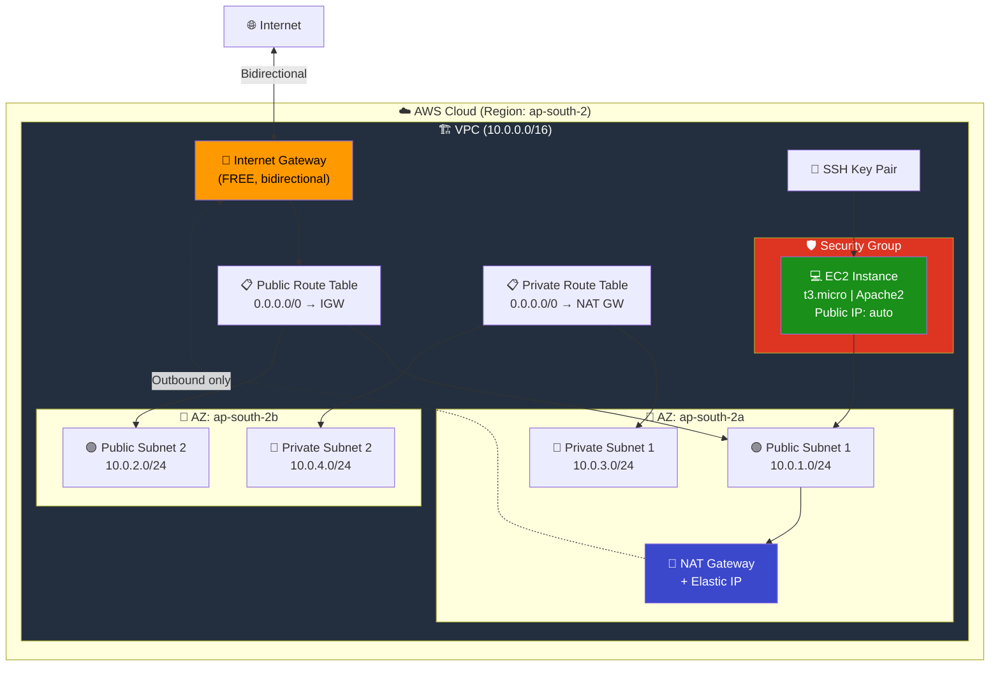
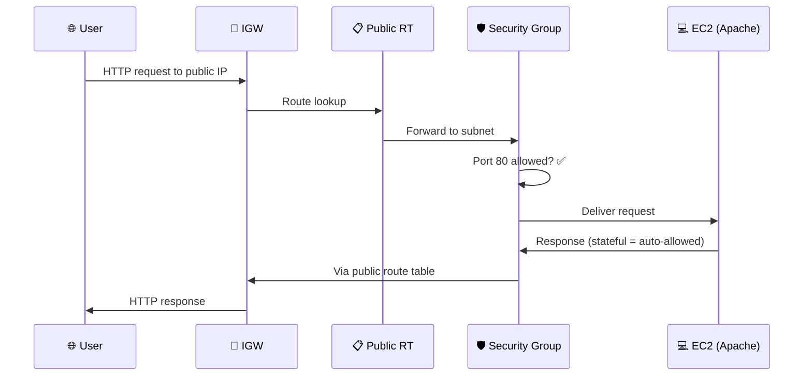
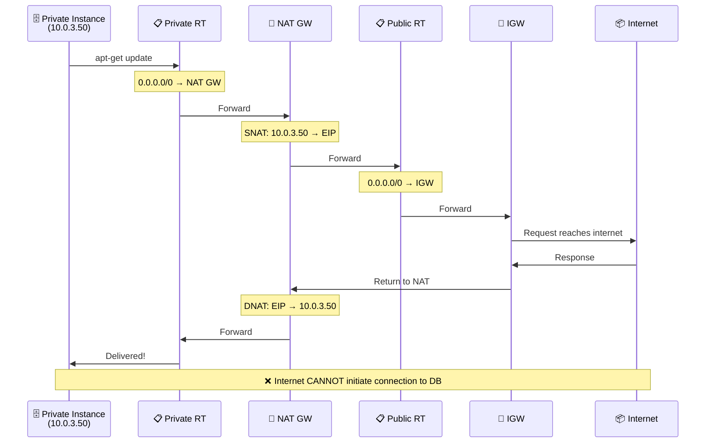
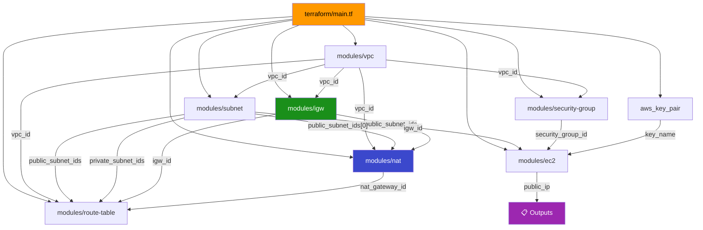
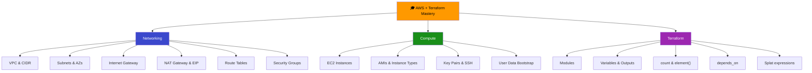

# 08 - EC2 Complete Infrastructure

## Overview

This is the **capstone project** — a production-grade AWS infrastructure combining **every concept** from the previous projects into one deployment.

**What gets created:**
- VPC with DNS support
- 2 Public subnets + 2 Private subnets (across 2 AZs)
- Internet Gateway for public internet access
- NAT Gateway + Elastic IP for private subnet outbound
- Public & Private route tables with associations
- Security Group (SSH + HTTP + HTTPS)
- SSH Key Pair
- EC2 instance (Apache web server) in public subnet

---

## Architecture



---

## Complete Traffic Flow

### Public Subnet Traffic (Web Server)



### Private Subnet Traffic (DB Update)



---

## Module Dependency Graph



---

## Resources Created (Total: 15)

| # | Resource | Module | Purpose |
|---|----------|--------|---------|
| 1 | `aws_vpc` | vpc | Isolated network |
| 2-3 | `aws_subnet` (public ×2) | subnet | Internet-facing subnets |
| 4-5 | `aws_subnet` (private ×2) | subnet | Internal subnets |
| 6 | `aws_internet_gateway` | igw | VPC internet access |
| 7 | `aws_eip` | nat | Static IP for NAT |
| 8 | `aws_nat_gateway` | nat | Private subnet outbound |
| 9 | `aws_route_table` (public) | route-table | Public routes |
| 10 | `aws_route_table` (private) | route-table | Private routes |
| 11-12 | `aws_route_table_association` (×2) | route-table | Link subnets to RTs |
| 13 | `aws_security_group` | security-group | Firewall rules |
| 14 | `aws_key_pair` | root | SSH access |
| 15 | `aws_instance` | ec2 | Web server |

---

## Terraform Concepts Used

### `count` — Create Multiple Subnets

```hcl
resource "aws_subnet" "public" {
  count             = length(var.public_subnet_cidrs)
  cidr_block        = var.public_subnet_cidrs[count.index]
  availability_zone = var.availability_zones[count.index]
}
```

### `element()` — Cycle Through Lists

```hcl
availability_zone = element(var.azs, count.index)
# If azs = ["2a", "2b"] and count.index = 2, wraps to "2a"
```

### `[*]` — Splat Expression

```hcl
output "subnet_ids" {
  value = aws_subnet.public[*].id
  # Returns ALL subnet IDs as a list
}
```

### `depends_on` — Explicit Dependencies

```hcl
resource "aws_nat_gateway" "nat" {
  depends_on = [var.igw_id]
  # NAT won't work without IGW existing first
}
```

---

## File Structure

```
08-ec2-complete-infrastructure/
├── README.md                    ← You are here
├── modules/
│   ├── vpc/
│   │   ├── main.tf
│   │   ├── variables.tf
│   │   └── outputs.tf
│   ├── subnet/
│   │   ├── main.tf              ← 2 public + 2 private subnets (count)
│   │   ├── variables.tf
│   │   └── outputs.tf
│   ├── igw/
│   │   ├── main.tf
│   │   ├── variables.tf
│   │   └── outputs.tf
│   ├── nat/
│   │   ├── main.tf              ← EIP + NAT Gateway
│   │   ├── variables.tf
│   │   └── outputs.tf
│   ├── route-table/
│   │   ├── main.tf              ← Public RT + Private RT + Associations
│   │   ├── variables.tf
│   │   └── outputs.tf
│   ├── security-group/
│   │   ├── main.tf
│   │   ├── variables.tf
│   │   └── outputs.tf
│   └── ec2/
│       ├── main.tf              ← EC2 + user_data (Apache)
│       ├── variables.tf
│       └── outputs.tf
└── terraform/
    ├── main.tf                  ← Orchestrates all modules
    ├── variables.tf
    ├── outputs.tf
    ├── providers.tf
    └── terraform.tfvars.example
```

---

## Usage

```bash
# 1. Generate SSH key pair
ssh-keygen -t rsa -b 4096 -f ~/.ssh/aws_key

# 2. Set up variables
cd terraform/
cp terraform.tfvars.example terraform.tfvars
# Edit terraform.tfvars

# 3. Deploy
terraform init
terraform plan
terraform apply

# 4. Access your server
ssh -i ~/.ssh/aws_key ubuntu@<PUBLIC_IP>
curl http://<PUBLIC_IP>

# 5. Clean up (avoid charges!)
terraform destroy
```

> **Cost Warning:** NAT Gateway costs ~$0.045/hr. Always destroy when done testing!

---

## What You've Learned

After completing all 8 projects, you now understand:


