# 09 - Network ACL (NACL)

## Overview

A **Network Access Control List (NACL)** is a **stateless** firewall at the **subnet level**. Unlike Security Groups (stateful, instance-level), NACLs evaluate both inbound and outbound rules independently.

---

## NACL vs Security Group

```mermaid
graph TB
    Internet["🌐 Internet"]

    subgraph VPC["VPC"]
        subgraph Subnet["Subnet"]
            NACL["🧱 NACL<br/>(Subnet-level firewall)<br/>STATELESS"]
            subgraph Instance["EC2 Instance"]
                SG["🛡️ Security Group<br/>(Instance-level firewall)<br/>STATEFUL"]
            end
        end
    end

    Internet -->|"1. Hits NACL first"| NACL
    NACL -->|"2. Then hits SG"| SG

    style NACL fill:#ff9900,color:#000
    style SG fill:#dd3522,color:#fff
```



### Comparison Table

| Feature | Security Group | NACL |
|---------|---------------|------|
| **Level** | Instance | Subnet |
| **State** | Stateful | Stateless |
| **Rules** | Allow only | Allow + Deny |
| **Evaluation** | All rules evaluated | Rules evaluated in order (by number) |
| **Return traffic** | Automatically allowed | Must explicitly allow |
| **Default** | Deny all inbound, allow all outbound | Allow all inbound + outbound |
| **Association** | Attached to ENI | Attached to subnet |

---

## Stateless = Must Allow Return Traffic

```mermaid
sequenceDiagram
    participant Client as 🌐 Client
    participant NACL as 🧱 NACL
    participant EC2 as 💻 EC2

    Note over NACL: INBOUND RULES
    Client->>NACL: HTTP request (port 80)
    NACL->>NACL: Rule 100: Allow TCP 80 ✅
    NACL->>EC2: Forward request

    Note over NACL: OUTBOUND RULES (separate!)
    EC2->>NACL: Response (ephemeral port 1024-65535)
    NACL->>NACL: Rule 100: Allow TCP 1024-65535 ✅
    NACL->>Client: Forward response

    Note over Client,EC2: ❌ Without outbound ephemeral rule,<br/>response is BLOCKED even though<br/>inbound was allowed!
```



> **Key Insight:** Because NACLs are stateless, you MUST create matching outbound rules for return traffic. Security Groups handle this automatically.

---

## Rule Evaluation Order

```mermaid
graph TD
    Packet["📦 Incoming Packet<br/>(TCP port 80)"]
    R100["Rule 100: Allow TCP 80<br/>from 0.0.0.0/0"]
    R200["Rule 200: Deny TCP 80<br/>from 10.0.0.50/32"]
    R_star["Rule *: Deny All"]
    Allow["✅ ALLOWED"]
    Deny["❌ DENIED"]

    Packet --> R100
    R100 -->|"MATCH → Stop"| Allow
    R100 -.->|"No match"| R200
    R200 -->|"MATCH → Stop"| Deny
    R200 -.->|"No match"| R_star
    R_star --> Deny

    style Allow fill:#1a8f1a,color:#fff
    style Deny fill:#dd3522,color:#fff
    style R100 fill:#ff9900,color:#000
```



> **Rules are evaluated by number (lowest first).** Once a rule matches, evaluation stops. The `*` rule is the implicit deny-all fallback.

### Best Practice: Number Rules by 100s

| Rule # | Purpose |
|--------|---------|
| 100 | SSH (22) |
| 200 | HTTP (80) |
| 300 | HTTPS (443) |
| 400 | Custom app port |
| 900 | Ephemeral ports (1024-65535) |
| * | Deny all (implicit) |

Spacing by 100 lets you insert rules later (e.g., 150) without renumbering.

---

## Default vs Custom NACLs


| NACL Type | Default Behavior | Use Case |
|-----------|-----------------|----------|
| **Default** | Allow everything | Quick development |
| **Custom** | Deny everything | Production security |

---

## Common NACL Patterns

### Web Server Subnet NACL

```
INBOUND:
  100: Allow TCP 80  (HTTP)     from 0.0.0.0/0
  200: Allow TCP 443 (HTTPS)    from 0.0.0.0/0
  300: Allow TCP 22  (SSH)      from YOUR_IP/32
  900: Allow TCP 1024-65535     from 0.0.0.0/0  ← Return traffic!
    *: Deny ALL

OUTBOUND:
  100: Allow TCP 80  (HTTP)     to 0.0.0.0/0
  200: Allow TCP 443 (HTTPS)    to 0.0.0.0/0
  900: Allow TCP 1024-65535     to 0.0.0.0/0    ← Response traffic!
    *: Deny ALL
```

### Database Subnet NACL

```
INBOUND:
  100: Allow TCP 3306 (MySQL)   from 10.0.1.0/24  ← App subnet only!
  900: Allow TCP 1024-65535     from 0.0.0.0/0     ← Return traffic
    *: Deny ALL

OUTBOUND:
  900: Allow TCP 1024-65535     to 10.0.1.0/24     ← Response to app
    *: Deny ALL
```

---

## What Gets Created

| # | Resource | Purpose |
|---|----------|---------|
| 1 | `aws_vpc` | Isolated network |
| 2 | `aws_subnet` (public) | Web server subnet |
| 3 | `aws_subnet` (private) | Database subnet |
| 4 | `aws_network_acl` (public) | Firewall for public subnet |
| 5 | `aws_network_acl` (private) | Firewall for private subnet |
| 6 | `aws_network_acl_rule` (×8) | Individual NACL rules |

---

## File Structure

```
09-network-acl/
├── README.md
├── modules/
│   ├── vpc/
│   │   ├── main.tf
│   │   ├── variables.tf
│   │   └── outputs.tf
│   ├── subnet/
│   │   ├── main.tf
│   │   ├── variables.tf
│   │   └── outputs.tf
│   └── nacl/
│       ├── main.tf          ← NACL + rules for public & private
│       ├── variables.tf
│       └── outputs.tf
└── terraform/
    ├── main.tf
    ├── variables.tf
    ├── outputs.tf
    ├── providers.tf
    └── terraform.tfvars.example
```

---

## When to Use NACLs

| Scenario | Use NACL? | Why |
|----------|-----------|-----|
| Block a specific IP | ✅ Yes | NACLs support DENY rules |
| Allow app traffic | ❌ Use SG | Simpler, stateful |
| Subnet-wide policy | ✅ Yes | Applies to all instances |
| Instance-specific rules | ❌ Use SG | More granular |
| Compliance (defense in depth) | ✅ Both | Belt + suspenders |

> **Rule of thumb:** Use Security Groups as your primary firewall. Add NACLs for subnet-level deny rules and compliance.
