# 10 - VPC Peering

## Overview

**VPC Peering** creates a private network connection between two VPCs — they can communicate using private IPs as if they're in the same network. Traffic never leaves the AWS backbone (no internet, no VPN).

---

## How VPC Peering Works

```mermaid
graph LR
    subgraph VPC_A["VPC A (10.0.0.0/16)<br/>Application"]
        EC2_A["💻 EC2<br/>10.0.1.10"]
        RT_A["📋 Route Table<br/>10.1.0.0/16 → pcx-xxx"]
    end

    subgraph Peering["🔗 VPC Peering<br/>Connection (pcx-xxx)"]
    end

    subgraph VPC_B["VPC B (10.1.0.0/16)<br/>Database"]
        EC2_B["🗄️ RDS<br/>10.1.1.20"]
        RT_B["📋 Route Table<br/>10.0.0.0/16 → pcx-xxx"]
    end

    EC2_A --> RT_A
    RT_A --> Peering
    Peering --> RT_B
    RT_B --> EC2_B

    style Peering fill:#ff9900,color:#000
    style VPC_A fill:#232f3e,color:#fff
    style VPC_B fill:#232f3e,color:#fff
```



---

## Peering Lifecycle

```mermaid
sequenceDiagram
    participant Requester as 🏗️ VPC A (Requester)
    participant AWS as ☁️ AWS
    participant Accepter as 🏗️ VPC B (Accepter)

    Requester->>AWS: Create peering request
    AWS->>Accepter: Peering pending acceptance
    Note over Accepter: Must ACCEPT the request<br/>(even if same account)
    Accepter->>AWS: Accept peering
    AWS->>Requester: Status: Active ✅

    Note over Requester,Accepter: Now add routes in BOTH VPCs!

    Requester->>Requester: Add route: 10.1.0.0/16 → pcx-xxx
    Accepter->>Accepter: Add route: 10.0.0.0/16 → pcx-xxx

    Note over Requester,Accepter: ✅ Private communication established!
```



---

## Key Rules

### What VPC Peering CAN Do

- Connect 2 VPCs in same account
- Connect 2 VPCs in different accounts
- Connect 2 VPCs in different regions (inter-region peering)
- Use private IPs for communication
- Reference peer's security groups (same region)

### What VPC Peering CANNOT Do

```mermaid
graph LR
    subgraph "❌ NO Transitive Peering"
        A["VPC A"] -->|"peered"| B["VPC B"]
        B -->|"peered"| C["VPC C"]
        A -.-x|"NOT connected!"| C
    end

    style A fill:#1a8f1a,color:#fff
    style B fill:#ff9900,color:#000
    style C fill:#dd3522,color:#fff
```



| Rule | Description |
|------|-------------|
| **No transitive routing** | A↔B and B↔C does NOT mean A↔C |
| **No overlapping CIDRs** | VPCs must have different CIDR ranges |
| **No edge-to-edge routing** | Can't use peer's IGW, NAT, or VPN |
| **One peering per VPC pair** | Can't create 2 peerings between same VPCs |

---

## CIDR Planning

```mermaid
graph TD
    subgraph Good["✅ Valid — No Overlap"]
        G1["VPC A: 10.0.0.0/16<br/>(10.0.0.0 – 10.0.255.255)"]
        G2["VPC B: 10.1.0.0/16<br/>(10.1.0.0 – 10.1.255.255)"]
    end

    subgraph Bad["❌ Invalid — Overlapping"]
        B1["VPC A: 10.0.0.0/16<br/>(10.0.0.0 – 10.0.255.255)"]
        B2["VPC B: 10.0.0.0/24<br/>(10.0.0.0 – 10.0.0.255)"]
    end

    style Good fill:#1a8f1a,color:#fff
    style Bad fill:#dd3522,color:#fff
```



> **Tip:** Plan your CIDRs early. Use different second octets (10.0.x.x, 10.1.x.x, 10.2.x.x) for easy peering.

---

## Terraform 3-Step Process

```hcl
# Step 1: Create the peering connection (requester side)
resource "aws_vpc_peering_connection" "peer" {
  vpc_id      = aws_vpc.vpc_a.id        # Requester
  peer_vpc_id = aws_vpc.vpc_b.id        # Accepter
  auto_accept = true                     # Same account only!
}

# Step 2: Route in VPC A → VPC B
resource "aws_route" "a_to_b" {
  route_table_id            = aws_route_table.vpc_a_rt.id
  destination_cidr_block    = "10.1.0.0/16"
  vpc_peering_connection_id = aws_vpc_peering_connection.peer.id
}

# Step 3: Route in VPC B → VPC A
resource "aws_route" "b_to_a" {
  route_table_id            = aws_route_table.vpc_b_rt.id
  destination_cidr_block    = "10.0.0.0/16"
  vpc_peering_connection_id = aws_vpc_peering_connection.peer.id
}
```

---

## What Gets Created

| # | Resource | Purpose |
|---|----------|---------|
| 1 | `aws_vpc` (A) | Application VPC |
| 2 | `aws_vpc` (B) | Database VPC |
| 3 | `aws_subnet` (A) | App subnet |
| 4 | `aws_subnet` (B) | DB subnet |
| 5 | `aws_vpc_peering_connection` | Peering link |
| 6 | `aws_route` (A→B) | Route from A to B |
| 7 | `aws_route` (B→A) | Route from B to A |
| 8 | `aws_route_table` (×2) | Route tables |

---

## Use Cases

| Scenario | Why Peering |
|----------|------------|
| **Shared services** | Central VPC with tools (monitoring, logging) peered to app VPCs |
| **Database isolation** | DB in separate VPC, peered to app VPC |
| **Multi-team** | Each team gets own VPC, peered as needed |
| **DR** | Replicate across regions via inter-region peering |

---

## File Structure

```
10-vpc-peering/
├── README.md
├── modules/
│   └── peering/
│       ├── main.tf          ← Both VPCs + peering + routes
│       ├── variables.tf
│       └── outputs.tf
└── terraform/
    ├── main.tf
    ├── variables.tf
    ├── outputs.tf
    ├── providers.tf
    └── terraform.tfvars.example
```
