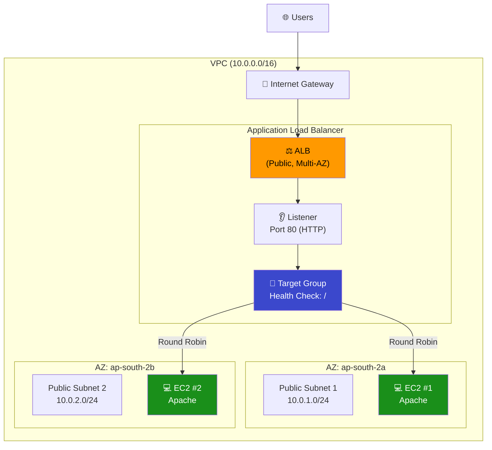
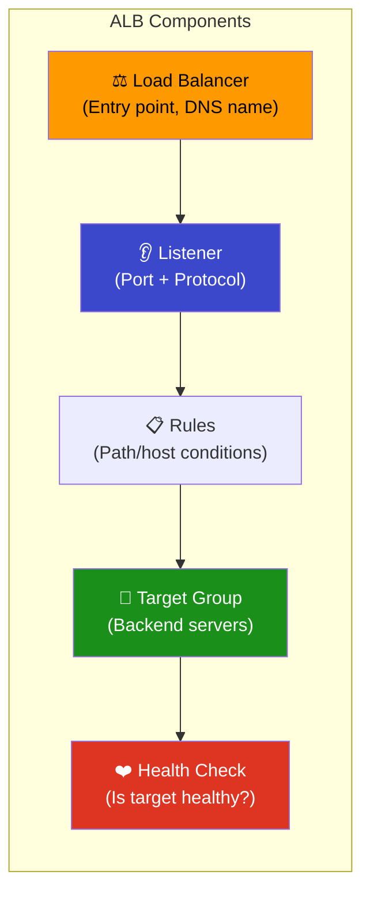
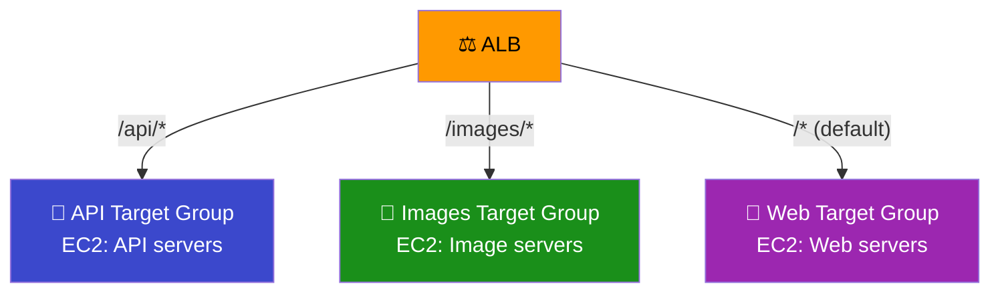
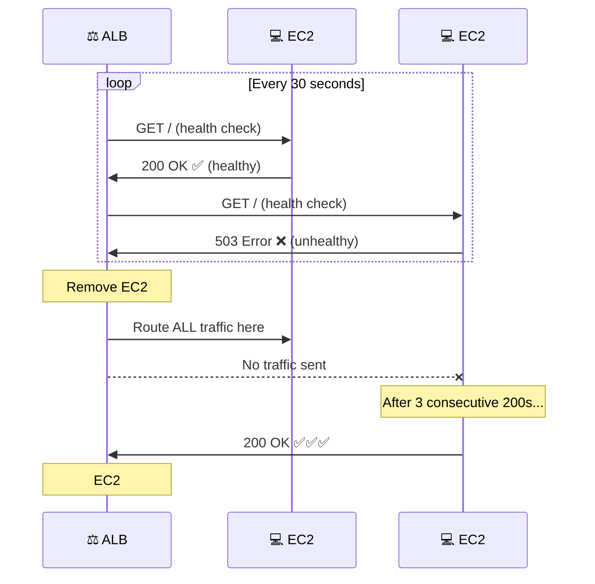
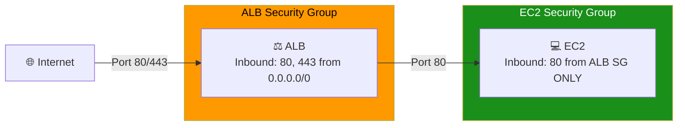

# 11 - Application Load Balancer (ALB)

## Overview

An **Application Load Balancer (ALB)** distributes incoming HTTP/HTTPS traffic across multiple EC2 instances. It operates at **Layer 7** (application layer), enabling path-based and host-based routing.

---

## How ALB Works



---

## ALB Components



| Component | What It Does |
|-----------|-------------|
| **Load Balancer** | Entry point — gets a DNS name (e.g., `my-alb-123.ap-south-2.elb.amazonaws.com`) |
| **Listener** | Listens on a port (80, 443) and routes to target groups |
| **Rules** | Conditions for routing (path `/api/*`, host `api.example.com`) |
| **Target Group** | Collection of backend targets (EC2s, IPs, Lambdas) |
| **Health Check** | Periodically checks target health (`/` every 30s) |

---

## Types of Load Balancers

| Type | Layer | Best For | Protocol |
|------|-------|----------|----------|
| **ALB** | Layer 7 | HTTP/HTTPS, microservices, path routing | HTTP, HTTPS, gRPC |
| **NLB** | Layer 4 | Ultra-high performance, TCP/UDP | TCP, UDP, TLS |
| **CLB** | Layer 4/7 | Legacy (don't use for new) | HTTP, TCP |
| **GWLB** | Layer 3 | Third-party appliances | GENEVE |

---

## Path-Based Routing



---

## Health Check Flow



---

## Security Groups for ALB



> **Best Practice:** EC2 instances should ONLY accept traffic from the ALB security group — not directly from the internet.

---

## What Gets Created

| # | Resource | Purpose |
|---|----------|---------|
| 1 | `aws_vpc` | Network |
| 2-3 | `aws_subnet` (×2 AZs) | ALB needs ≥2 AZs |
| 4 | `aws_internet_gateway` | Internet access |
| 5 | `aws_route_table` + associations | Public routing |
| 6 | `aws_security_group` (ALB) | ALB firewall |
| 7 | `aws_security_group` (EC2) | EC2 firewall (ALB-only) |
| 8 | `aws_lb` | Application Load Balancer |
| 9 | `aws_lb_target_group` | Backend targets |
| 10 | `aws_lb_listener` | Port 80 listener |
| 11-12 | `aws_instance` (×2) | Web servers |
| 13-14 | `aws_lb_target_group_attachment` (×2) | Register EC2s |

---

## File Structure

```
11-load-balancer/
├── README.md
├── modules/
│   ├── vpc/
│   │   ├── main.tf
│   │   ├── variables.tf
│   │   └── outputs.tf
│   ├── network/
│   │   ├── main.tf         ← Subnets, IGW, Route Tables
│   │   ├── variables.tf
│   │   └── outputs.tf
│   ├── security-group/
│   │   ├── main.tf         ← ALB SG + EC2 SG
│   │   ├── variables.tf
│   │   └── outputs.tf
│   ├── alb/
│   │   ├── main.tf         ← ALB, Target Group, Listener
│   │   ├── variables.tf
│   │   └── outputs.tf
│   └── ec2/
│       ├── main.tf         ← 2 EC2 instances + TG attachments
│       ├── variables.tf
│       └── outputs.tf
└── terraform/
    ├── main.tf
    ├── variables.tf
    ├── outputs.tf
    ├── providers.tf
    └── terraform.tfvars.example
```

---

## Cost

| Resource | Cost |
|----------|------|
| ALB | ~$0.0225/hr + $0.008/LCU-hr |
| EC2 (t3.micro ×2) | ~$0.0104/hr each |
| Data transfer | $0.09/GB (outbound) |

> **Always `terraform destroy` when done testing!**
