# 12 - Auto Scaling Group (ASG)

## Overview

**Auto Scaling** automatically adjusts the number of EC2 instances based on demand. Combined with an ALB, it ensures your application handles traffic spikes and reduces costs during low usage.

---

## How Auto Scaling Works


---

## Scaling Flow


---

## ASG Capacity Settings

```mermaid
graph LR
    subgraph Capacity["ASG Capacity"]
        Min["🔽 Min: 1<br/>(Never fewer)"]
        Desired["🎯 Desired: 2<br/>(Normal load)"]
        Max["🔼 Max: 4<br/>(Peak load)"]
    end

    Min -->|"≤"| Desired -->|"≤"| Max

    style Min fill:#1a8f1a,color:#fff
    style Desired fill:#ff9900,color:#000
    style Max fill:#dd3522,color:#fff
```



| Setting | Value | Meaning |
|---------|-------|---------|
| **min_size** | 1 | Minimum instances always running |
| **desired_capacity** | 2 | How many ASG tries to maintain |
| **max_size** | 4 | Maximum during scaling events |

---

## Launch Template vs Launch Configuration

| Feature | Launch Template | Launch Configuration |
|---------|----------------|---------------------|
| Versioning | ✅ Yes | ❌ No |
| Mixed instances | ✅ Yes | ❌ No |
| Spot + On-Demand | ✅ Yes | ❌ No |
| Status | **Current** | Deprecated |

> **Always use Launch Templates.** Launch Configurations are deprecated.

---

## Scaling Policy Types

| Type | How It Works | Example |
|------|-------------|---------|
| **Target Tracking** | Maintain a metric at target value | Keep CPU at 50% |
| **Step Scaling** | Add/remove based on alarm severity | CPU > 70%: +1, CPU > 90%: +3 |
| **Simple Scaling** | One action per alarm | CPU > 70%: +1 instance |
| **Scheduled** | Scale at specific times | Every morning at 9 AM: set to 4 |

---

## Complete Architecture

```mermaid
graph TB
    Users["🌐 Users"]

    subgraph VPC["VPC"]
        IGW["🚪 IGW"]

        subgraph ALB_Layer["Load Balancing"]
            ALB["⚖️ ALB"]
            TG["🎯 Target Group"]
        end

        subgraph ASG["Auto Scaling Group<br/>Min: 1 | Desired: 2 | Max: 4"]
            subgraph AZ1["AZ-a"]
                EC2_1["💻 EC2 #1"]
            end
            subgraph AZ2["AZ-b"]
                EC2_2["💻 EC2 #2"]
            end
        end

        CW["📈 CloudWatch<br/>CPU Alarms"]
        Policy_Out["📊 Scale Out<br/>CPU > 70%: +1"]
        Policy_In["📊 Scale In<br/>CPU < 30%: -1"]
    end

    Users --> IGW --> ALB --> TG
    TG --> EC2_1 & EC2_2
    CW --> Policy_Out & Policy_In
    Policy_Out & Policy_In --> ASG

    style ALB fill:#ff9900,color:#000
    style ASG fill:#3b48cc,color:#fff
    style CW fill:#9c27b0,color:#fff
```



---

## What Gets Created

| # | Resource | Purpose |
|---|----------|---------|
| 1 | `aws_launch_template` | Instance blueprint |
| 2 | `aws_autoscaling_group` | Manages EC2 fleet |
| 3 | `aws_autoscaling_policy` (scale out) | Add instances |
| 4 | `aws_autoscaling_policy` (scale in) | Remove instances |
| 5 | `aws_cloudwatch_metric_alarm` (high) | Trigger scale out |
| 6 | `aws_cloudwatch_metric_alarm` (low) | Trigger scale in |
| 7 | `aws_lb` + listener + target group | Load balancer |
| + | VPC, subnets, IGW, RT, SGs | Networking |

---

## File Structure

```
12-auto-scaling/
├── README.md
├── modules/
│   ├── vpc/
│   ├── network/
│   ├── security-group/
│   ├── alb/
│   └── asg/
│       ├── main.tf         ← Launch Template + ASG + Policies + Alarms
│       ├── variables.tf
│       └── outputs.tf
└── terraform/
    ├── main.tf
    ├── variables.tf
    ├── outputs.tf
    ├── providers.tf
    └── terraform.tfvars.example
```
