# 13 - S3 Remote Backend (Terraform State Management)

## Overview

By default, Terraform stores state in a local `terraform.tfstate` file. In production and team environments, you should store state **remotely** in S3 with **DynamoDB locking** to prevent concurrent modifications.

---

## Local vs Remote State

```mermaid
graph LR
    subgraph Local["❌ Local State"]
        Dev["💻 Developer"]
        File["📄 terraform.tfstate<br/>(on disk)"]
        Dev --> File
    end

    subgraph Remote["✅ Remote State (S3 + DynamoDB)"]
        Dev1["👤 Dev 1"]
        Dev2["👤 Dev 2"]
        S3["🪣 S3 Bucket<br/>(state file)"]
        DDB["🔒 DynamoDB<br/>(lock table)"]
        Dev1 --> S3
        Dev2 --> S3
        S3 --- DDB
    end

    style Local fill:#dd3522,color:#fff
    style Remote fill:#1a8f1a,color:#fff
```



### Why Remote State?

| Problem (Local) | Solution (Remote) |
|-----------------|-------------------|
| State on one laptop only | Shared in S3 |
| Team members overwrite each other | DynamoDB locking |
| No versioning | S3 versioning |
| No encryption | S3 encryption (SSE) |
| Lose laptop = lose state | Durable cloud storage |

---

## How Locking Works

```mermaid
sequenceDiagram
    participant Dev1 as 👤 Dev 1
    participant DDB as 🔒 DynamoDB
    participant S3 as 🪣 S3
    participant Dev2 as 👤 Dev 2

    Dev1->>DDB: terraform apply → Acquire lock
    DDB->>Dev1: Lock acquired ✅ (LockID: abc-123)
    Dev1->>S3: Read state
    S3->>Dev1: Current state

    Dev2->>DDB: terraform apply → Acquire lock
    DDB->>Dev2: ❌ LOCKED by Dev 1!
    Note over Dev2: "Error: state locked"<br/>"Lock ID: abc-123"

    Dev1->>S3: Write updated state
    Dev1->>DDB: Release lock
    DDB->>Dev1: Lock released ✅

    Dev2->>DDB: terraform apply → Acquire lock
    DDB->>Dev2: Lock acquired ✅
    Dev2->>S3: Read latest state
```



---

## Backend Configuration Flow

```mermaid
graph TD
    A["1. Create S3 bucket<br/>(store state)"] --> B["2. Create DynamoDB table<br/>(state locking)"]
    B --> C["3. Add backend config<br/>to providers.tf"]
    C --> D["4. Run terraform init<br/>(migrates local → S3)"]
    D --> E["5. State now in S3!<br/>terraform.tfstate is empty"]

    style A fill:#ff9900,color:#000
    style B fill:#3b48cc,color:#fff
    style C fill:#1a8f1a,color:#fff
    style D fill:#9c27b0,color:#fff
    style E fill:#dd3522,color:#fff
```



---

## The Chicken-and-Egg Problem

> How do you create the S3 bucket and DynamoDB table if they're managed by Terraform... which needs a backend to store state?

**Solution:** Create the backend infrastructure FIRST with local state, then configure other projects to use it.

```mermaid
graph LR
    Step1["📦 This Project<br/>(13-s3-remote-backend)<br/>Local state → Creates S3 + DynamoDB"]
    Step2["📦 Other Projects<br/>(01-15)<br/>Use remote backend"]

    Step1 -->|"Creates infra"| Step2

    style Step1 fill:#ff9900,color:#000
    style Step2 fill:#1a8f1a,color:#fff
```



---

## S3 Bucket Best Practices

| Setting | Value | Why |
|---------|-------|-----|
| **Versioning** | Enabled | Recover from bad state |
| **Encryption** | SSE-S3 | Protect sensitive data |
| **Public access** | Blocked | Security |
| **Lifecycle** | Keep old versions 30 days | Cost management |
| **Bucket name** | Globally unique! | `company-terraform-state-prod` |

---

## Backend Configuration Example

```hcl
# Add this to any project's providers.tf
terraform {
  backend "s3" {
    bucket         = "my-terraform-state-bucket"
    key            = "project-name/terraform.tfstate"
    region         = "ap-south-2"
    dynamodb_table = "terraform-state-lock"
    encrypt        = true
  }
}
```

| Parameter | Purpose |
|-----------|---------|
| **bucket** | S3 bucket name |
| **key** | Path within bucket (unique per project!) |
| **region** | Bucket region |
| **dynamodb_table** | Lock table name |
| **encrypt** | Encrypt state at rest |

---

## State File Contents

> ⚠️ State files contain **sensitive data** — passwords, private IPs, resource IDs. NEVER commit to Git!

```
.gitignore should include:
  *.tfstate
  *.tfstate.backup
  .terraform/
```

---

## What Gets Created

| # | Resource | Purpose |
|---|----------|---------|
| 1 | `aws_s3_bucket` | Store state files |
| 2 | `aws_s3_bucket_versioning` | Version history |
| 3 | `aws_s3_bucket_server_side_encryption_configuration` | Encryption |
| 4 | `aws_s3_bucket_public_access_block` | Block public access |
| 5 | `aws_dynamodb_table` | State locking |

---

## File Structure

```
13-s3-remote-backend/
├── README.md
├── modules/
│   └── backend/
│       ├── main.tf         ← S3 bucket + DynamoDB table
│       ├── variables.tf
│       └── outputs.tf
└── terraform/
    ├── main.tf
    ├── variables.tf
    ├── outputs.tf
    ├── providers.tf         ← Local backend (for this project)
    └── terraform.tfvars.example
```

---

## Usage

```bash
# 1. Create the backend infrastructure
cd terraform/
terraform init
terraform apply

# 2. Note the outputs (bucket name, table name)

# 3. In OTHER projects, add backend config to providers.tf:
terraform {
  backend "s3" {
    bucket         = "<BUCKET_NAME from output>"
    key            = "01-vpc-basics/terraform.tfstate"
    region         = "ap-south-2"
    dynamodb_table = "<TABLE_NAME from output>"
    encrypt        = true
  }
}

# 4. Run terraform init to migrate
cd ../01-vpc-basics/terraform/
terraform init    # Will ask to migrate local → S3
```

> **This project uses LOCAL state intentionally** (chicken-and-egg). All other projects can then use the S3 backend it creates.
