# 14 - IAM Roles & Policies

## Overview

**IAM (Identity and Access Management)** controls WHO can do WHAT on WHICH AWS resources. For EC2 instances, we use **IAM Roles** + **Instance Profiles** to grant permissions without storing credentials on the server.

---

## IAM Building Blocks

```mermaid
graph TD
    subgraph IAM["IAM Components"]
        User["👤 IAM User<br/>(Human)"]
        Group["👥 IAM Group<br/>(Collection of users)"]
        Role["🎭 IAM Role<br/>(Assumed by services)"]
        Policy["📜 IAM Policy<br/>(JSON permissions)"]
        IP["🔗 Instance Profile<br/>(Attaches role to EC2)"]
    end

    Policy -->|"Attached to"| User
    Policy -->|"Attached to"| Group
    Policy -->|"Attached to"| Role
    User -->|"Member of"| Group
    Role -->|"Wrapped in"| IP
    IP -->|"Attached to"| EC2["💻 EC2"]

    style Role fill:#ff9900,color:#000
    style Policy fill:#3b48cc,color:#fff
    style IP fill:#1a8f1a,color:#fff
```



---

## How EC2 Gets Permissions

```mermaid
sequenceDiagram
    participant EC2 as 💻 EC2 Instance
    participant IMDS as 📡 Instance Metadata<br/>(169.254.169.254)
    participant STS as 🔐 AWS STS
    participant S3 as 🪣 S3

    Note over EC2: Has Instance Profile attached

    EC2->>IMDS: Get credentials
    IMDS->>STS: Assume role
    STS->>IMDS: Temporary credentials<br/>(auto-rotated!)
    IMDS->>EC2: AccessKeyId, SecretKey, Token

    EC2->>S3: List buckets (using temp creds)
    S3->>S3: Check IAM policy
    S3->>EC2: ✅ Bucket list

    Note over EC2,S3: ✅ No hardcoded credentials!<br/>✅ Auto-rotated every ~6 hours
```



> **Key insight:** EC2 instances with IAM Roles get **temporary credentials** that auto-rotate. You NEVER need to put AWS keys on an EC2 instance.

---

## IAM Policy Structure

```json
{
  "Version": "2012-10-17",
  "Statement": [
    {
      "Sid": "AllowS3Read",
      "Effect": "Allow",
      "Action": [
        "s3:GetObject",
        "s3:ListBucket"
      ],
      "Resource": [
        "arn:aws:s3:::my-bucket",
        "arn:aws:s3:::my-bucket/*"
      ]
    }
  ]
}
```

| Field | Purpose | Values |
|-------|---------|--------|
| **Effect** | Allow or deny | `Allow`, `Deny` |
| **Action** | What API calls | `s3:GetObject`, `ec2:*` |
| **Resource** | Which resources | ARN or `*` (all) |
| **Condition** | Optional filters | IP range, time, MFA |

---

## Trust Policy vs Permission Policy


| Policy Type | Question Answered | Example |
|-------------|-------------------|---------|
| **Trust Policy** | WHO can assume this role? | EC2 service, Lambda, another account |
| **Permission Policy** | WHAT can the role do? | Read S3, write logs |

---

## Managed vs Inline Policies

| Type | Description | Use Case |
|------|-------------|----------|
| **AWS Managed** | Pre-built by AWS (`AmazonS3ReadOnlyAccess`) | Common permissions |
| **Customer Managed** | You create, reusable across roles | Custom shared policies |
| **Inline** | Embedded in one role, not reusable | One-off permissions |

---

## Least Privilege Principle

```mermaid
graph TD
    Bad["❌ Bad: Full Admin Access<br/>Effect: Allow<br/>Action: *<br/>Resource: *"]
    Good["✅ Good: Least Privilege<br/>Effect: Allow<br/>Action: s3:GetObject<br/>Resource: arn:aws:s3:::my-bucket/*"]

    style Bad fill:#dd3522,color:#fff
    style Good fill:#1a8f1a,color:#fff
```



> **Rule:** Grant only the minimum permissions needed. Start restrictive, add as needed.

---

## What Gets Created

| # | Resource | Purpose |
|---|----------|---------|
| 1 | `aws_iam_role` | Role with trust policy |
| 2 | `aws_iam_policy` | Custom permission policy |
| 3 | `aws_iam_role_policy_attachment` | Attach policy to role |
| 4 | `aws_iam_instance_profile` | Bridge role → EC2 |
| 5 | `aws_instance` | EC2 with instance profile |

---

## File Structure

```
14-iam-roles-policies/
├── README.md
├── modules/
│   ├── iam/
│   │   ├── main.tf         ← Role + Policy + Instance Profile
│   │   ├── variables.tf
│   │   └── outputs.tf
│   └── ec2/
│       ├── main.tf         ← EC2 with IAM instance profile
│       ├── variables.tf
│       └── outputs.tf
└── terraform/
    ├── main.tf
    ├── variables.tf
    ├── outputs.tf
    ├── providers.tf
    └── terraform.tfvars.example
```
