# 15 - RDS in Private Subnet

## Overview

**Amazon RDS** (Relational Database Service) is a managed database in a **private subnet** — not accessible from the internet, only reachable from your application servers. This is the standard production pattern.

---

## Architecture

```mermaid
graph TB
    Users["🌐 Users"]

    subgraph VPC["VPC (10.0.0.0/16)"]
        IGW["🚪 Internet Gateway"]

        subgraph Public["Public Subnets"]
            subgraph AZ1_Pub["AZ-a"]
                EC2["💻 EC2 (App Server)<br/>10.0.1.0/24"]
            end
            subgraph AZ2_Pub["AZ-b"]
                EC2_2["💻 EC2 (App Server)<br/>10.0.2.0/24"]
            end
        end

        subgraph Private["Private Subnets (DB Subnet Group)"]
            subgraph AZ1_Priv["AZ-a"]
                RDS_P["🗄️ RDS Primary<br/>10.0.3.0/24"]
            end
            subgraph AZ2_Priv["AZ-b"]
                RDS_S["🗄️ RDS Standby<br/>10.0.4.0/24"]
            end
        end

        SG_EC2["🛡️ EC2 SG<br/>SSH + HTTP"]
        SG_RDS["🛡️ RDS SG<br/>MySQL 3306<br/>from EC2 SG only"]
    end

    Users --> IGW --> EC2
    EC2 -->|"Port 3306"| RDS_P
    RDS_P -.->|"Replication"| RDS_S

    style RDS_P fill:#3b48cc,color:#fff
    style RDS_S fill:#3b48cc,color:#fff
    style EC2 fill:#1a8f1a,color:#fff
    style SG_RDS fill:#dd3522,color:#fff
```



---

## DB Subnet Group

> RDS requires a **DB Subnet Group** — a collection of subnets in at least **2 different AZs**. This enables Multi-AZ failover.

```mermaid
graph LR
    subgraph DSG["🗃️ DB Subnet Group"]
        S1["Private Subnet 1<br/>AZ-a: 10.0.3.0/24"]
        S2["Private Subnet 2<br/>AZ-b: 10.0.4.0/24"]
    end

    DSG -->|"RDS placed in"| RDS["🗄️ RDS Instance"]
    RDS -->|"Failover to"| S2

    style DSG fill:#ff9900,color:#000
    style RDS fill:#3b48cc,color:#fff
```



---

## Multi-AZ vs Read Replica

```mermaid
graph TB
    subgraph MultiAZ["Multi-AZ (High Availability)"]
        Primary["🗄️ Primary<br/>(AZ-a, active)"]
        Standby["🗄️ Standby<br/>(AZ-b, passive)"]
        Primary -->|"Synchronous<br/>replication"| Standby

        Note1["✅ Auto failover<br/>❌ Not for read scaling"]
    end

    subgraph ReadReplica["Read Replica (Performance)"]
        Master["🗄️ Master<br/>(writes)"]
        Replica["🗄️ Read Replica<br/>(reads)"]
        Master -->|"Asynchronous<br/>replication"| Replica

        Note2["✅ Read scaling<br/>❌ No auto failover"]
    end

    style Primary fill:#3b48cc,color:#fff
    style Standby fill:#9c27b0,color:#fff
    style Master fill:#3b48cc,color:#fff
    style Replica fill:#1a8f1a,color:#fff
```



| Feature | Multi-AZ | Read Replica |
|---------|----------|-------------|
| **Purpose** | High availability | Read scaling |
| **Replication** | Synchronous | Asynchronous |
| **Failover** | Automatic (~60s) | Manual promotion |
| **Reads** | Primary only | Can read from replica |
| **Cost** | 2× primary cost | Per-replica cost |

---

## RDS Security


### 3 Layers of Protection

1. **Private subnet** — no Internet Gateway route
2. **Security Group** — only accepts from EC2 SG
3. **No public IP** — `publicly_accessible = false`

---

## RDS Engine Options

| Engine | Port | Use Case |
|--------|------|----------|
| **MySQL** | 3306 | General purpose, web apps |
| **PostgreSQL** | 5432 | Complex queries, GIS |
| **MariaDB** | 3306 | MySQL compatible, open source |
| **Aurora** | 3306/5432 | AWS-native, high performance |
| **Oracle** | 1521 | Enterprise |
| **SQL Server** | 1433 | Microsoft ecosystem |

---

## What Gets Created

| # | Resource | Purpose |
|---|----------|---------|
| 1 | `aws_vpc` | Network |
| 2-3 | `aws_subnet` (public ×2) | App servers |
| 4-5 | `aws_subnet` (private ×2) | Database |
| 6 | `aws_internet_gateway` | Public access |
| 7 | `aws_route_table` + associations | Routing |
| 8 | `aws_security_group` (EC2) | App firewall |
| 9 | `aws_security_group` (RDS) | DB firewall |
| 10 | `aws_db_subnet_group` | RDS subnet group |
| 11 | `aws_db_instance` | MySQL RDS instance |

---

## File Structure

```
15-rds-private-subnet/
├── README.md
├── modules/
│   ├── vpc/
│   ├── network/
│   ├── security-group/
│   └── rds/
│       ├── main.tf         ← DB Subnet Group + RDS Instance
│       ├── variables.tf
│       └── outputs.tf
└── terraform/
    ├── main.tf
    ├── variables.tf
    ├── outputs.tf
    ├── providers.tf
    └── terraform.tfvars.example
```

---

## Cost Warning

| Resource | Cost |
|----------|------|
| RDS db.t3.micro | ~$0.017/hr (free tier eligible) |
| Multi-AZ | 2× single instance |
| Storage | $0.115/GB/month (gp2) |

> **Always `terraform destroy` when done! RDS bills 24/7.**
