# Project 16: S3 Static Website Hosting

## Concepts Covered

- S3 bucket creation and configuration
- Static website hosting on S3
- Bucket policies for public access
- CORS (Cross-Origin Resource Sharing)
- Index and error documents
- Public access block settings

---

## Architecture

```mermaid
graph TB
    User["👤 User Browser"]
    
    subgraph S3["Amazon S3"]
        Bucket["S3 Bucket<br/>(Website Enabled)"]
        
        subgraph Objects["Website Files"]
            Index["index.html"]
            Error["error.html"]
            CSS["styles.css"]
        end

        Policy["Bucket Policy<br/>(Public Read)"]
        CORS["CORS Configuration"]
        PAB["Public Access Block<br/>(Allow Public)"]
    end

    User -->|"HTTP Request"| Bucket
    Bucket --> Objects
    Policy -.->|"Allows s3:GetObject"| Bucket
    CORS -.->|"Cross-origin rules"| Bucket
    PAB -.->|"Controls access"| Bucket

    style Bucket fill:#3b48cc,color:#fff
    style Policy fill:#dd3522,color:#fff
    style CORS fill:#ff9900,color:#000
    style PAB fill:#232f3e,color:#fff
```



---

## How S3 Static Website Hosting Works


---

## Key Concepts

### S3 Website Endpoint vs REST Endpoint

| Feature | Website Endpoint | REST API Endpoint |
|---------|-----------------|-------------------|
| URL Format | `bucket.s3-website-region.amazonaws.com` | `bucket.s3.region.amazonaws.com` |
| Supports index.html | Yes | No |
| Supports error.html | Yes | No |
| Supports redirects | Yes | No |
| HTTPS | No (use CloudFront) | Yes |
| Access | Public via bucket policy | IAM / presigned URLs |

### Public Access Block

S3 has 4 levels of public access protection:

| Setting | What It Blocks |
|---------|---------------|
| `block_public_acls` | New public ACLs |
| `ignore_public_acls` | Existing public ACLs |
| `block_public_policy` | New public bucket policies |
| `restrict_public_buckets` | Cross-account access via public policies |

> **For static websites**, all 4 must be set to `false` so the bucket policy granting public read access works.

### Bucket Policy for Static Website

```json
{
  "Effect": "Allow",
  "Principal": "*",
  "Action": "s3:GetObject",
  "Resource": "arn:aws:s3:::bucket-name/*"
}
```

---

## Resources Created

| Resource | Purpose |
|----------|---------|
| `aws_s3_bucket` | The S3 bucket |
| `aws_s3_bucket_website_configuration` | Enable static website hosting |
| `aws_s3_bucket_public_access_block` | Allow public access |
| `aws_s3_bucket_policy` | Grant public read to all objects |
| `aws_s3_bucket_cors_configuration` | CORS rules for browser access |
| `aws_s3_object` | Upload index.html and error.html |

---

## Outputs

| Output | Description |
|--------|-------------|
| `bucket_name` | Name of the S3 bucket |
| `bucket_arn` | ARN of the S3 bucket |
| `website_endpoint` | S3 static website URL |
| `website_domain` | S3 website domain name |
