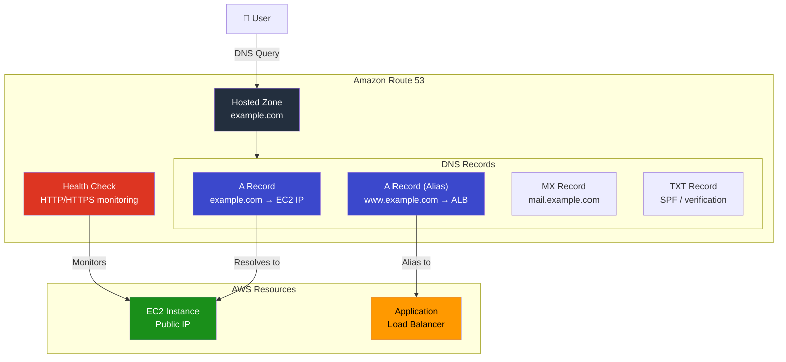
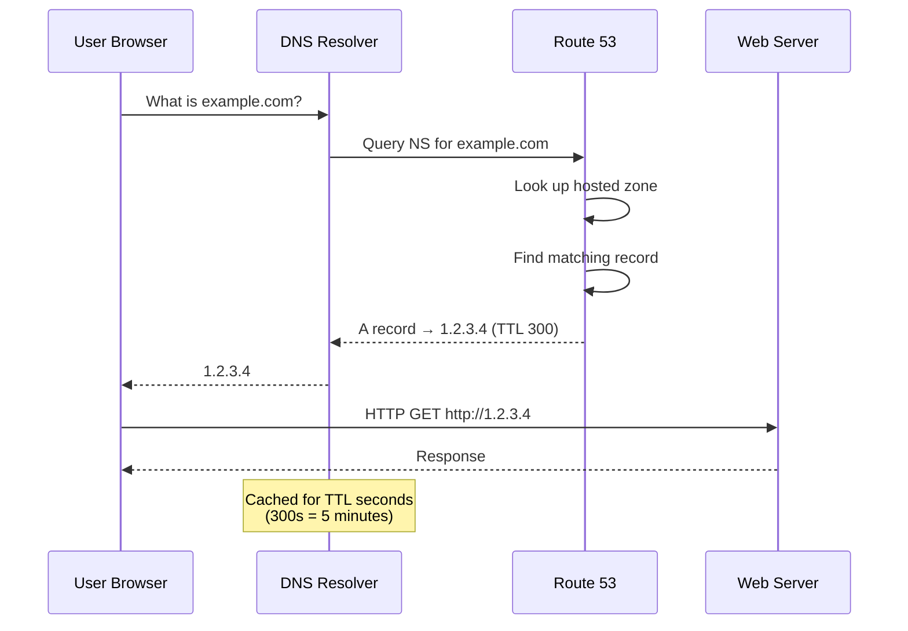

# Project 17: Route 53 DNS

## Concepts Covered

- Route 53 hosted zones (public)
- DNS record types (A, CNAME, ALIAS, MX, TXT)
- Alias records vs standard records
- TTL (Time to Live)
- Health checks and routing policies
- Simple, weighted, and failover routing

---

## Architecture

---

## DNS Resolution Flow

---

## Key Concepts

### Record Types

| Type | Purpose | Example |
|------|---------|---------|
| **A** | Maps domain to IPv4 address | `example.com → 1.2.3.4` |
| **AAAA** | Maps domain to IPv6 address | `example.com → 2001:db8::1` |
| **CNAME** | Maps domain to another domain | `www → example.com` |
| **ALIAS** | AWS-specific, maps to AWS resource | `example.com → ALB DNS` |
| **MX** | Mail server routing | `mail.example.com → 10 smtp.example.com` |
| **TXT** | Text records (SPF, verification) | `v=spf1 include:_spf.google.com` |
| **NS** | Name server delegation | Auto-created by Route 53 |
| **SOA** | Start of Authority | Auto-created by Route 53 |

### Alias vs CNAME

| Feature | ALIAS | CNAME |
|---------|-------|-------|
| Works at zone apex | Yes (`example.com`) | No (only subdomains) |
| DNS query charges | Free | Standard charges |
| Points to | AWS resources only | Any domain |
| TTL | Inherited from target | Custom |
| Health check | Evaluated automatically | Must configure |

### Routing Policies

| Policy | Use Case |
|--------|----------|
| **Simple** | Single resource, basic routing |
| **Weighted** | Split traffic (e.g., 70/30 for A/B testing) |
| **Failover** | Active-passive DR |
| **Latency** | Route to lowest-latency region |
| **Geolocation** | Route based on user location |
| **Multi-Value** | Multiple healthy IPs (basic LB) |

---

## Resources Created

| Resource | Purpose |
|----------|---------|
| `aws_route53_zone` | Public hosted zone |
| `aws_route53_record` (A) | A record pointing to an IP |
| `aws_route53_record` (CNAME) | CNAME record |
| `aws_route53_record` (Alias) | Alias record to AWS resource |
| `aws_route53_health_check` | HTTP health check |

---

## Outputs

| Output | Description |
|--------|-------------|
| `zone_id` | Hosted zone ID |
| `name_servers` | NS records for domain delegation |
| `a_record_fqdn` | Fully qualified domain name of A record |
