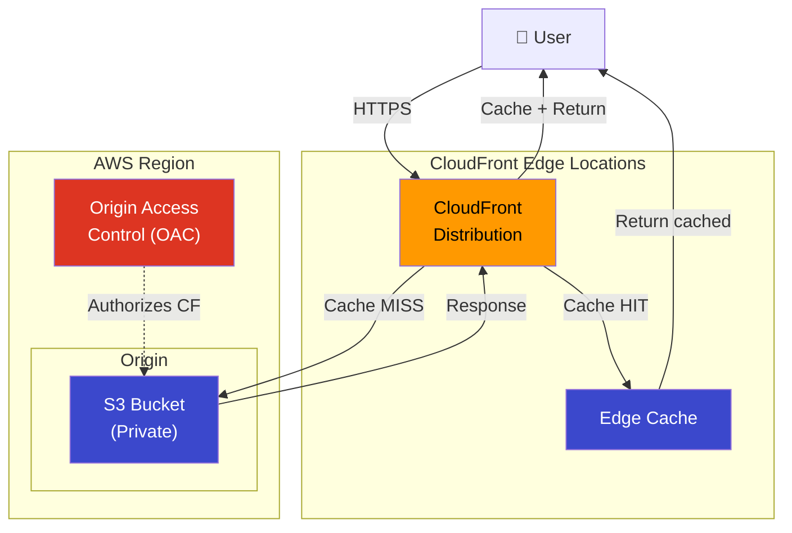
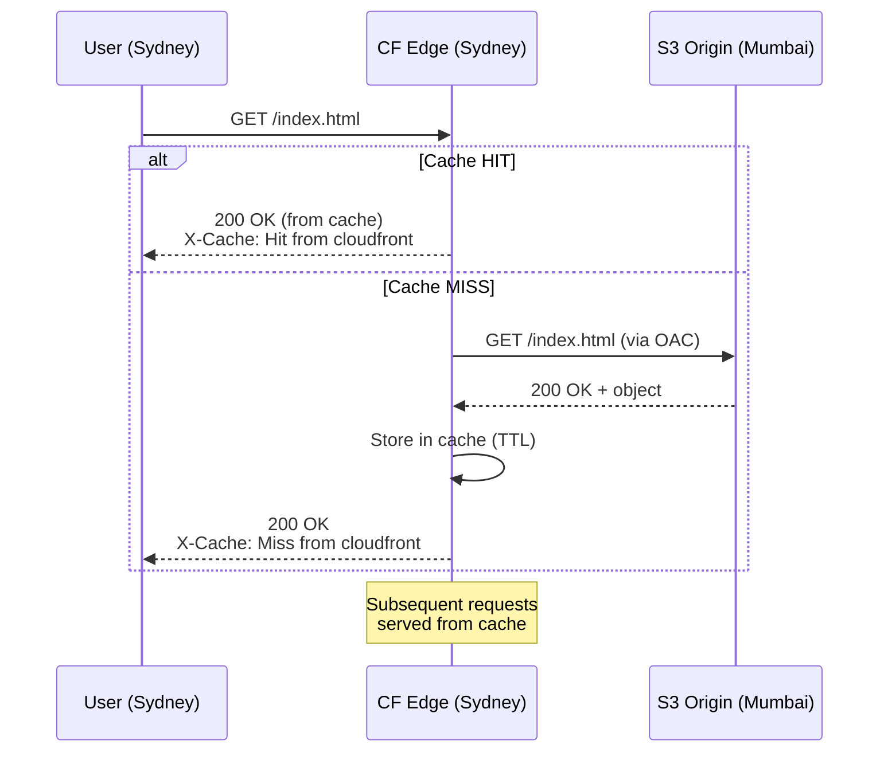

# Project 18: CloudFront CDN

## Concepts Covered

- CloudFront distributions
- Origins (S3, ALB, custom)
- Origin Access Control (OAC)
- Cache behaviors and TTLs
- HTTPS with default CloudFront certificate
- Geo-restrictions
- Price classes

---

## Architecture

---

## CloudFront Request Flow

---

## Key Concepts

### Origin Access Control (OAC) vs Origin Access Identity (OAI)

| Feature | OAC (Recommended) | OAI (Legacy) |
|---------|--------------------|--------------|
| S3 server-side encryption | SSE-S3, SSE-KMS | SSE-S3 only |
| POST/PUT support | Yes | No |
| All S3 regions | Yes | Some regions |
| Granular permissions | Yes | Limited |
| AWS recommends | Yes | Deprecated |

### Cache Behavior Settings

| Setting | Description |
|---------|-------------|
| `viewer_protocol_policy` | HTTP → HTTPS redirect, HTTPS only, or allow all |
| `allowed_methods` | GET, HEAD, OPTIONS, PUT, POST, etc. |
| `cached_methods` | Which methods to cache (GET, HEAD) |
| `default_ttl` | Default cache duration if origin doesn't set Cache-Control |
| `min_ttl` | Minimum time in cache regardless of headers |
| `max_ttl` | Maximum time in cache regardless of headers |
| `compress` | Enable Gzip/Brotli compression |

### Price Classes

| Price Class | Edge Locations | Cost |
|-------------|---------------|------|
| `PriceClass_All` | All locations worldwide | Highest |
| `PriceClass_200` | Most locations (no South America, Australia) | Medium |
| `PriceClass_100` | US, Canada, Europe only | Lowest |

---

## Resources Created

| Resource | Purpose |
|----------|---------|
| `aws_s3_bucket` | Origin bucket (private) |
| `aws_cloudfront_origin_access_control` | Secure access from CF to S3 |
| `aws_cloudfront_distribution` | CDN distribution |
| `aws_s3_bucket_policy` | Allow CloudFront OAC to read S3 |
| `aws_s3_object` | Sample website files |

---

## Outputs

| Output | Description |
|--------|-------------|
| `distribution_id` | CloudFront distribution ID |
| `distribution_domain` | CloudFront domain (d1234.cloudfront.net) |
| `bucket_name` | Origin S3 bucket name |
