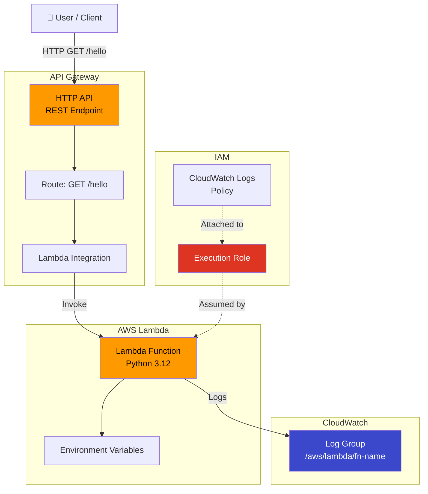
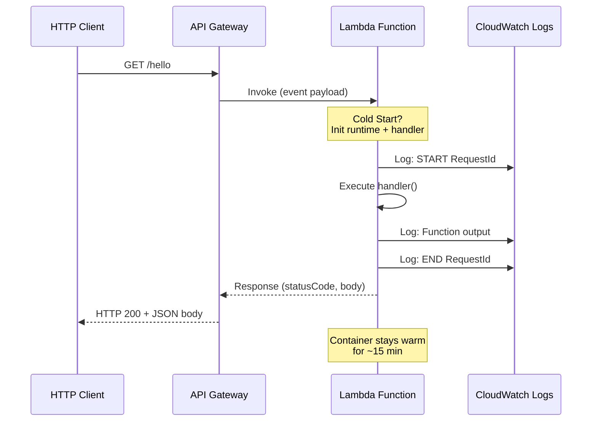

# Project 19: Lambda Functions

## Concepts Covered

- AWS Lambda function creation
- IAM execution roles for Lambda
- Function packaging (zip deployment)
- API Gateway integration (HTTP trigger)
- CloudWatch Logs for Lambda
- Environment variables
- Lambda permissions and resource policies

---

## Architecture

---

## Lambda Invocation Flow

---

## Key Concepts

### Lambda Execution Model

| Concept | Description |
|---------|-------------|
| **Cold Start** | First invocation — Lambda provisions container, loads code |
| **Warm Start** | Reuses existing container — much faster |
| **Concurrency** | Max simultaneous executions (default: 1000/region) |
| **Timeout** | Max execution time (default: 3s, max: 900s) |
| **Memory** | 128 MB – 10,240 MB (CPU scales proportionally) |
| **Ephemeral Storage** | /tmp directory, 512 MB – 10,240 MB |

### Deployment Package

| Method | Best For |
|--------|----------|
| **Zip upload** | Small functions (< 50 MB) |
| **S3 reference** | Larger packages |
| **Container image** | Complex dependencies, up to 10 GB |
| **Layers** | Shared libraries across functions |

### API Gateway Types

| Type | Protocol | Use Case |
|------|----------|----------|
| **HTTP API** | HTTP/REST | Simple, low-cost, modern |
| **REST API** | REST | Full-featured, API keys, caching |
| **WebSocket** | WebSocket | Real-time, bidirectional |

---

## Resources Created

| Resource | Purpose |
|----------|---------|
| `aws_lambda_function` | The Lambda function |
| `aws_iam_role` | Execution role for Lambda |
| `aws_iam_role_policy_attachment` | CloudWatch Logs access |
| `aws_cloudwatch_log_group` | Log group for function logs |
| `aws_apigatewayv2_api` | HTTP API Gateway |
| `aws_apigatewayv2_stage` | API stage (auto-deploy) |
| `aws_apigatewayv2_integration` | Lambda integration |
| `aws_apigatewayv2_route` | Route: GET /hello |
| `aws_lambda_permission` | Allow API GW to invoke Lambda |

---

## Outputs

| Output | Description |
|--------|-------------|
| `function_name` | Lambda function name |
| `function_arn` | Lambda function ARN |
| `api_endpoint` | API Gateway invoke URL |
| `log_group` | CloudWatch log group name |
