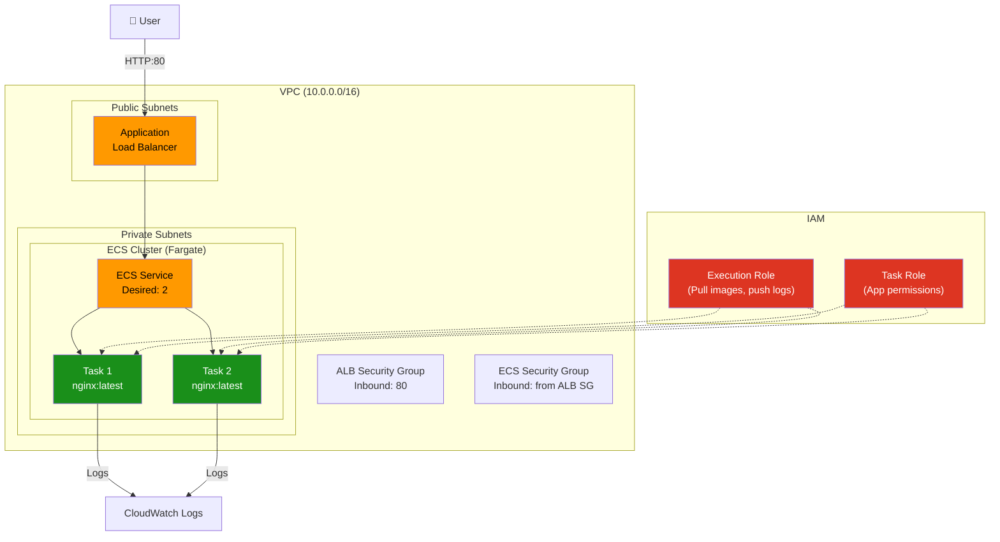
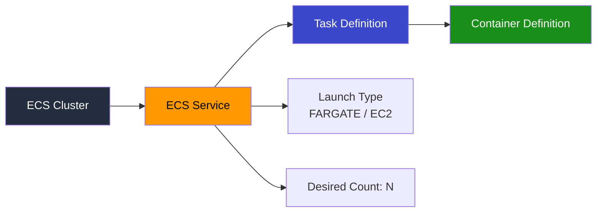

# Project 20: ECS Fargate

## Concepts Covered

- ECS Cluster (serverless with Fargate)
- Task Definitions (container configuration)
- ECS Services (desired count, deployment)
- Fargate vs EC2 launch types
- ALB integration with ECS
- IAM roles: Task Role vs Execution Role
- CloudWatch Logs for containers
- Networking mode: awsvpc

---

## Architecture

---

## Key Concepts

### ECS Components

### Fargate vs EC2 Launch Type

| Feature | Fargate | EC2 |
|---------|---------|-----|
| Server management | None (serverless) | You manage EC2 instances |
| Scaling | Per-task | Must scale EC2 fleet |
| Pricing | Per vCPU + memory/second | EC2 instance pricing |
| Networking | awsvpc only (each task gets ENI) | bridge, host, or awsvpc |
| GPU support | No | Yes |
| Best for | Most workloads, simplicity | GPU, large persistent workloads |

### Two IAM Roles

| Role | Purpose |
|------|---------|
| **Execution Role** | ECS agent — pull images from ECR, push logs to CloudWatch |
| **Task Role** | Your app — access S3, DynamoDB, etc. from inside the container |

### Task Definition Key Fields

| Field | Description |
|-------|-------------|
| `family` | Logical name (versioned automatically) |
| `network_mode` | `awsvpc` for Fargate |
| `requires_compatibilities` | `["FARGATE"]` |
| `cpu` | vCPU units (256 = 0.25 vCPU) |
| `memory` | MiB (512 = 0.5 GB) |
| `container_definitions` | JSON array of container configs |

---

## Resources Created

| Resource | Purpose |
|----------|---------|
| `aws_ecs_cluster` | ECS cluster |
| `aws_ecs_task_definition` | Container configuration |
| `aws_ecs_service` | Maintains desired task count |
| `aws_iam_role` (execution) | Pull images + push logs |
| `aws_iam_role` (task) | Application permissions |
| `aws_cloudwatch_log_group` | Container logs |
| `aws_lb` + target group | ALB for traffic distribution |
| VPC, Subnets, SGs | Network infrastructure |

---

## Outputs

| Output | Description |
|--------|-------------|
| `cluster_name` | ECS cluster name |
| `service_name` | ECS service name |
| `alb_dns_name` | ALB DNS to access the app |
