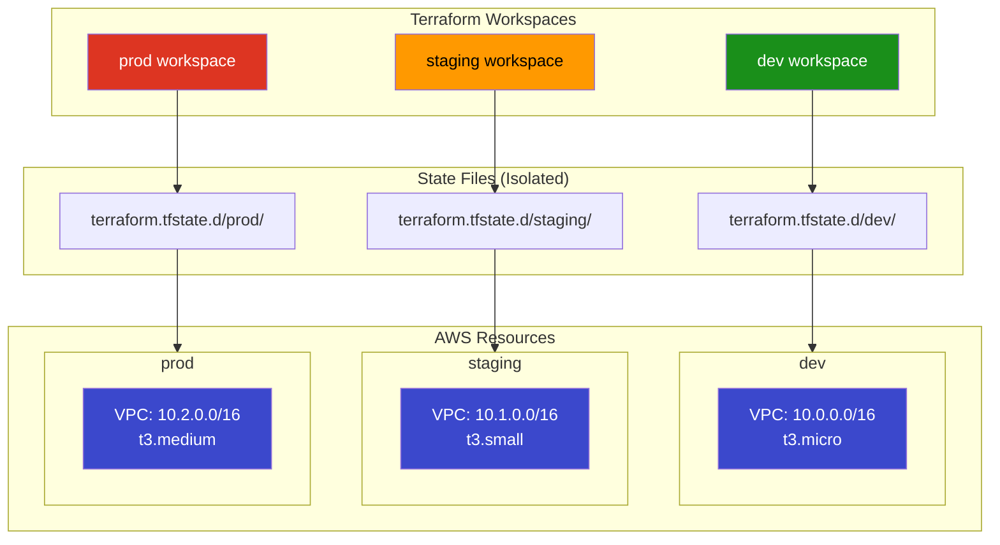
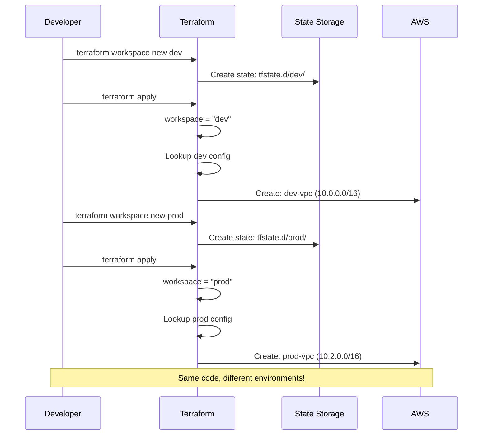

# Project 21: Terraform Workspaces

## Concepts Covered

- Terraform workspaces for multi-environment management
- `terraform.workspace` interpolation
- Environment-specific variables with `lookup()`
- Workspace-aware resource naming
- State isolation per environment
- `terraform workspace` CLI commands

---

## Architecture



---

## Workspace Flow



---

## Key Concepts

### Workspace CLI Commands

| Command | Description |
|---------|-------------|
| `terraform workspace list` | List all workspaces |
| `terraform workspace new <name>` | Create a new workspace |
| `terraform workspace select <name>` | Switch to a workspace |
| `terraform workspace show` | Show current workspace |
| `terraform workspace delete <name>` | Delete a workspace |

### Using `terraform.workspace`

```hcl
# Access current workspace name
locals {
  environment = terraform.workspace
}

# Environment-specific config via lookup
locals {
  vpc_cidr = lookup({
    dev     = "10.0.0.0/16"
    staging = "10.1.0.0/16"
    prod    = "10.2.0.0/16"
  }, terraform.workspace, "10.0.0.0/16")
}

# Prefix resource names
resource "aws_vpc" "main" {
  cidr_block = local.vpc_cidr
  tags = {
    Name = "${terraform.workspace}-vpc"
  }
}
```

### Workspaces vs Separate Directories

| Feature | Workspaces | Separate Dirs |
|---------|-----------|---------------|
| Code duplication | None (shared) | Full copy per env |
| State isolation | Automatic | Manual |
| Config differences | `lookup()` / conditionals | Separate `.tfvars` |
| Best for | Similar environments | Very different environments |
| Team workflows | Simple projects | Complex organizations |

### When to Use Workspaces

| Use | Avoid |
|-----|-------|
| Dev / Staging / Prod with same infra | Completely different architectures per env |
| Quick environment spin-up/teardown | Enterprise multi-team setups |
| Personal dev sandboxes | When environments diverge significantly |

---

## Resources Created (Per Workspace)

| Resource | Purpose |
|----------|---------|
| `aws_vpc` | VPC with workspace-specific CIDR |
| `aws_subnet` | Subnet with workspace-specific config |
| `aws_internet_gateway` | IGW for internet access |
| `aws_route_table` | Routing for the subnet |
| `aws_security_group` | SG with workspace-specific rules |

---

## Outputs

| Output | Description |
|--------|-------------|
| `workspace` | Current workspace name |
| `vpc_id` | VPC ID for this workspace |
| `vpc_cidr` | VPC CIDR for this workspace |
| `instance_type` | Instance type for this workspace |
