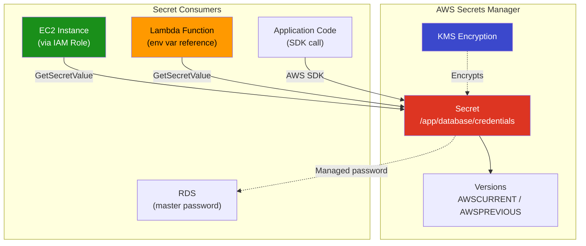
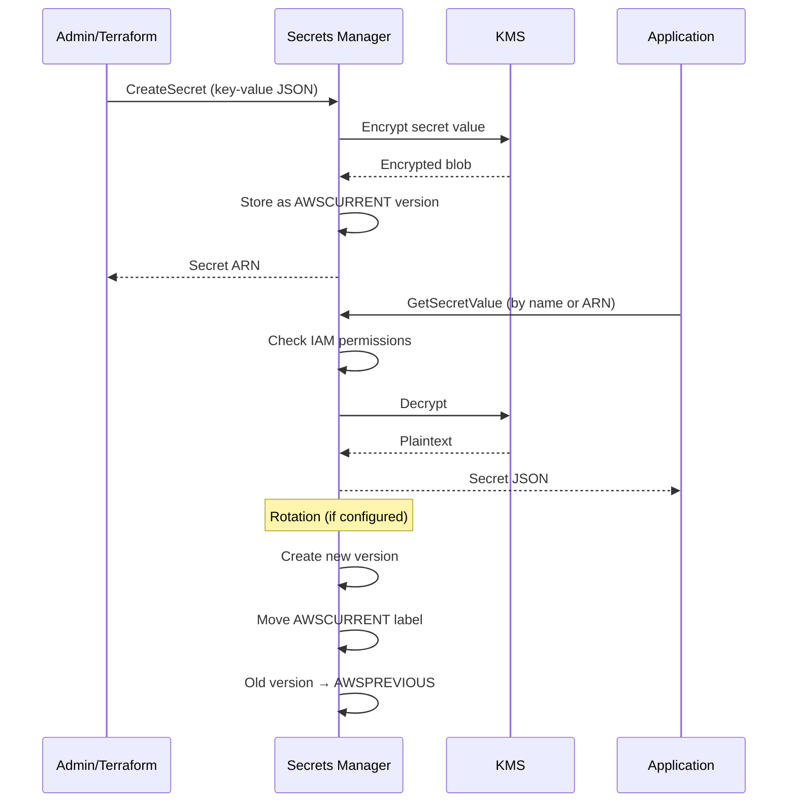

# Project 22: Secrets Manager

## Concepts Covered

- AWS Secrets Manager for secret storage
- Secret creation and versioning
- Automatic secret rotation
- Secret retrieval in Terraform
- KMS encryption for secrets
- Secret policies (resource-based)
- Integration with RDS, Lambda, EC2

---

## Architecture



---

## Secret Lifecycle



---

## Key Concepts

### Secrets Manager vs Parameter Store

| Feature | Secrets Manager | Parameter Store (SSM) |
|---------|----------------|----------------------|
| Cost | $0.40/secret/month + API calls | Free tier (standard) |
| Automatic rotation | Built-in Lambda rotation | Manual |
| Cross-region replication | Yes | No |
| Max secret size | 64 KB | 8 KB (advanced: 8 KB) |
| Versioning | Automatic (staging labels) | Yes (basic) |
| RDS integration | Native (managed passwords) | Manual |
| Best for | Database creds, API keys | Config values, feature flags |

### Secret Naming Convention

```
/<environment>/<service>/<secret-type>
```

Examples:
- `/dev/myapp/database-credentials`
- `/prod/api/stripe-key`
- `/staging/auth/jwt-secret`

### Secret Rotation

| Rotation Type | Description |
|--------------|-------------|
| **Single-user** | Updates one set of credentials |
| **Alternating-user** | Alternates between two IAM users |
| **Lambda-based** | Custom rotation logic |
| **RDS managed** | Automatic for supported RDS engines |

---

## Resources Created

| Resource | Purpose |
|----------|---------|
| `aws_secretsmanager_secret` | The secret container |
| `aws_secretsmanager_secret_version` | The secret value |
| `aws_iam_policy` | Policy to read the secret |
| `aws_iam_role` | Role that can access the secret |
| `aws_kms_key` | Custom KMS key for encryption |
| `aws_kms_alias` | Friendly name for the KMS key |

---

## Outputs

| Output | Description |
|--------|-------------|
| `secret_arn` | ARN of the secret |
| `secret_name` | Name of the secret |
| `kms_key_arn` | KMS key ARN used for encryption |
| `reader_policy_arn` | IAM policy ARN for reading the secret |
