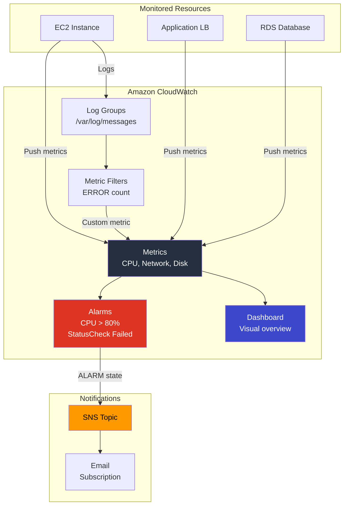
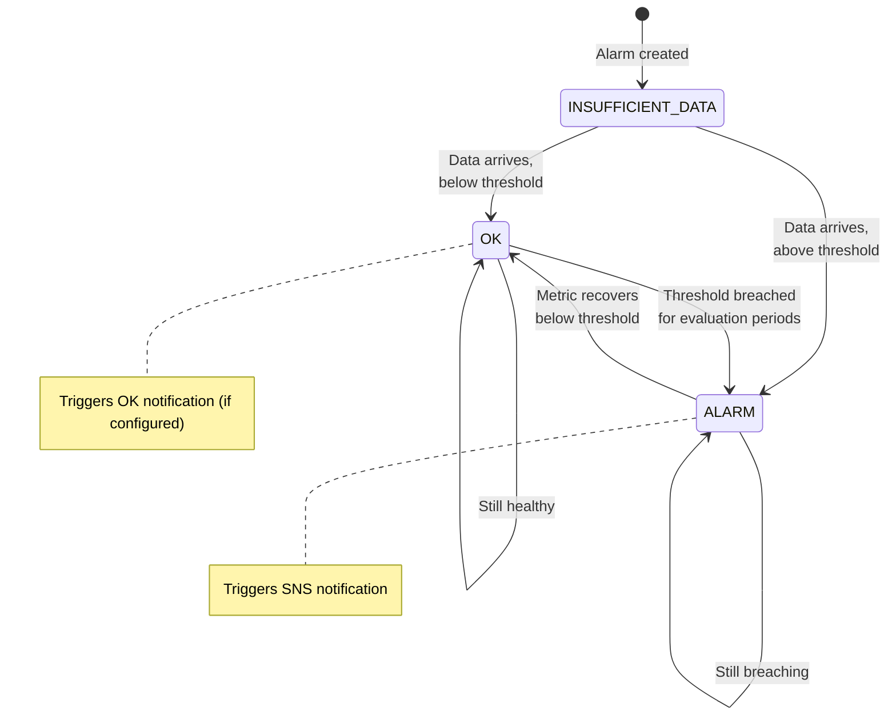

# Project 23: CloudWatch Monitoring

## Concepts Covered

- CloudWatch Metrics and Alarms
- SNS Topics for notifications
- CloudWatch Dashboards
- Log Groups and Log Streams
- Metric Filters (extract metrics from logs)
- Composite alarms
- Alarm actions (SNS, Auto Scaling, EC2)

---

## Architecture

---

## Alarm State Machine

---

## Key Concepts

### CloudWatch Metric Dimensions

| Service | Key Metrics | Namespace |
|---------|-------------|-----------|
| **EC2** | CPUUtilization, StatusCheckFailed, NetworkIn/Out | AWS/EC2 |
| **ALB** | RequestCount, TargetResponseTime, HTTPCode_Target_5XX | AWS/ApplicationELB |
| **RDS** | CPUUtilization, FreeStorageSpace, DatabaseConnections | AWS/RDS |
| **Lambda** | Invocations, Duration, Errors, Throttles | AWS/Lambda |
| **S3** | BucketSizeBytes, NumberOfObjects | AWS/S3 |

### Alarm Evaluation

| Setting | Description |
|---------|-------------|
| `period` | Length of each evaluation period (seconds) |
| `evaluation_periods` | How many periods to evaluate |
| `datapoints_to_alarm` | How many periods must breach (M of N) |
| `statistic` | Average, Sum, Minimum, Maximum, SampleCount |
| `comparison_operator` | GreaterThanThreshold, LessThanThreshold, etc. |
| `threshold` | The value to compare against |

**Example**: CPU > 80% for 3 out of 5 periods of 60 seconds = alarm if CPU exceeds 80% in at least 3 of the last 5 minutes.

### SNS Subscription Types

| Protocol | Endpoint | Use Case |
|----------|----------|----------|
| `email` | Email address | Notifications to team |
| `sms` | Phone number | Critical alerts |
| `lambda` | Function ARN | Automated remediation |
| `https` | Webhook URL | PagerDuty, Slack, etc. |
| `sqs` | Queue ARN | Async processing |

---

## Resources Created

| Resource | Purpose |
|----------|---------|
| `aws_sns_topic` | Notification topic |
| `aws_sns_topic_subscription` | Email subscription |
| `aws_cloudwatch_metric_alarm` | CPU high alarm |
| `aws_cloudwatch_metric_alarm` | CPU low alarm |
| `aws_cloudwatch_metric_alarm` | Status check alarm |
| `aws_cloudwatch_dashboard` | Visual dashboard |
| `aws_cloudwatch_log_group` | Application log group |
| `aws_cloudwatch_log_metric_filter` | Extract ERROR count from logs |

---

## Outputs

| Output | Description |
|--------|-------------|
| `sns_topic_arn` | SNS topic ARN for alarm notifications |
| `cpu_alarm_arn` | CPU high alarm ARN |
| `dashboard_name` | CloudWatch dashboard name |
| `log_group_name` | Log group name |
