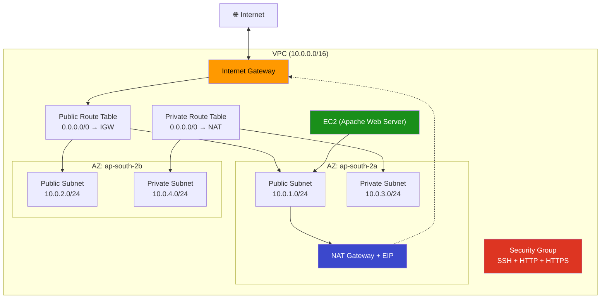

# AWS Provisioning with Terraform

> **Master AWS infrastructure with Terraform** — 23 progressive projects from basic VPC to production-grade deployments with ALB, Auto Scaling, Lambda, ECS Fargate, CloudFront, and more. Each project is self-contained with its own documentation, Mermaid diagrams, and deployable Terraform code.

---

## Learning Path

```mermaid
graph LR
    A["01<br/>VPC Basics"] --> B["02<br/>Subnets"]
    B --> C["03<br/>Public/Private<br/>Subnets"]
    C --> D["04<br/>Internet<br/>Gateway"]
    D --> E["05<br/>NAT<br/>Gateway"]
    E --> F["06<br/>Security<br/>Groups"]
    F --> G["07<br/>EC2<br/>Basic"]
    G --> H["08<br/>Complete<br/>Infrastructure"]
    H --> I["09<br/>Network<br/>ACL"]
    I --> J["10<br/>VPC<br/>Peering"]
    J --> K["11<br/>Load<br/>Balancer"]
    K --> L["12<br/>Auto<br/>Scaling"]
    L --> M["13<br/>S3 Remote<br/>Backend"]
    M --> N["14<br/>IAM Roles<br/>& Policies"]
    N --> O["15<br/>RDS Private<br/>Subnet"]
    O --> P["16<br/>S3 Static<br/>Website"]
    P --> Q["17<br/>Route 53<br/>DNS"]
    Q --> R["18<br/>CloudFront<br/>CDN"]
    R --> S["19<br/>Lambda<br/>Functions"]
    S --> T["20<br/>ECS<br/>Fargate"]
    T --> U["21<br/>Terraform<br/>Workspaces"]
    U --> V["22<br/>Secrets<br/>Manager"]
    V --> W["23<br/>CloudWatch<br/>Monitoring"]

    style A fill:#232f3e,color:#fff
    style B fill:#232f3e,color:#fff
    style C fill:#3b48cc,color:#fff
    style D fill:#3b48cc,color:#fff
    style E fill:#3b48cc,color:#fff
    style F fill:#dd3522,color:#fff
    style G fill:#1a8f1a,color:#fff
    style H fill:#ff9900,color:#000
    style I fill:#232f3e,color:#fff
    style J fill:#3b48cc,color:#fff
    style K fill:#ff9900,color:#000
    style L fill:#ff9900,color:#000
    style M fill:#9c27b0,color:#fff
    style N fill:#dd3522,color:#fff
    style O fill:#3b48cc,color:#fff
    style P fill:#3b48cc,color:#fff
    style Q fill:#232f3e,color:#fff
    style R fill:#ff9900,color:#000
    style S fill:#ff9900,color:#000
    style T fill:#1a8f1a,color:#fff
    style U fill:#9c27b0,color:#fff
    style V fill:#dd3522,color:#fff
    style W fill:#3b48cc,color:#fff
```



---

## Projects

| # | Project | What You Learn | Resources Created |
|---|---------|---------------|-------------------|
| 01 | [VPC Basics](01-vpc-basics/) | VPC, CIDR, DNS settings | VPC |
| 02 | [Subnets](02-subnets/) | Subnets, Availability Zones | VPC, Subnet |
| 03 | [Public/Private Subnets](03-public-private-subnets/) | Public vs Private, 3-tier architecture | VPC, 2 Subnets |
| 04 | [Internet Gateway](04-internet-gateway/) | IGW, Route Tables, public internet access | VPC, Subnet, IGW, Route Table |
| 05 | [NAT Gateway](05-nat-gateway/) | NAT GW, EIP, SNAT/DNAT, private outbound | VPC, 2 Subnets, IGW, NAT, EIP, 2 RTs |
| 06 | [Security Groups](06-security-groups/) | Firewall rules, stateful filtering, ports | VPC, Subnet, Security Group |
| 07 | [EC2 Basic](07-ec2-basic/) | EC2, AMI, Key Pairs, user_data | VPC, Subnet, IGW, RT, SG, EC2 |
| 08 | [Complete Infrastructure](08-ec2-complete-infrastructure/) | **Everything combined** — production setup | VPC, 4 Subnets, IGW, NAT, EIP, 2 RTs, SG, Key, EC2 |
| 09 | [Network ACL](09-network-acl/) | NACLs, stateless filtering, rule evaluation | VPC, 2 Subnets, Public NACL, Private NACL |
| 10 | [VPC Peering](10-vpc-peering/) | Cross-VPC connectivity, bidirectional routing | 2 VPCs, 2 Subnets, Peering Connection, Routes |
| 11 | [Load Balancer](11-load-balancer/) | ALB, Target Groups, Listeners, health checks | VPC, Subnets, IGW, ALB, TG, 2 EC2, SGs |
| 12 | [Auto Scaling](12-auto-scaling/) | ASG, Launch Templates, scaling policies, CloudWatch | VPC, Subnets, ALB, ASG, Launch Template, Alarms |
| 13 | [S3 Remote Backend](13-s3-remote-backend/) | Remote state, S3 backend, DynamoDB locking | S3 Bucket, DynamoDB Table |
| 14 | [IAM Roles & Policies](14-iam-roles-policies/) | IAM Roles, Policies, Instance Profiles | IAM Role, Policy, Instance Profile, EC2 |
| 15 | [RDS Private Subnet](15-rds-private-subnet/) | RDS, DB Subnet Groups, Multi-AZ, private access | VPC, 4 Subnets, IGW, RT, SGs, RDS MySQL |
| 16 | [S3 Static Website](16-s3-static-website/) | S3 website hosting, bucket policy, CORS | S3 Bucket, Policy, Website Config, Objects |
| 17 | [Route 53 DNS](17-route53-dns/) | Hosted zones, record types, health checks | Hosted Zone, A/CNAME/TXT Records, Health Check |
| 18 | [CloudFront CDN](18-cloudfront-cdn/) | CDN, OAC, edge caching, price classes | S3, CloudFront Distribution, OAC, Policy |
| 19 | [Lambda Functions](19-lambda-functions/) | Serverless, API Gateway, execution roles | Lambda, API GW HTTP, IAM Role, Log Group |
| 20 | [ECS Fargate](20-ecs-fargate/) | Containers, task definitions, services | ECS Cluster, Service, ALB, VPC, IAM Roles |
| 21 | [Terraform Workspaces](21-terraform-workspaces/) | Multi-env, workspace interpolation, lookup | VPC, Subnet, IGW, SG (per workspace) |
| 22 | [Secrets Manager](22-secrets-manager/) | Secret storage, KMS encryption, IAM policies | Secret, KMS Key, IAM Policy |
| 23 | [CloudWatch Monitoring](23-cloudwatch-monitoring/) | Alarms, dashboards, SNS, metric filters | SNS, Alarms, Dashboard, Log Group, Filters |

---

## Full Architecture (Project 08)



---

## Quick Start

```bash
# Pick any project (e.g., 01-vpc-basics)
cd 01-vpc-basics/terraform/

# Set up variables
cp terraform.tfvars.example terraform.tfvars
# Edit terraform.tfvars with your values

# Deploy
terraform init
terraform plan
terraform apply

# Clean up
terraform destroy
```

### Prerequisites

- [Terraform](https://developer.hashicorp.com/terraform/install) >= 1.11
- [AWS CLI](https://aws.amazon.com/cli/) configured with credentials
- SSH key pair (for EC2 projects): `ssh-keygen -t rsa -b 4096 -f ~/.ssh/aws_key`

---

## Project Structure (Each Project)

```
XX-project-name/
├── README.md              ← Concept docs + Mermaid diagrams
├── modules/               ← Reusable Terraform modules
│   └── resource-name/
│       ├── main.tf        ← Resource definitions
│       ├── variables.tf   ← Input variables
│       └── outputs.tf     ← Output values
└── terraform/             ← Root module (entry point)
    ├── main.tf            ← Module calls
    ├── variables.tf       ← Variable declarations
    ├── outputs.tf         ← Stack outputs
    ├── providers.tf       ← AWS provider config
    └── terraform.tfvars.example
```

---

## Key Concepts Summary

### Networking — Foundations

| Concept | What It Does | Cost |
|---------|-------------|------|
| **VPC** | Isolated virtual network | Free |
| **Subnet** | IP range partition within a VPC | Free |
| **Internet Gateway** | Connects VPC to internet (bidirectional) | Free |
| **NAT Gateway** | Lets private subnets access internet (outbound only) | ~$0.045/hr |
| **Elastic IP** | Static public IPv4 address | Free (if attached) |
| **Route Table** | Traffic routing rules for subnets | Free |
| **Security Group** | Stateful firewall at instance level | Free |

### Networking — Advanced

| Concept | What It Does | Cost |
|---------|-------------|------|
| **Network ACL** | Stateless firewall at subnet level (rule # order) | Free |
| **VPC Peering** | Private connectivity between two VPCs | Free (data transfer charges apply) |

### Storage & CDN

| Concept | What It Does | Cost |
|---------|-------------|------|
| **S3 Bucket** | Object storage (files, backups, static content) | ~$0.023/GB/month |
| **S3 Static Website** | Host static HTML/CSS/JS directly from S3 | S3 pricing |
| **CloudFront** | Global CDN with edge caching | ~$0.085/GB transfer |
| **Origin Access Control** | Secure S3 access from CloudFront only | Free |

### DNS

| Concept | What It Does | Cost |
|---------|-------------|------|
| **Route 53 Hosted Zone** | DNS zone for your domain | $0.50/zone/month |
| **A Record** | Maps domain to IPv4 address | Free (within zone) |
| **ALIAS Record** | Maps domain to AWS resource (zone apex safe) | Free |
| **Health Check** | Monitors endpoint availability | $0.50–$1.00/check/month |

### Load Balancing & Scaling

| Concept | What It Does | Cost |
|---------|-------------|------|
| **ALB** | Layer 7 load balancer (HTTP/HTTPS routing) | ~$0.0225/hr + LCU |
| **Target Group** | Group of instances receiving traffic from ALB | Free |
| **Auto Scaling Group** | Dynamically scales EC2 fleet based on demand | Free (pay for instances) |
| **Launch Template** | Reusable EC2 instance configuration blueprint | Free |
| **CloudWatch Alarm** | Triggers scaling based on metrics (CPU, network) | ~$0.10/alarm/month |

### Compute

| Concept | What It Does | Cost |
|---------|-------------|------|
| **EC2** | Virtual server instance | ~$0.0104/hr (t3.micro) |
| **AMI** | Machine image (OS template) | Free (built-in) |
| **Key Pair** | SSH authentication | Free |
| **User Data** | Bootstrap script at launch | Free |
| **Lambda** | Serverless functions (event-driven) | 1M free requests/month |
| **ECS Fargate** | Serverless containers | ~$0.04048/vCPU/hr |
| **API Gateway** | HTTP/REST API endpoint for Lambda | $1.00/million requests |

### Security & IAM

| Concept | What It Does | Cost |
|---------|-------------|------|
| **IAM Role** | Identity with permission policies (no credentials) | Free |
| **IAM Policy** | JSON document defining allowed/denied actions | Free |
| **Instance Profile** | Wrapper to attach IAM Role to EC2 | Free |
| **Trust Policy** | Controls which services can assume a role | Free |
| **Secrets Manager** | Encrypted secret storage with rotation | $0.40/secret/month |
| **KMS Key** | Customer-managed encryption key | $1.00/key/month |

### Database

| Concept | What It Does | Cost |
|---------|-------------|------|
| **RDS** | Managed relational database service | ~$0.017/hr (db.t3.micro) |
| **DB Subnet Group** | Defines which subnets RDS can use | Free |
| **Multi-AZ** | Automatic failover to standby in another AZ | 2x instance cost |

### Monitoring

| Concept | What It Does | Cost |
|---------|-------------|------|
| **CloudWatch Metrics** | Resource performance data points | Free (basic), $0.30/metric (detailed) |
| **CloudWatch Alarms** | Threshold-based notifications | $0.10/alarm/month |
| **CloudWatch Dashboard** | Visual metric overview | $3.00/dashboard/month |
| **SNS Topic** | Pub/sub notification service | Free tier: 1M publishes |
| **Metric Filters** | Extract metrics from log patterns | Free |

### Terraform

| Feature | Purpose |
|---------|---------|
| **Modules** | Reusable, composable infrastructure blocks |
| **Variables** | Parameterized configurations |
| **Outputs** | Export values between modules |
| **count** | Create multiple resources from one block |
| **element()** | Cycle through list values |
| **depends_on** | Explicit resource ordering |
| **Remote Backend** | Store state in S3 with DynamoDB locking |
| **sensitive** | Mark variables to hide values in output |
| **base64encode()** | Encode user_data scripts for launch templates |
| **Workspaces** | Multi-environment management (dev/staging/prod) |
| **lookup()** | Map workspace to environment-specific values |
| **jsonencode()** | Convert HCL maps to JSON (policies, configs) |
| **archive_file** | Package Lambda code into zip |
| **data sources** | Reference existing AWS resources |

---

## Defaults

| Setting | Value |
|---------|-------|
| Region | `ap-south-2` (Hyderabad) |
| VPC CIDR | `10.0.0.0/16` |
| Instance Type | `t3.micro` |
| AMI | `ami-053a0835435bf4f45` (Ubuntu) |
| Provider | `hashicorp/aws ~> 6.0` |
| Terraform | `>= 1.11` |

---

> **Tip:** Start from Project 01 and work through sequentially. Projects 01–08 cover foundational networking and compute. Projects 09–15 cover advanced topics like NACLs, VPC Peering, Load Balancing, Auto Scaling, Remote State, IAM, and Databases. Projects 16–23 cover modern AWS services: S3 websites, Route 53, CloudFront, Lambda, ECS Fargate, Workspaces, Secrets Manager, and CloudWatch. Each project's README explains the concepts in detail with diagrams before you touch any code.
